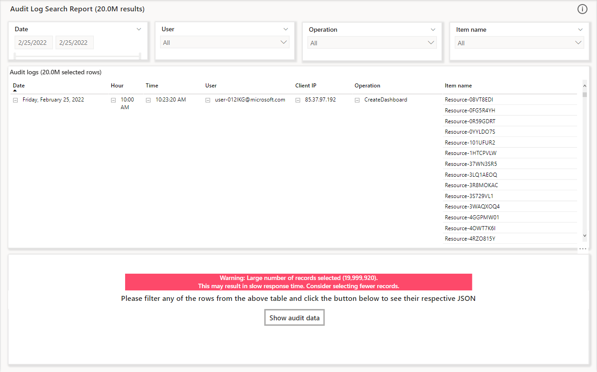
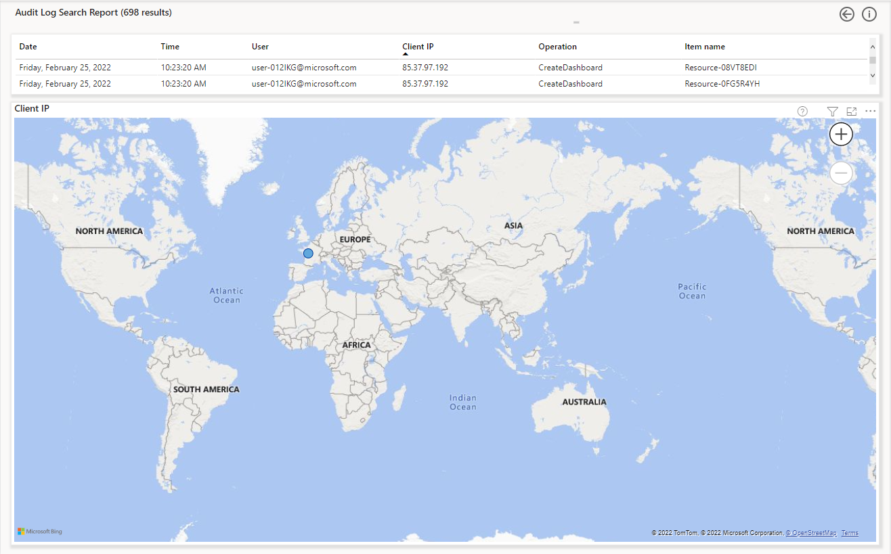

# Using the Audit Logs Search Report (preview)

The _Audit Log Search report_ is designed to provide monitoring capabilities for audit log data. Monitoring audit logs can help admins in troubleshooting specific scenarios and ensure compliance across the Power BI tenant. The audit logs are detailed historical events that have been been performed across the Power BI tenant.

Administrators can use the report to filter out data to match their expected scenario based on the different slicers that have been provided.

## Report Slicers 
- Date Range 
  - The range for filtering data during a specific day or time period
- User
  - The various users that performed operations during the date range
- Operation 
  - The various operations that were performed during the date range 
- Item Name 
  - The various items used to perform the operations during the date range

## Report Data Model 

## Report Pages

* [Overview](#page-overview)
* [IP Lookup](#drill-through-page-ip-lookup)

### Page: Overview

This page is designed to give an overview of the Audit Log Search functionality using two visuals:

The matrix _Audit Logs_ is used to view the data that is returned based on the values provided to the slicers (For example, setting all slicers to ‘All’ will return all the data).

The title of the visual also has the number of rows returned and number of rows selected as dynamic values. For example in the below image, 2.0M rows are returned and selected without any slicer filtering. The number will change based on the slicer selections.

Administrators can also drill through to the IP Look up page but selecting any row and right clicking on the "Client IP" field. 

>[!NOTE]
> The report has functionality built in which gives warning to administrators about the number of rows selected. This is to let administrators know that selecting a higher number of records will result in slower response times.
>
> 
> 

The second table “_Audit Data_” is used to view the JSON objects. This table is hidden in the default view as shown by the image below

Administrators can choose one or more rows from the first table and click the button “_Show audit data_” to see the JSON objects for those specific rows as shown below. 

>[!NOTE]
>Click the back button to return to the default view in order to interact with the slicers again. 

Administrators can also export the data that has been returned in the second table by clicking on the ellipsis icon on the right of the visual and choosing “_Export data_” as shown below 

>[!NOTE]
> The data being exported will contain the filtered rows as per selections in the first table. 

### Drill-through Page: IP Lookup

This page is designed to provide details about Client IP addresses. The page has two visuals.

The table visual includes the same fields as the Overview page matrix with only the drill-down selection details, as shown in the image below.

The map visual plots the location of the Client IP address for more details.  

## Considerations and Limitations

## Next Steps
