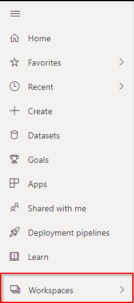
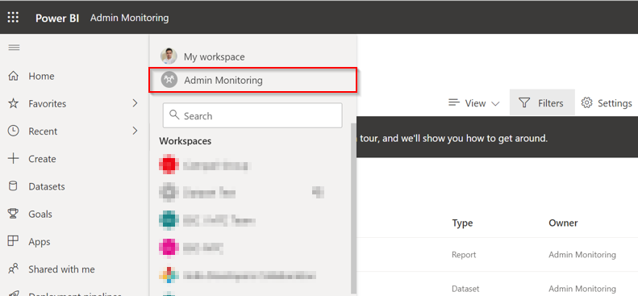
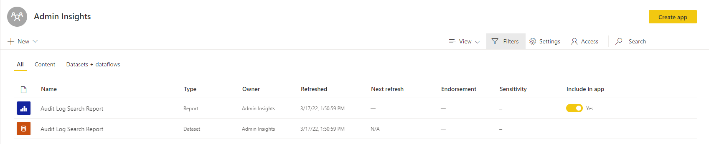

# Admin Monitoring Workspace (preview)
   
The Admin Monitoring workspace is a new workspace designed to provide administrators with monitoring capabilities for audit log data. 

## Installing the Admin Monitoring Artifacts

The Admin Monitoring workspace is enabled for administrators directly through the Microsoft Power BI tenant. To install and access the artifacts, administrators should follow these steps:

- Log into [Power BI](https://app.powerbi.com/) with your account
- Navigate to the Workspaces section as shown below

  

- You will see a new option "Admin Monitoring" under "My workspace" as shown below

  

- Clicking on "Admin Monitoring" will automatically install the required resources and artifacts for you in the workspace

  

## Artifacts in the Workspace

Currently the workspace holds two artifacts:
- Raw dataset for audit logs
- Report visualizing the dataset

All the data is currently sourced from the raw dataset

### Dataset

- The dataset has a scheduled refresh once per day
- The dataset can be imported to other workspaces
- You can also use Direct Query or Live connection with the dataset

### Report

- The Audit Log Search report included in the workspace is used to monitor activities and drill down on specific events. You can learn more about the [Audit Log Search Report here](https://dev.azure.com/bhmerc/BYOLATemplateApps/_wiki/wikis/BYOLATemplateApps.wiki/56/Audit-Log-Search-Report)
- The Audit Log Search report is connected to the raw dataset
- The raw dataset can be used to build additional reports in other workspaces

## To Enable/Disable Export of Data to Excel

- Go to the Admin portal and toggle the "Export Data" setting in [Tenant Admin Settings](https://docs.microsoft.com/en-us/power-bi/guidance/admin-tenant-settings#export-data)
