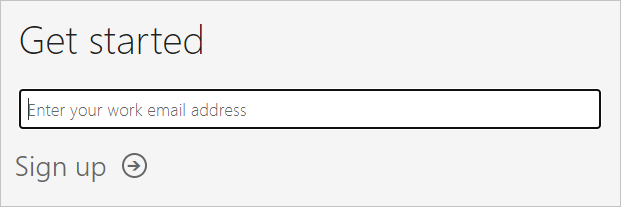
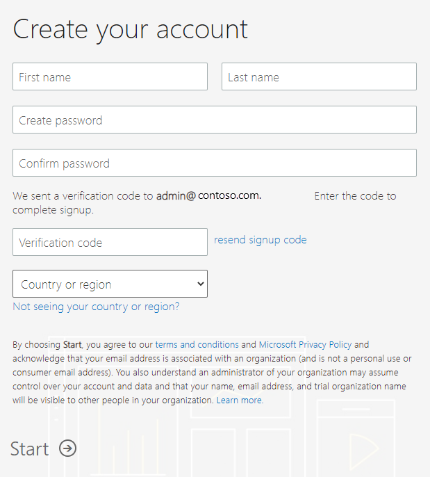

# Get a Power BI subscription for your organization

As an administrator, you can sign up for Power BI through the [Power BI web site](https://powerbi.microsoft.com). You can also sign up through the purchase services page on the Microsoft 365 admin center. When an administrator signs up for Power BI, they can assign licenses to users who should have access.

Additionally, individual users in your organization may be able to sign up for Power BI through the Power BI web site. When a user in your organization signs up for Power BI, that user is assigned a Power BI license automatically. If you want to turn off this capability, follow the steps in [Enable or disable self-service sign-up and purchasing](service-admin-disable-self-service.md).

## Sign up through Power BI

You'll need a work or school account to sign up for a Power BI subscription. We don't support email addresses provided by consumer email services or telecommunications providers.

Follow these steps to sign up:

1. Go to the [Power BI web site](https://powerbi.microsoft.com). Select **Try free**.
2. Enter your work email address, then select **Sign up**.

  

3. Verify your identity. We'll call or text you a verification code to use.
4. Select **Yes** to confirm that you are using an email address that you got from your company.
5. Create your account. We send a verification code to your email address to complete signup.

  

## Sign up through Microsoft 365

If you're a Microsoft 365 global admin or billing admin, you can get a Power BI subscription for your organization. For more information, see [Who can purchase and assign licenses?](../service-admin-licensing-organization.md#who-can-purchase-and-assign-licenses).

> [!NOTE]
>
> A Microsoft 365 E5 subscription already includes Power BI Pro licenses. To learn how to manage licenses, see [View and manage user licenses](service-admin-manage-licenses.md).
>
>

Follow these steps to purchase Power BI Pro licenses in the Microsoft 365 admin center:

1. Sign in to the [Microsoft 365 admin center](https://admin.microsoft.com).

2. On the navigation menu, select **Billing** > **Purchase services**.
  
  

3. Search or scroll to find the subscription you want to buy. You'll find **Power BI** under **Other categories that might interest you** near the bottom of the page. Select the link to view the Power BI subscriptions available to your organization.

4. Select an offer, like Power BI Pro.

5. On the **Purchase services** page, select **Buy**. If you haven't previously used it, you can start a Power BI Pro free trial subscription. It includes 25 licenses and expires in one month.

  

6. Choose **Pay monthly** or **Pay for a full year**, according to how you want to pay.

7. Under **How many users do you want?** enter the number of licenses to buy, then select **Check out now** to complete the transaction.

8. To verify your purchase, go to **Billing** > **Products & services** and look for  **Power BI Pro**.

To read more about how your organization acquires the Power BI service, see [Power BI in your organization](https://docs.microsoft.com/microsoft-365/admin/misc/power-bi-in-your-organization?view=o365-worldwide).

## Next steps

- [View and manage user licenses](service-admin-manage-licenses.md)
- [Enable or disable self-service sign-up and purchasing](service-admin-disable-self-service.md)
- [Business subscriptions and billing documentation](https://docs.microsoft.com/microsoft-365/commerce/?view=o365-worldwide)
