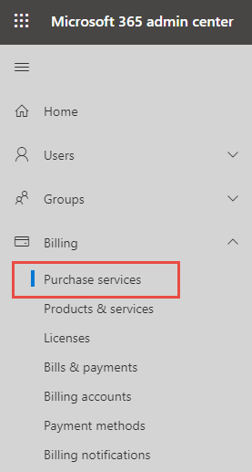
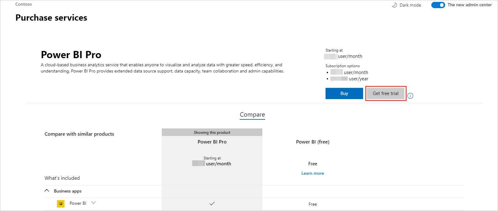
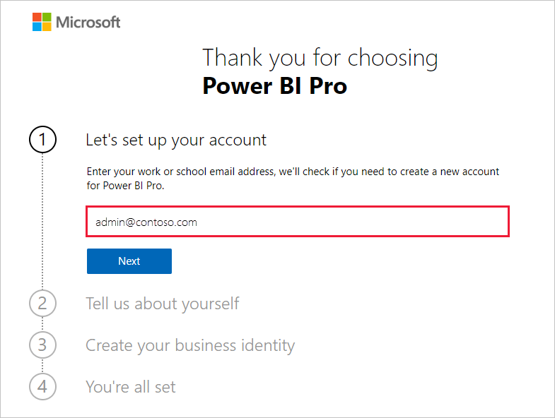
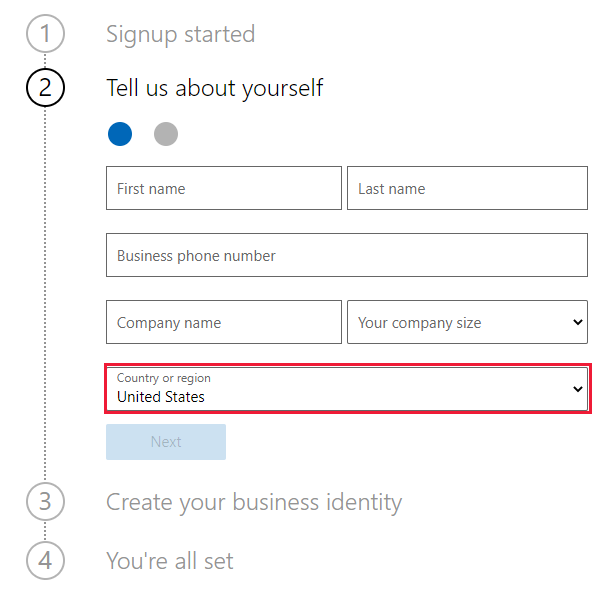

# Get a Power BI service subscription for your organization

Administrators can sign up for the Power BI service through the **Purchase services** page of the Microsoft 365 admin center. When an administrator signs up for Power BI, they can assign licenses to users who should have access.

Users in your organization can sign up for Power BI through the Power BI web site. When a user in your organization signs up for Power BI, they're assigned a Power BI license automatically. If you want to turn off self-service capabilities, follow the steps in [Enable or disable self-service sign-up and purchasing](service-admin-disable-self-service.md).

## Sign up through Microsoft 365

If you're a global admin or billing admin, you can get a Power BI subscription for your organization. For more information, see [Who can purchase and assign licenses?](service-admin-licensing-organization.md#who-can-purchase-and-assign-licenses).

> [!NOTE]
>
> A Microsoft 365 E5 subscription already includes Power BI Pro licenses. To learn how to manage licenses, see [View and manage user licenses](service-admin-manage-licenses.md).
>
>

Follow these steps to purchase Power BI Pro licenses in the Microsoft 365 admin center:

1. Sign in to the [Microsoft 365 admin center](https://admin.microsoft.com).

2. On the navigation menu, select **Billing** > **Purchase services**.
  
   

3. Search or scroll to find the subscription you want to buy. You'll find **Power BI** under **Other categories that might interest you** near the bottom of the page. Select the link to view the Power BI subscriptions available to your organization.

4. Select an offer, like Power BI Pro.

5. On the **Purchase services** page, select **Buy**. If you haven't previously used it, you can start a Power BI Pro free trial subscription. It includes 25 licenses and expires in one month.

   

6. Choose **Pay monthly** or **Pay for a full year**, according to how you want to pay.

7. Under **How many users do you want?** enter the number of licenses to buy, then select **Check out now** to complete the transaction.

8. To verify your purchase, go to **Billing** > **Products & services** and look for  **Power BI Pro**.

To read more about how your organization can control and acquire the Power BI service, see [Power BI in your organization](/microsoft-365/admin/misc/power-bi-in-your-organization).

## More ways to get Power BI for your organization

If you aren't already a Microsoft 365 subscriber, use the steps below to get a Power BI Pro trial for your organization. Or, you can [Sign up for a new Microsoft 365 trial](service-admin-signing-up-for-power-bi-with-a-new-office-365-trial.md), then add Power BI by following the steps in the preceding section.

You'll need a work or school account to sign up for a Power BI subscription. We don't support email addresses provided by consumer email services or telecommunications providers. If you don't have a work or school account, you can create one during sign-up.

Follow these steps to sign up:

1. Go to [Power BI Pro signup](https://signup.microsoft.com/create-account/signup?OfferId=d59682f3-3e3b-4686-9c00-7c7c1c736085&ali=1&products=d59682f3-3e3b-4686-9c00-7c7c1c736085). 

2. Enter your work or school email address, then select **Next**. It's okay if you enter an email address that isn't considered a work or school email address. We'll get a new account set up for you when you create your business identity.

   

3. We run a quick check to see if you need to create a new account. Select **Set up account** to continue with the sign-up process.

   > [!NOTE]
   >If your email address is already in use with another Microsoft service, you can **Sign in** or **Create a new account instead**. If you choose to create a new account, continue to follow these steps to get set up.
>
>
 
4. Complete the form to tell us about yourself. Be sure to choose the correct country or region. The country you select determines where your data is stored, as explained in [How to determine where your Power BI tenant is located](service-admin-where-is-my-tenant-located.md#how-to-determine-where-your-power-bi-tenant-is-located).

   

5. Select **Next**. We need to send a verification code to verify your identity. Provide a phone number where we can send a text or call you. Then, select **Send Verification Code**.

6. Enter the verification code, then continue to **Create your business identity**.

   

    Enter a short name for your business, and we'll check to make sure it's available. We use this short name to create your organization name in the datacenter as a subdomain of onmicrosoft.com. You can add your own business domain later. Don't worry if the short name you want is taken. Most likely someone with a similar business name chose the same short name - just try a different variation. Select **Next**.
    
7. Create your user ID and password to sign in to your account. Select **Sign up**, and you're all set.

The account you created is now the global admin of a new Power BI Pro trial tenant. You can sign in to the [Microsoft 365 admin center](https://admin.microsoft.com) to add more users, set up a custom domain, purchase more services, and manage your Power BI subscription.

## Next steps

- [View and manage user licenses](service-admin-manage-licenses.md)
- [Enable or disable self-service sign-up and purchasing](service-admin-disable-self-service.md)
- [Business subscriptions and billing documentation](/microsoft-365/commerce/)