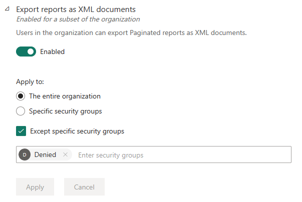
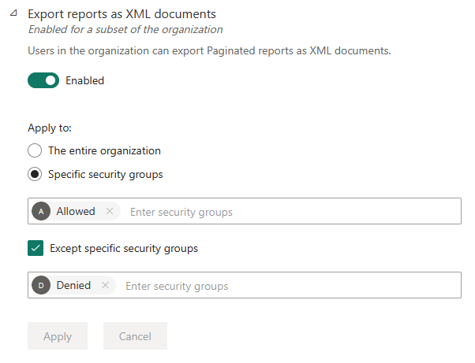

# About tenant settings

**Tenant settings** enable fine-grained control over the features that are made available to your organization. If you have concerns around sensitive data, some of our features may not be right for your organization, or you may only want a particular feature to be available to a specific group.

Tenant settings that control the availability of features in the Power BI user interface can help to establish governance policies, but they're not a security measure. For example, the **Export data** setting doesn't restrict the permissions of a Power BI user on a dataset. Power BI users with read access to a dataset have the permission to query this dataset and might be able to persist the results without using the **Export data** feature in the Power BI user interface.

> [!NOTE]
> It can take up to 15 minutes for a setting change to take effect for everyone in your organization.

## New tenant settings

To help you quickly identify changes and respond, a message at the top of the tenant settings page appears when there's a change. The message lists new tenant settings and changes to existing ones.

You can identify new settings according to their *new* icon.  

## How to get to the tenant settings

Go to the Admin portal and select Tenant settings.

:::image type="content" source="media/service-admin-portal-about-tenant-settings/admin-portal-tenant-settings.png" alt-text="Screenshot of how to get to the tenant settings":::

## How to use the tenant settings

Many of the settings can have one of three states:

* **Disabled for the entire organization**: No one in your organization can use this feature.

    

* **Enabled for the entire organization**: Everyone in your organization can use this feature.

    

* **Enabled for a subset of the organization**: Specific security groups in your organization are allowed to use this feature.

    You can also enable a feature for your entire organization, **Except specific security groups**.

    

    You can also combine settings to enable the feature only for a specific group of users and also disable it for a group of users. Using this approach ensures that certain users don't have access to the feature even if they're in the allowed group. The most restrictive setting for a user applies.

    

## Tenant setting sections

The sections of the tenant settings page are listed in the table below.

* [Help and support settings](/power-bi/support/service-admin-portal-help-support)
* [Workspace settings](service-admin-portal-workspace.md)
* [Information protection](service-admin-portal-information-protection.md)
* [Export and sharing settings](service-admin-portal-export-sharing.md)
* [Discovery settings](service-admin-portal-discovery.md)
* [Content pack and app settings](service-admin-portal-content-pack-app.md)
* [Integration settings](service-admin-portal-integration.md)
* [Power BI visuals](service-admin-portal-power-bi-visuals.md)
* [R and Python visuals settings](service-admin-portal-r-python-visuals.md)
* [Audit and usage settings](service-admin-portal-audit-usage.md)
* [Dashboard settings](service-admin-portal-dashboard.md)
* [Developer settings](service-admin-portal-developer.md)
* [Admin API settings](service-admin-portal-admin-api-settings.md)
* [Dataflow settings](service-admin-portal-dataflow.md)
* [Template app settings](service-admin-portal-template-app.md)
* [Q&A settings](service-admin-portal-qa.md)
* [Dataset Security](service-admin-portal-dataset-security.md)
* [Advanced networking](service-admin-portal-advanced-networking.md)
* [Metrics settings](service-admin-portal-goals-settings.md)
* [User experience experiments](service-admin-portal-user-experience-experiments.md)
* [Share data with your Microsoft 365 services](service-admin-portal-share-data-microsoft-365-services.md)
* [Insights settings](service-admin-portal-insights.md)
* [Datamart settings](service-admin-portal-datamarts.md)
* [Data model settings]((service-admin-portal-data-model.md))
*  Quick measure suggestions
* [Scale-out settings](./service-admin-portal-scale-out.md)
* [Git integration](./service-admin-portal-git-integration.md)

* [Quick measure suggestions settings](service-admin-portal-quick-measure-suggestions-settings.md)

## Next steps

> [!div class="nextstepaction"]
> [About the Admin portal](service-admin-portal.md)