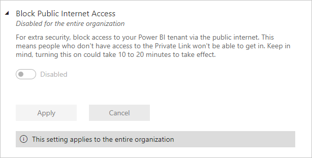

# Advanced networking tenant settings 

These settings are configured in the tenant settings section of the Admin portal. For information about how to get to and use tenant settings, see [About tenant settings](service-admin-portal-about-tenant-settings.md).

## Azure Private Link

## Block Public Internet Access

## Next steps

* [About tenant settings](service-admin-portal-about-tenant-settings.md)