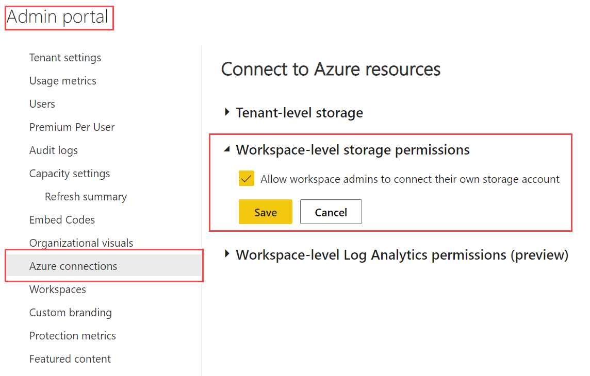

# Manage Azure connections (preview)

With Power BI you can store your dataflows in your organization's Azure Data Lake Storage Gen2 (ADLS Gen2) account. You can read about the benefits of this approach in [Reasons to use the ADLS Gen 2 workspace or tenant connection](../transform-model/dataflows/dataflows-azure-data-lake-storage-integration.md#reasons-to-use-the-adls-gen-2-workspace-or-tenant-connection).

The Azure connections admin settings has the following options:

* [Tenant-level storage](#tenant-level-storage) - Use to store dataflows in your organizations tenant settings. This setting can be configured if you want a central Data Lake storage place, or as a default storage place in addition to workspace level storage.

* [Workspace-level storage permissions](#workspace-level-storage-permissions) - Use to store dataflows in specific ADLS Gen 2 accounts, organized per workspace.

* [Workspace-level Log Analytics permissions]() - Use to 

[!INCLUDE[admin portal settings](../includes/admin-portal-settings.md)]

Go to the **Admin portal** to access this feature. For information about how to get to and use the Admin portal, see [About the Admin portal](service-admin-portal.md).

## Tenant-level storage

By default, data used with Power BI is stored in internal storage provided by Power BI. With the integration of dataflows and Azure Data Lake Storage Gen2 (ADLS Gen2), you can store your dataflows in your organization's Azure Data Lake Storage Gen2 account. For more information, see [Dataflows and Azure Data Lake integration (Preview)](../transform-model/dataflows/dataflows-azure-data-lake-storage-integration.md).

## Workspace-level storage permissions

By default, workspace admins can't connect their own storage account. This preview feature lets Power BI administrators turn on a setting that allows workspace admins to connect their own storage account.

To activate this feature, go to **Admin portal > Azure connections > Connect to Azure resources (preview) > Workspace-level storage permissions (preview)**, and check the **Allow workspace admins to connect their own storage account** checkbox.

## Next steps

>[!div class="nextstepaction"]
>[About the Admin portal](service-admin-portal.md)

>[!div class="nextstepaction"]
>[Configuring dataflow storage to use Azure Data Lake Gen 2](../transform-model/dataflows/dataflows-azure-data-lake-storage-integration.md)
