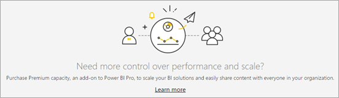

# Manage Capacity settings

Capacity is a dedicated set of resources reserved for exclusive use. Premium and Embedded capacities offer a dependable and consistent performance for your content. Here are some settings that you can configure when managing your organization's capacity settings:

* Creating new capacities

* Deleting capacities

* Managing capacity permissions

* Changing the size of the capacity

[!INCLUDE[Get to the admin settings](../includes/admin-portal-settings.md)]

## Power BI Premium

The **Power BI Premium** tab enables you to manage any Power BI Premium capacities (EM or P SKU) that have been purchased for your organization. All users within your organization can see the **Power BI Premium** tab, but they only see contents within it if they're assigned as either a *Capacity admin* or a user that has assignment permissions. If a user doesn't have any permissions, the following message appears:

To understand more about the concepts of capacity management, see [Managing Premium capacities](../enterprise/service-premium-capacity-manage-gen2.md).

The capacity management process is described in [Configure and manage capacities in Power BI Premium](../enterprise/service-admin-premium-manage.md).

## Power BI Embedded

The **Power BI Embedded** tab enables you to view your Power BI Embedded (A SKU) capacities that you've purchased for your customer. Because you can only purchase A SKUs from Azure, you [manage embedded capacities in Azure](../developer/embedded/azure-pbie-create-capacity.md) from **the Azure portal**.

For more information about Power BI Embedded, see:

* Power BI Embedded SKUs - [Capacity and SKUs in Power BI embedded analytics](../developer/embedded/embedded-capacity.md)

* Create a Power BI Embedded capacity in Azure  - [Create Power BI Embedded capacity in the Azure portal](../developer/embedded/azure-pbie-create-capacity.md)

* Scale a capacity in Azure - [Scale your Power BI Embedded capacity in the Azure portal](../developer/embedded/azure-pbie-scale-capacity.md)

* Pause and start a capacity Azure - [Pause and start your Power BI Embedded capacity in the Azure portal](../developer/embedded/azure-pbie-pause-start.md)

## Next steps

> [!div class="nextstepaction"]
> [About the Admin portal](service-admin-portal.md)
