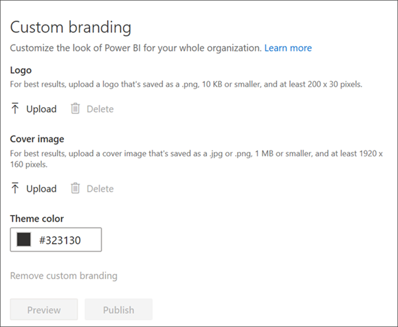

# Customize branding

Go to the **Admin portal** to access this feature. For information about how to get to and use the Admin portal, see [About the Admin portal](service-admin-portal.md).

As an administrator, you can customize the look of Power BI for your whole organization. Currently there are three main options:

* **Upload Logo**: For best results, upload a logo that's saved as a .png, 10 KB or smaller, and at least 200 x 30 pixels.

* **Upload Cover image**: For best results, upload a cover image that's saved as a .jpg or .png, 1 MB or smaller, and at least 1920 x 160 pixels.

* **Select Theme color**: You can select your theme based on a hex #, RGB, value, or from the provided palette.

For more information, see [Add custom branding to the Power BI service](service-admin-custom-branding.md).

## Next steps

* [About the Admin portal](service-admin-portal.md)