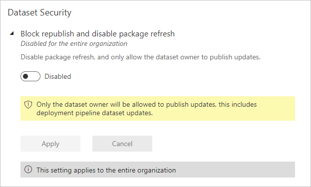

# Dataset Security tenant setting

These settings are configured in the tenant settings section of the Admin portal. For information about how to get to and use tenant settings, see [About tenant settings](service-admin-portal-about-tenant-settings.md).

## Block republish and disable package refresh

## Next steps

* [About tenant settings](service-admin-portal-about-tenant-settings.md)