# Export and sharing tenant settings

These settings are configured in the tenant settings section of the Admin portal. For information about how to get to and use tenant settings, see [About tenant settings](service-admin-portal-about-tenant-settings.md).

## Allow Azure Active Directory guest users to access Power BI

Enabling this setting allows Azure Active Directory Business-to-Business (Azure AD B2B) guest users to access Power BI. If you disable this setting, guest users receive an error when trying to access Power BI. Disabling this setting for the entire organization also prevents users from inviting guests to your organization. Use the specific security groups option to control which guest users can access Power BI.

## Invite external users to your organization

The **Invite external users to your organization** setting helps organizations choose whether new external users can be invited to the organization through Power BI sharing, permissions, and subscription experiences. If the setting is disabled, an external user who isn't already a guest user in the organization, can’t be added to the organization through Power BI.

:::image type="content" source="media/service-admin-portal-export-sharing/power-bi-invite-external-users.png" alt-text="Screenshot that shows the Invite external users to your organization setting.":::

> [!IMPORTANT]
> This setting was previously called “Share content with external users”. The revised name reflects more accurately what the setting does.

To invite external users to your organization, a user also needs the Azure Active Directory Guest Inviter role. This setting only controls the ability to invite through Power BI.

## Allow external guest users to edit and manage content in the organization

Azure AD B2B guest users can edit and manage content in the organization. [Learn more](../enterprise/service-admin-azure-ad-b2b.md)

The following image shows the option to Allow Azure Active Directory external guest users to edit and manage content in the organization.

:::image type="content" source="media/service-admin-portal-export-sharing/allow-external-guest-users-azure-ad.png" alt-text="Screenshot that shows the Allow Azure A D guest users to edit and manage content in the organization.":::

In the admin portal, you also control which users have permissions to invite external users to the organization. See [Share content with external users](service-admin-portal-export-sharing.md) in this article for details.

## Show Azure Active Directory guests in lists of suggested people

The **Show Azure Active Directory guests in lists of suggested people** setting helps organizations limit visibility of external users in sharing experiences. When disabled, Azure Active Directory (Azure AD) guest users are not shown in people picker suggested users lists. This helps prevent accidental sharing to external users and seeing which external users have been added to your organization through Power BI sharing UIs. 

> [!IMPORTANT]
> When the setting is set to disabled, you can still give permission to a guest user by providing their full email address in people pickers.
  

## Publish to web

As a Power BI admin, the **Publish to web** setting gives you options that let users create embed codes to publish reports to the web. This functionality makes the report and its data available to anyone on the web. Learn more about [publishing to the web](../collaborate-share/service-publish-to-web.md).

> [!NOTE]
> Only Power BI admins can allow creating new publish to web embed codes. Organizations may have existing embed codes. See the [Embed codes](service-admin-portal-embed-codes.md) section of the admin portal to review currently published reports.

You can find **Publish to web** under **File** > **Embed report** when the **Publish to web** setting is enabled.

:::image type="content" source="media/service-admin-portal-export-sharing/power-bi-embed-options.png" alt-text="Screenshot that shows the Publish to web option.":::

The **Publish to web** setting in the admin portal gives options for which users can create embed codes.

Admins can set **Publish to web** to **Enabled** and **Choose how embed codes work** to **Allow only existing embed codes**. In that case, users can create embed codes, but they have to contact the Power BI admin to allow them to do so.

Users see different options in the UI based on what the **Publish to web** setting is.

|Feature |Enabled for entire organization |Disabled for entire organization |Specific security groups   |
|---------|---------|---------|---------|
|**Publish to web** under report **More options (...)** menu|Enabled for all|Not visible for all|Only visible for authorized users or groups.|
|**Manage embed codes** under **Settings**|Enabled for all|Enabled for all|Enabled for all  * **Delete** option only for authorized users or groups. * **Get codes** enabled for all.|
|**Embed codes** within admin portal|Status has one of the following values: * Active * Not supported * Blocked|Status displays **Disabled**|Status has one of the following values: * Active * Not supported * Blocked  If a user isn't authorized based on the tenant setting, status displays **infringed**.|
|Existing published reports|All enabled|All disabled|Reports continue to render for all.|

## Copy and paste visuals

Users in the organization can copy visuals from a tile or report visual and paste them as static images into external applications.

## Export to Excel

Users in the organization can export the data from a visualization to an Excel file.

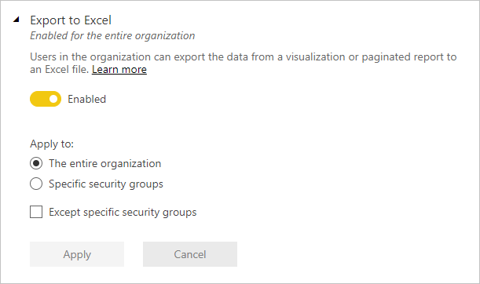

## Export to .csv

Users in the organization can export data from a tile, visualization, or paginated report to a .csv file.

## Download reports

Users in the organization can download .pbix files and paginated reports.

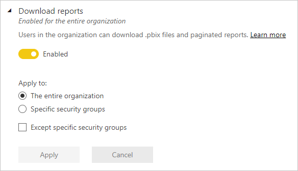

## Users can work with Power BI datasets in Excel using a live connection

Users can export data to Excel from a Power BI visual or dataset, or export a dataset to an Excel workbook with Analyze in Excel, both options with a live connection to the XMLA endpoint.

:::image type="content" source="media/service-admin-portal-export-sharing/tenant-settings-live-connection.png" alt-text="Screenshot showing Users can work with Power BI datasets in Excel using a live connection.":::

## Allow live connections

Users in the organization can use Power BI service Live Connect. Allowing live connections also allows users to Analyze in Excel.

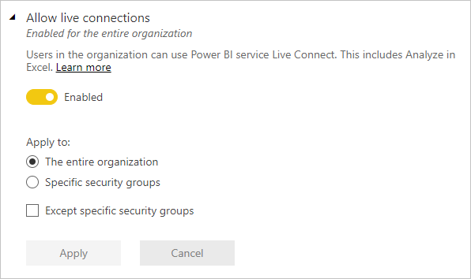

## Export reports as PowerPoint presentations or PDF documents

Users in the organization can export reports as PowerPoint files or PDF documents.

## Export reports as MHTML documents

Users in the organization can export Paginated reports as MHTML documents.

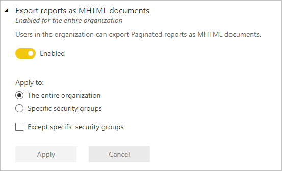

## Export reports as Word documents

Users in the organization can export Paginated reports as Word documents.

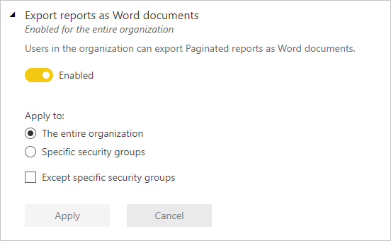

## Export reports as XML documents

Users in the organization can export Paginated reports as XML documents.

:::image type="content" source="media/service-admin-portal-export-sharing/powerbi-admin-portal-export-xml-setting.png" alt-text="Screenshot of export to XML setting.":::

## Export reports as image files

Users in the organization can use the export report to file API to export reports as image files.

:::image type="content" source="media/service-admin-portal-export-sharing/powerbi-admin-portal-export-as-image-setting.png" alt-text="Screenshot of export as image setting.":::

## Print dashboards and reports

## Certification

Allow users in this org to certify datasets, dataflows, reports, and apps. See [Enable content certification](service-admin-setup-certification.md) for details.

## Create email subscriptions

Users can create email subscriptions to reports and dashboards. Learn more about [subscriptions](/power-bi/collaborate-share/end-user-subscribe).

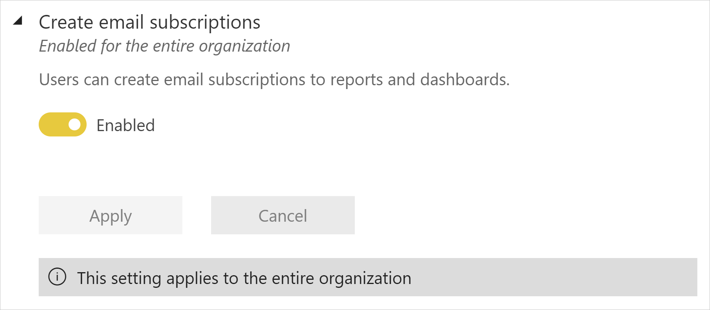

## Allow email subscriptions to be sent to external users 

The **Allow email subscriptions to be sent to external users** setting helps organizations choose whether external users can be included as recipients of email subscriptions.

External users are users outside of the organization that have not been added as Azure Active Directory business-to-business (B2B) guest users. If this setting is turned off, an external user who isn't already a guest user in the organization can't be included as a recipient of an email subscription.

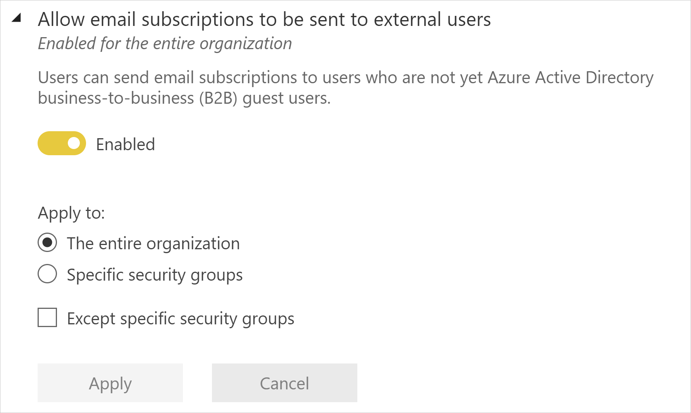

## Featured content

By default, anyone with the Admin, Member, or Contributor role in a workspace in your organization can feature content on Power BI Home. See [Feature content on colleagues' Power BI Home page](../collaborate-share/service-featured-content.md) for details.

This setting enables you enable/disable the ability of users in your organization to promote their published content to the **Featured** section of the Power BI Home page.

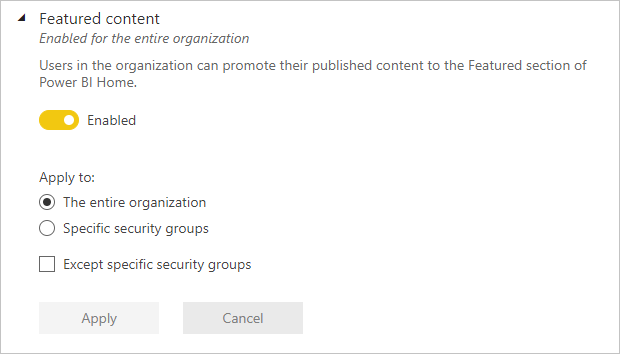

Featured content can be managed on the **Featured content** page in the Admin portal. See [Manage featured content](service-admin-portal-featured-content.md).

## Allow connections to featured tables

This setting lets Power BI admins control who in the organization can use featured tables in the Excel Data Types Gallery. 

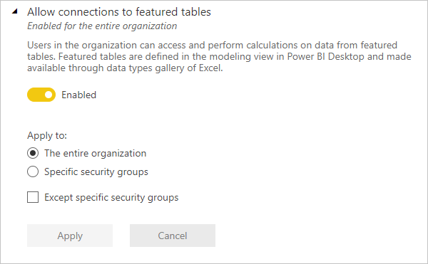

>[!NOTE]
>Connections to featured tables are also disabled if the [Allow live connections](service-admin-portal-export-sharing.md#allow-live-connections) setting is set to Disabled.

Read more about [Power BI featured tables in Excel](../collaborate-share/service-excel-featured-tables.md).

## Microsoft Teams integration in the Power BI service

This setting allows organizations to access features that work with Microsoft Teams and the Power BI service. These features include launching Teams experiences from Power BI like chats, the Power BI app for Teams, and getting Power BI notifications from Teams. To completely enable or disable Teams integration, work with your Teams admin.

:::image type="content" source="media/service-admin-portal-export-sharing/power-bi-enable-teams-integration.png" alt-text="Screenshot that shows the Microsoft Teams integration tenant setting in the Power B I admin portal.":::

Read more about [collaborating in Microsoft Teams with Power BI](../collaborate-share/service-collaborate-microsoft-teams.md).

## Install the Power BI app for Teams automatically

Automatic installation makes it easier to install the Power BI app for Microsoft Teams, without needing to change Microsoft Teams app setup policies. This change speeds up the installation and removes admin hassles of configuring and maintaining infrastructure needed by an app setup policy.

The **Install Power BI app for Microsoft Teams automatically** tenant setting is added to the Power BI admin portal so Power BI admins can control the auto-install behavior. By default, the auto-install is enabled.

The automatic installation happens for a user under the following conditions: 

- The Power BI app for Microsoft Teams is set to **Allowed** in the Microsoft Teams admin portal.
- The Power BI tenant setting **Install Power BI app for Microsoft Teams automatically** is **Enabled**. 
- The user has a Microsoft Teams license.
- The user opens the Power BI service (e.g. app.powerbi.com) in a web browser.

Initially, auto-install applies to new users the first time they visit the Power BI service in a web browser. Automatic installation will start occurring after November 1, 2021 for users who visit the Power BI service and meet the criteria.

When auto-install occurs, users see the following notification in the Power BI service notification pane.

:::image type="content" source="../collaborate-share/media/service-microsoft-teams-app/teams-auto-install-notification.png" alt-text="Notification that the Microsoft Teams app was automatically installed.":::

Read more about the [Power BI app for Microsoft Teams](../collaborate-share/service-microsoft-teams-app.md).

## Enable Power BI add-in for PowerPoint

The Power BI add-in for PowerPoint makes it possible for users to add live, interactive data from Power BI to a PowerPoint presentation. See [About the Power BI add-in for PowerPoint](../collaborate-share/service-power-bi-powerpoint-add-in-about.md) for more detail.

When this setting is enabled (default), entry points for opening a new PowerPoint presentation with the add-in already loaded are available in Power BI. When this setting is disabled, the entry points in Power BI are unavailable.

>[!NOTE]
> Disabling this setting does not prevent people from using the add-in starting from PowerPoint. To completely block adding live Power BI report pages to PowerPoint slides using the add-in, the add-in must be disabled in both Power BI and PowerPoint.

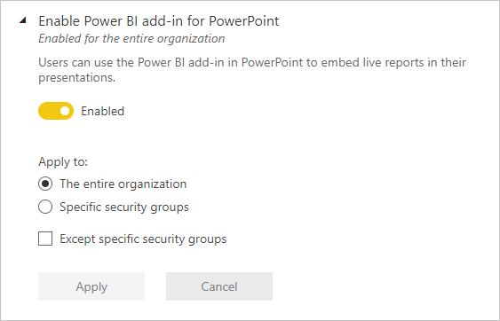

## Allow shareable links to grant access to everyone in your organization
This tenant setting is available for admins looking to disable creating shareable links to **People in your organization**. You can find this option in the Admin portal by navigating to **Tenant settings** > **Export and sharing settings** > **Allow shareable links to grant access to everyone in your organization**.

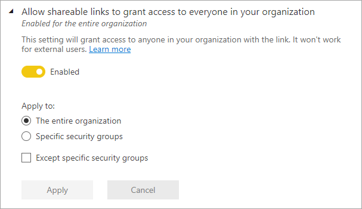

As with other tenant settings, you can enable sharing links to **People in your organization** for:
- **The entire organization**
- **Specific security groups**
- Or **Except specific security groups**

If this setting is disabled for a user with share permissions to a report, that user can only share the report via link to **Specific people** or **People with existing access**.

## Allow DirectQuery connections to Power BI datasets

When this setting is enabled (default), users can use DirectQuery to connect to Azure Analysis Services or Power BI datasets. See [Using DirectQuery for Power BI datasets and Azure Analysis Services](../connect-data/desktop-directquery-datasets-azure-analysis-services.md) for more detail.

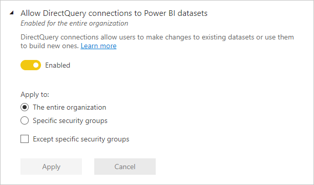

Disabling this switch effectively stops users from publishing new composite models on Power BI datasets to the service. Existing reports that leverage a composite model on a Power BI dataset will continue to work, and users will still be able to create composite models using Desktop, but they will not be able to publish to the service.

>[!NOTE]
> Live connections to Power BI datasets are not affected by this switch, nor are live or DirectQuery connections to Azure Analysis Services. These will continue to work regardless of whether the setting is enabled or disabled. In addition, any published reports that leverage a composite model on a Power BI dataset will continue to work even if the setting has been disabled after they were published.

## Allow guest users to work with shared datasets in their own tenants

When this setting is turned on, Azure AD B2B guest users of datasets shared with them by users in your organization will be able to access and build on those datasets in their own tenant. See [Use in-place dataset sharing to enable external users to view and share datasets in their own tenants (preview) - Admin info](../collaborate-share/service-dataset-external-org-share-admin.md) for detailed information.

## Allow specific users to turn on external data sharing

As a Power BI admin, you can specify which users or user groups in your organization can share datasets externally with guests from a different tenant through the in-place mechanism. Disabling this setting prevents any user from sharing datasets externally by blocking the ability of users to turn on external sharing for datasets they own or manage.  See [Use in-place dataset sharing to enable external users to view and share datasets in their own tenants (preview) - Admin info](../collaborate-share/service-dataset-external-org-share-admin.md) for detailed information.

## Next steps

* [About tenant settings](service-admin-portal-about-tenant-settings.md)