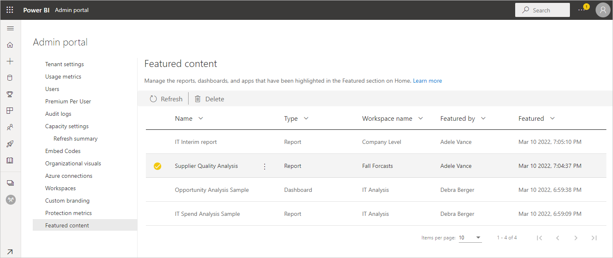

# Manage featured content

If the *featured content* feature is enabled in your organization, users can feature content in the **Featured** section of the Power BI Home page. See [Feature content on colleagues' Power BI Home page](../collaborate-share/service-featured-content.md) for details.

As a Power BI admin, you can monitor this featured content and remove it from the **Featured** section if necessary. You can also disable the featured content feature entirely, in which case users will no longer be able to feature content. See [Enable/disable featured content](#enabledisable-featured-content) below.

## Monitor and manage featured content

In the [Admin portal](service-admin-portal.md), select **Featured content**.

Here you see a list of all featured items along with their relevant metadata. If something looks suspicious, or you want to clean up the **Featured** section, you can delete featured items as needed.

To delete an item, mouseover and select the item, and then click the trash can that appears in the top ribbon, or choose **More options (...) > Delete**. It is possible to select multiple items and then delete.

## Enable/disable featured content

The featured content feature is enabled, disabled, and configured (for example, specifying who can feature content) via an admin setting. See [Featured content](/fabric/admin/service-admin-portal-export-sharing#featured-content) for detail.

## Next steps

* [Enable/disable featured content](/fabric/admin/service-admin-portal-export-sharing#featured-content)
* [Feature content on colleagues' Power BI Home page](../collaborate-share/service-featured-content.md)
* [About the Admin portal](service-admin-portal.md)