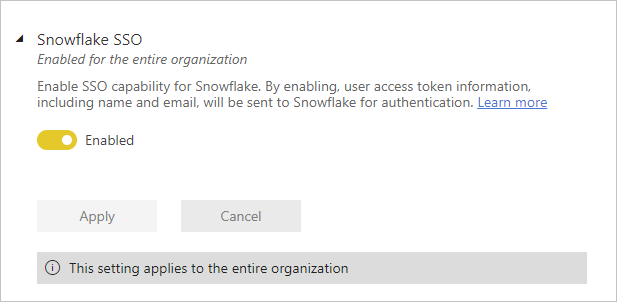

# Integration tenant settings

These settings are configured in the tenant settings section of the Admin portal. For information about how to get to and use tenant settings, see [About tenant settings](service-admin-portal-about-tenant-settings.md).

## Allow XMLA endpoints and Analyze in Excel with on-premises datasets

When enabled, users in the organization can use Excel to view and interact with on-premises Power BI datasets. This also allows connections to XMLA endpoints. Learn more about [analyzing in Excel](../collaborate-share/service-analyze-in-excel.md).

:::image type="content" source="media/service-admin-portal-integration/admin-integration-allow-xmla-endpoints-setting.png" alt-text="Screenshot of the allow XMLA endpoints and analyze in Excel with on-premises datasets admin setting.":::

## Use ArcGIS Maps for Power BI

When enabled, users in the organization can use the ArcGIS Maps for Power BI visualization provided by Esri. Learn more about [ArcGIS maps](../visuals/power-bi-visualizations-arcgis.md).

:::image type="content" source="media/service-admin-portal-integration/admin-integration-use-arcgis-maps-setting.png" alt-text="Screenshot of the use arc gis maps for power BI admin setting.":::

## Use global search for Power BI

When enabled, users in the organization can use external search features that rely on Azure Search. See [Navigation for Power BI business users: global search](../consumer/end-user-search-sort.md) for more information.

:::image type="content" source="media/service-admin-portal-integration/admin-integration-use-global-search-setting.png" alt-text="Screenshot of the use global search for power BI admin setting.":::

## Use Azure Maps Visual

When enabled, users in the organization can use the Azure Maps visual for Power BI. See [Get started with Azure Maps Power BI visual](/azure/azure-maps/power-bi-visual-get-started) for more information.

:::image type="content" source="media/service-admin-portal-integration/admin-integration-use-azure-maps-visual-setting.png" alt-text="Screenshot of the Use Azure Maps visual admin setting.":::

## Map and filled map visuals

When enabled, users in the organization can use map and filled map visualizations in their reports.

:::image type="content" source="media/service-admin-portal-integration/admin-integration-map-filled-map-visuals-setting.png" alt-text="Screenshot of the map and filled map visuals admin setting.":::

## Integration with SharePoint and Microsoft Lists

Users in the organization can create Power BI reports directly from SharePoint and Microsoft Lists. Then they can build Power BI reports on the data in those lists and publish them back to the lists, to be visible to others who can access the list. This setting is in **Tenant settings** > **Integration settings**.

:::image type="content" source="media/service-admin-portal-integration/admin-integration-sharepoint-lists.png" alt-text="Allow integration with SharePoint and Microsoft Lists.":::

This feature is on by default. Even if the feature is disabled, in SharePoint and Microsoft Lists users will still see **Power BI** > **Visualize the list**, and any existing Power BI reports, on the **Integrate** menu. If they select **Visualize the list**, they go to an error page explaining that their admin has disabled the feature.

Learn more about [creating reports from SharePoint and Microsoft Lists](../create-reports/service-quick-create-sharepoint-list.md).

## Snowflake (SSO)

For dataset owners to be able to enable single sign-on for DirectQuery connections to Snowflake in dataset settings, a Power BI admin must enable the **Snowflake SSO** setting. This setting approves sending Azure AD credentials to Snowflake for authentication for the entire organization. See [Connect to Snowflake in Power BI Service](../connect-data/service-connect-snowflake.md) for more detail.

## Azure AD single sign-on (SSO) for Gateway

This setting enables Azure Active Directory (Azure AD) single sign-on (SSO) through on-premises data gateways to cloud data sources that rely on Azure AD-based authentication. It gives seamless Azure AD SSO connectivity to Azure-based data sources, such as Azure Synapse Analytics (SQL DW), Azure Data Explorer, Snowflake on Azure, and Azure Databricks through an on-premises data gateway.

This feature is important for users who work with reports that require SSO connectivity in DirectQuery mode to data sources deployed in an Azure virtual network (Azure VNet). When you configure SSO for an applicable data source, queries execute under the Azure AD identity of the user that interacts with the Power BI report.

An important security-related consideration is that gateway owners have full control over their on-premises data gateways. This means that it's theoretically possible for a malicious gateway owner to intercept Azure AD SSO tokens as they flow through an on-premises data gateway (this isn't a concern for VNet data gateways because they're maintained by Microsoft). 

Because of this possible threat, the Azure AD single sign-on feature is disabled by default for on-premises data gateways. As a Power BI admin, you must enable the **Azure AD Single Sign-On (SSO) for Gateway** tenant setting (shown below) in the Power BI admin portal before data sources can be enabled for Azure AD SSO on an on-premises data gateway. Before enabling the feature, make sure to restrict the ability to deploy on-premises data gateways in your organization to appropriate administrators.  

## Power Platform Solutions Integration (Preview)

This setting enables the Power BI/Power Platform Solutions integration from the Power BI side (admin settings also have to be turned on in Power Platform). When the integration is enabled, when Power BI components are created in a Power Apps solution, a special Power BI workspace dedicated to the Power Apps environment is created in Power BI to store copies of the Power BI report and dataset that are being to create the component. For more detail, see [Power BI content management in Power Apps solutions](/power-apps/maker/model-driven-apps/power-bi-content-management-power-apps-solutions) and [About Power BI in Power Apps Solutions](../collaborate-share/service-power-bi-powerapps-integration-about.md).

This setting is on by default. To change the setting, go to the Power BI Admin portal, select **Tenant settings > Integration settings > Power Platform Solutions Integration (Preview)**, and set the toggle as desired.

## Power Platform interregional access

When this setting and the Power Platform Power BI components setting **Allow information sharing between this environment and Power BI workspaces in other geographic regions** (see [Manage feature settings](/power-platform/admin/settings-features)) are **ON**, information sharing between Power BI workspaces and Power Platform environments in other geographic regions is allowed. For more information, see [Cross-geo operations](../collaborate-share/service-power-bi-powerapps-integration-considerations.md#cross-geo-operations).

This setting is on by default. To change the setting, go to the Power BI Admin portal, select **Tenant settings > Integration settings > Power Platform interregional access**, and set the toggle as desired.

> [!NOTE]
> Cross-geo operations in the Power BI/Power Apps solutions integration are allowed only when both this setting and the Power Platform setting are **ON**.

## Users can view Power BI items saved in OneDrive and SharePoint (Preview)
This setting allows users to view Power BI files saved in OneDrive for Business and SharePoint Online document libraries in their browser without needing to download the file and open in Power BI Desktop on their local machine. When enabled, the setting applies to all users in your organization. 

Learn more about [viewing Power BI files saved in OneDrive and SharePoint](../collaborate-share/service-sharepoint-viewer.md).

:::image type="content" source="media/service-admin-portal-integration/admin-integration-viewer.png" alt-text="Screenshot of admin setting called: Users can view Power BI items saved in OneDrive and SharePoint.":::

This setting is **off** by default. To change the setting, go to the Power BI Admin portal, select **Tenant settings > Integration settings > Users can view Power BI items saved in OneDrive and SharePoint (Preview)**, and set the toggle as desired.

## Users can share links to Power BI files stored in OneDrive and SharePoint through Power BI Desktop
Users can share links to Power BI Desktop files (.pbix) saved to OneDrive and SharePoint through Power BI Desktop. Sharing uses standard OneDrive and SharePoint sharing functionality. When enabled, this setting applies to all users in your organization. 

:::image type="content" source="media/service-admin-portal-integration/admin-integration-desktop-sharing.png" alt-text="Screenshot of admin setting called: Users can share links to Power BI files stored in OneDrive and SharePoint through Power BI Desktop.":::

During public preview, if a user has enabled share through the Power BI Desktop menu, but the admin setting is disabled for the tenant, a **Share** button will still appear in Power BI Desktop, but the user will be notified that the capability is disabled when they attempt to share. 

This setting is **on** by default. To change the setting, go to the Power BI Admin portal, select **Tenant settings > Integration settings > Users can share links to Power BI files stored in OneDrive and SharePoint through Power BI Desktop**.

## Next steps

* [About tenant settings](service-admin-portal-about-tenant-settings.md)
