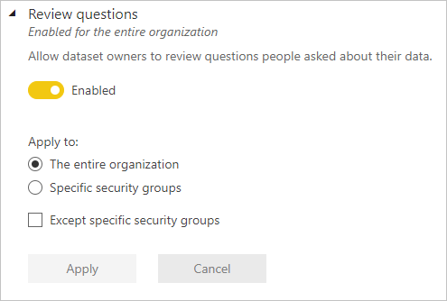

# Q&A tenant settings

These settings are configured in the tenant settings section of the Admin portal. For information about how to get to and use tenant settings, see [About tenant settings](service-admin-portal-about-tenant-settings.md).

## Review questions
When this setting is enabled, dataset owners can review questions end-users ask about their data.

## Synonym sharing
When this setting is enabled, users can share Q&A synonyms as suggested terms with everyone in your organization.

> [!NOTE]
> If you disable this setting and apply the changes, and then later re-enable synonym sharing, it might take a few weeks to reshare all the synonyms within your organization.

## Next steps

* [About tenant settings](service-admin-portal-about-tenant-settings.md)