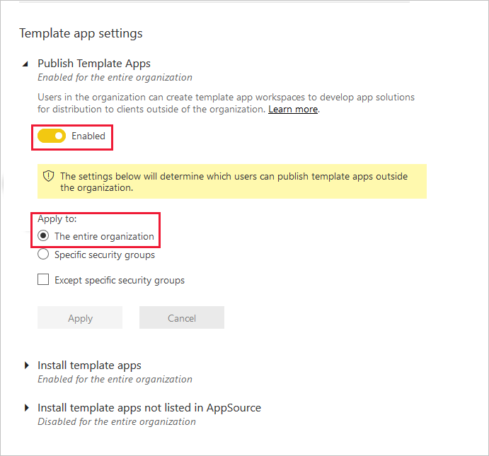
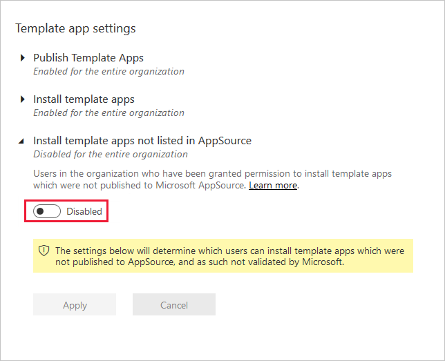

# Template app tenant settings

These settings are configured in the tenant settings section of the Admin portal. For information about how to get to and use tenant settings, see [About tenant settings](service-admin-portal-about-tenant-settings.md).

Three settings control template apps ability to publish or install template apps.

:::image type="content" source="media/service-admin-portal-template-app/template-app-settings.png" alt-text="Screenshot that shows the Power B I admin portal template app settings.":::

## Publish Template Apps

Users in the organization can create template apps workspaces. Control which users can publish template apps or distribute them to clients outside your organization by way of [AppSource](https://appsource.microsoft.com) or other distribution methods.

## Install template apps listed on AppSource

Users in the organization can download and install template apps **only** from [AppSource](https://appsource.microsoft.com). Control which specific users or security groups can install template apps from AppSource.

:::image type="content" source="media/service-admin-portal-template-app/power-bi-install-template-apps-settings.png" alt-text="Screenshot that shows the Install template apps setting.":::

## Install template apps not listed on AppSource

Control which users in the organization can download and install template apps **not listed on [AppSource](https://appsource.microsoft.com)**.

## Next steps

* [About tenant settings](service-admin-portal-about-tenant-settings.md)