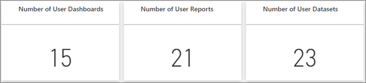
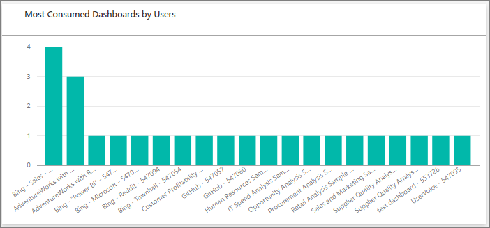
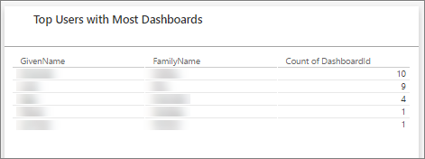

# View usage metrics

The *usage metrics* page in the Power BI admin settings allows you to monitor Power BI usage for your organization. It also shows which users and groups in your organization are the most active in Power BI. With this information, you can get real insights into how people are using Power BI across your organization.

[!INCLUDE[get to the admin settings](../includes/admin-portal-settings.md)]

## Usage metrics dashboard

The first time you access the dashboard, or when you revisit after a long period of not viewing the dashboard, you might see a loading screen before the dashboard appears. After the dashboard loads, you see two sections of tiles. The first section, at the top of the page, includes usage data for individual users. The second section, at the bottom of the page, has similar information for groups. This section lets you see which groups in your organization are most active and what kind of content they're consuming.

The following sections of the article show a breakdown of what you can see in each tile.

### Number of users

This tile is in the first section of the report. It shows a distinct count of all dashboards, reports, and datasets in a workspace, and it refers to users. The second section of the report contains a similar tile that refers to groups.
  

### Consumed dashboards

This tile shows a list of the most consumed dashboards. The tile in the first section refers to the number of users who consumed the dashboards. The report's second section has a similar tile that refers to the number of groups. For example, if you have a dashboard that you shared with three users and you also added it to an app that two different users connected to, the dashboard's count would be six: you, three shared users, and two app users.
  

### Consumed packages

This tile shows a breakdown of the most popular content. The tile in the first section shows content users connected to. The report the second section shows a tile that displays content groups connected to. The content includes anything the users could reach using the Get Data process, such as SaaS template apps, files, or databases.

### Top users or groups based on dashboards

This tile shows a view of your top users based on how many dashboards they have. Each entry includes dashboards they created themselves and dashboards shared with them. The report in the second section shows a tile that displays top groups based on the number of dashboards they have.
  

### Top users or groups based on reports

This tile shows a view of your top users based on how many reports they have. The report in the second section shows a tile that displays top groups based on the number of reports they have.
  

## Next steps

>[!div class="nextstepaction"]
>[About the admin portal](service-admin-portal.md)
