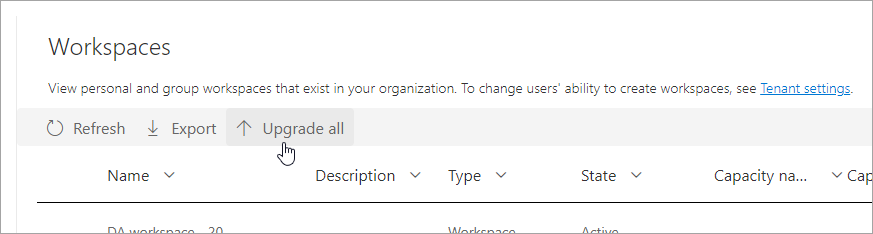

# View workspaces

Go to the **Admin portal** access this feature. For information about how to get to and use the Admin portal, see [About the Admin portal](service-admin-portal.md).

As an administrator, you can view the workspaces that exist in your organization on the **Workspaces** tab. On this tab, you can perform these actions:

- Refresh the list of workspaces and their details.
- Export the data about the workspaces to a .csv file. 
- See details about a workspace, including its ID, its users and their roles, and its dashboards, reports, and datasets.
- Edit the list of people who have access. This means you can delete the workspace. You can add yourself to a workspace as an admin, then open the workspace and delete it.
- Edit the Name and Description fields.
- Upgrade classic workspaces to the new workspace experience

:::image type="content" source="media/service-admin-portal-workspaces/power-bi-workspaces-admin-portal.png" alt-text="Screenshot that shows a Power B I workspaces list in the admin portal.":::

Admins can also control users' ability to create new workspace experience workspaces, and classic workspaces. See [Workspace settings](service-admin-portal.md#workspace-settings) in this article for details.

The table columns on the **Workspaces** tab correspond to the properties returned by the [Power BI admin Rest API](/rest/api/power-bi/admin) for workspaces. Personal workspaces are of type **PersonalGroup**, classic workspaces are of type **Group**, and the new workspace experience workspaces are of type **Workspace**. For more information, see [The new workspaces](../collaborate-share/service-new-workspaces.md).

On the **Workspaces** tab, you see the *state* for each workspace. The following table gives more details about the meaning of those states.

|State  |Description  |
|---------|---------|
| **Active** | A normal workspace. It doesn't indicate anything about usage or what's inside, only that the workspace itself is "normal". |
| **Orphaned** | A workspace with no admin user. Please assign an admin. |
| **Deleted** | A deleted workspace. A Power BI administrator can restore the workspace up to 90 days after it was deleted. When the 90 days pass, the workspace enters the *Removing* state. If you delete a *MyWorkspace* workspace, it moves to the *Removing* state immediately, without the 90 days grace period. |
| **Removing** | After deleting a workspace, and once the 90 day grace period passes, the workspace moves into the *Removing* state. During this state the workspace is permanently removed. Permanently removing a workspace takes a short while, and depends on the service and folder content. |
| **Not found** | If the customer's API request includes a workspace ID for a workspace that doesn't belong to the customer's tenant, "Not found" is returned as the status for that ID. |

Admins can also manage and recover workspaces, using either the admin portal or PowerShell cmdlets.

_Selecting one or more workspaces for upgrade._

## Upgrade workspaces

Admins can upgrade classic workspaces to the new workspace experience. Admins can select one or more workspaces with Type **Group** to upgrade or use **Upgrade all** to queue up upgrade of all **Group** workspaces. Upgrades are queued and executed asynchronously. It may take several minutes to several days to complete all **Pending** upgrades because the overall rate of admin-initiated upgrades is limited to keep the service running smoothly. The **Workspace upgrade status** column helps admins track the progress of the admin-initiated upgrades. Admins can cancel admin-initiated upgrades when they are **Pending**. To upgrade a workspace immediately, contact the Workspace Admin and have them start the upgrade through the workspace settings pane. Learn more about [workspace upgrade](../collaborate-share/service-upgrade-workspaces.md) before starting your Power BI admin-initiated workspace upgrade.

_Upgrade all queues up all workspaces for upgrade._

The following table gives more details about the status of the upgrade.

|Status  |Description  |
|---------|---------|
| **(Blank)** | The workspace is not being upgraded by a Power BI admin. |
| **Pending** | The workspace is queued to be upgraded. The upgrade can be canceled. |
| **In Progress** | The workspace is actively being upgraded. The upgrade can't be canceled. |
| **Failed** | The workspace failed because of a validation rule. Power BI has released and will continue to release fixes for upgrade failures, please retry any 'Failed' upgrades. |
| **Completed** | The workspace was upgraded in the last 30 days by a Power BI admin. A workspace admin can go back to classic option during the 30-day period after the workspace was upgraded. |

### Limitations to upgrading workspaces

There are a few limitations to upgrading workspaces, such as those listed here. Learn more about [upgrading workspaces](../collaborate-share/service-upgrade-workspaces.md) before attempting an upgrade.

- If the admin for a workspace hasn't accessed Power BI recently (in the last 14 days), the upgrade may fail. Have the workspace admin access Power BI or change to a different admin before trying to upgrade.
- If the group associated with the workspace doesn't have a group owner in Azure Active Directory or Microsoft 365, the upgrade may fail. Assign a group owner in Azure Active Directory or Microsoft 365 before upgrading.
- As noted above, please check for **Orphaned** workspaces after upgrade and be sure to assign an admin to those workspaces. Power BI Admins may use filters from the Admin Portal to find Orphaned workspaces and assign admins one by one or in bulk.

_Helpful tip: Use text filters from column headers to find the workspaces you want to take action on, like finding Orphaned workspaces to assign admins to._

## Next steps

* [About the Admin portal](service-admin-portal.md)