# Administering Power BI in the admin portal

The admin portal includes settings that govern Power BI for all users in your organization. For example, in the admin portal you can view usage metrics, access  the Microsoft 365 admin center, and control how users interact with Power BI.

The full admin portal can be accessed by global admins and users who have the Power BI Administrator role. If you're not in one of these roles, you only see **Capacity settings** in the portal. For more information about the Power BI service administrator role, see [Understanding the Power BI admin role](service-admin-role.md).

## How to get to the admin portal

You have to be a global admin or Power BI service admin to access the Power BI admin portal. For more information about the Power BI service administrator role, see [Understanding the Power BI admin role](service-admin-role.md). To get to the Power BI admin portal, follow these steps:

1. Sign in to [Power BI](https://app.powerbi.com) using your admin account credentials.

1. From the page header, select **...** > **Settings** > **Admin portal**.

   :::image type="content" source="media/service-admin-portal/power-bi-settings-menu.png" alt-text="Settings menu with admin portal selected.":::

There are many sections in the Admin portal. The rest of this article provides information about each of these sections.

   :::image type="content" source="media/service-admin-portal/power-bi-admin-portal-menu-2021.png" alt-text="Screenshot that shows the Admin portal menu.":::

* [Usage metrics](#usage-metrics)
* [Users](#users)
* [Premium per user](#premium-per-user)
* [Audit logs](#audit-logs)
* [Tenant settings](#tenant-settings)
* [Capacity settings](#capacity-settings)
* [Embed codes](#embed-codes)
* [Organizational visuals](organizational-visuals.md#organizational-visuals)
* [Azure connections](#azure-connections)
* [Workspaces](#workspaces)
* [Custom branding](#custom-branding)
* [Protection metrics](#protection-metrics)
* [Featured content](#featured-content)

## Usage metrics

**Usage metrics** let you monitor Power BI usage for your organization. It also shows which users and groups in your organization are the most active in Power BI.

> [!NOTE]
> The first time you access the dashboard, or after you visit again after a long period of not viewing the dashboard, you'll likely see a loading screen while we load the dashboard.

After the dashboard loads, you see two sections of tiles. The first section includes usage data for individual users and the second section has similar information for groups.

Here's a breakdown of what you can see in each tile:

* Distinct count of all dashboards, reports, and datasets in the user workspace.
  
    


* Most consumed dashboard by number of users who can access it. For example: You have a dashboard that you shared with three users. You also added the dashboard to a content pack that two different users connected to. The dashboard's count would be 6 (1 + 3 + 2).
  
    

* The most popular content users connected to. The content would be anything the users could reach through the Get Data process, such as SaaS content packs, Organizational content packs, files, or databases.

  
    

* A view of your top users based on how many dashboards they have, both dashboards they created themselves and dashboards shared to them.
  
    

* A view of your top users based on how many reports they have.
  
    

The second section shows the same type of information, but based on groups. This section lets you see which groups in your organization are most active and what kind of content they're consuming.

With this information, you can get real insights into how people are using Power BI across your organization.

## Control usage metrics

Usage metrics reports are a feature that the Power BI or global administrator can turn on or off. Administrators have granular control over which users have access to usage metrics. They are **On** by default for all users in the organization.

Admins can also determine whether content creators can see per-user data in usage metrics. 

See [Monitor usage metrics for Power BI dashboards and reports](../collaborate-share/service-usage-metrics.md) for details about the reports themselves.

### Usage metrics for content creators

1. In the Admin portal, select **Tenant settings** > **Audit and usage settings** > **Usage metrics for content creators**.

    :::image type="content" source="media/service-admin-portal/admin-portal-usage-metrics.png" alt-text="Screenshot that shows the Admin portal tenant settings usage metrics.":::

1. Enable (or disable) usage metrics > **Apply**.

    :::image type="content" source="media/service-admin-portal/power-bi-usage-metrics-content-creators.png" alt-text="Screenshot that shows the Usage metrics for content creators setting enabled.":::

### Per-user data in usage metrics for content creators

By default, per-user data is enabled for usage metrics, and account information is included in the metrics report. If you don't want to include account information for some or all users, disable the feature for specified security groups or for an entire organization. Account information then shows in the report as *Unnamed*.

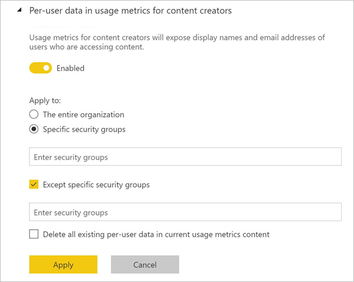

### Delete all existing usage metrics content

When disabling usage metrics for their entire organization, admins can also choose one or both options to:

- **Delete all existing usage metrics content** to delete all existing reports and dashboard tiles that were built using the usage metrics reports and datasets. This option removes all access to usage metrics data for all users in the organization who may already be using it.
- **Delete all existing per-user data in current usage metrics content** to remove all access to per-user data for all users in the organization who may already be using it.

Be careful, because deleting existing usage and per-user metrics content is irreversible.

## Users

You manage Power BI users, groups, and admins in the Microsoft 365 admin center. The **Users** tab provides a link to the admin center.


## Premium per user

Premium per user is a new way to license Premium features on a per user basis. After at least one user is assigned a Premium per user license, the associated features can be turned on in any workspace. Admins can manage the auto refresh and dataset workload settings that are shown to users and their default values. For example, access to the XMLA Endpoint can be turned off, set to read-only, or set to read-write.

   :::image type="content" source="media/service-admin-portal/premium-per-user-options.png" alt-text="Premium per user settings.":::

Reference [Power BI Premium Per User FAQ (preview)](service-premium-per-user-faq.yml) to learn more about this licensing model.

## Audit logs

You manage Power BI audit logs in the Office 365 Security & Compliance center. The **Audit logs** tab provides a link to the Security & Compliance center. To learn more, see [Track user activities in Power BI](service-admin-auditing.md).

To use audit logs, make sure the [**Create audit logs for internal activity auditing and compliance**](#create-audit-logs-for-internal-activity-auditing-and-compliance) setting is enabled.

## Tenant settings

**Tenant settings** enable fine-grained control over the features that are made available to your organization. If you have concerns around sensitive data, some of our features may not be right for your organization, or you may only want a particular feature to be available to a specific group.

> [!NOTE]
> Tenant settings that control the availability of features in the Power BI user interface can help to establish governance policies, but they're not a security measure. For example, the **Export data** setting doesn't restrict the permissions of a Power BI user on a dataset. Power BI users with read access to a dataset have the permission to query this dataset and might be able to persist the results without using the **Export data** feature in the Power BI user interface.

The following sections elaborate on the settings on the **Tenant settings** tab.

> [!NOTE]
> It can take up to 15 minutes for a setting change to take effect for everyone in your organization.

Many of the settings can have one of three states:

* **Disabled for the entire organization**: No one in your organization can use this feature.

    

* **Enabled for the entire organization**: Everyone in your organization can use this feature.

    

* **Enabled for a subset of the organization**: Specific security groups in your organization are allowed to use this feature.

    You can also enable a feature for your entire organization, **Except specific security groups**.

    

    You can also combine settings to enable the feature only for a specific group of users and also disable it for a group of users. Using this approach ensures that certain users don't have access to the feature even if they're in the allowed group. The most restrictive setting for a user applies.

    

The next few sections provide an overview of the different types of tenant settings.

## Help and support settings

### Publish "Get Help" information

  :::image type="content" source="media/service-admin-portal/publish-get-help.png" alt-text="Screen capture showing interface for Publish get help information.":::

Admins can specify internal URLs to override the destination of links on the Power BI help menu and for license upgrades. If custom URLs are set, users in the organization go to internal help and support resources instead of the default destinations. The following resource destinations can be customized:

* **Learn**. By default, this help menu link targets a [list of all our Power BI learning paths and modules](/learn/browse/?products=power-bi). To direct this link to internal training resources instead, set a custom URL for **Training documentation**.

* **Community**. To take users to an internal forum from the help menu, instead of to the [Power BI Community](https://community.powerbi.com/), set a custom URL for **Discussion forum**.

* **Licensing upgrades**. Users with a Power BI (free) license may be presented with the opportunity to upgrade their account to Power BI Pro while using the service. Users who already hold a Power BI Pro license may be prompted to upgrade to a Power BI Premium Per User license. If you specify an internal URL for **Licensing requests**, you redirect users to an internal request and purchase flow and prevent self-service purchase. If you want to prevent users from buying licenses, but are okay with letting users start a Power BI Pro or Power BI Premium Per User trial, see [Allow users to try Power BI paid features](#allow-users-to-try-power-bi-paid-features) to separate the buy and try experiences.

* **Get help**. To take users to an internal help desk from the help menu, instead of to [Power BI Support](https://powerbi.microsoft.com/support/), set a custom URL for **Help Desk**.

### Receive email notifications for service outages or incidents

Mail-enabled security groups will receive email notifications if this tenant is impacted by a service outage or incident. Learn more about [Service interruption notifications](service-interruption-notifications.md).

### Allow users to try Power BI paid features

   :::image type="content" source="media/service-admin-portal/power-bi-settings-paid-features.png" alt-text="Screen capture showing Allow users to try Power BI paid features interface.":::

The setting to **Allow users to try Power BI paid features** is enabled by default. This setting increases your control over how users get license upgrades. In scenarios where you have blocked self-service purchase, this setting lets users use more features free for 60 days. Users who have a Power BI (free) license can start a Power BI Pro trial. Users with a Power BI Pro license can start a Power BI Premium Per User trial. The user's license upgrade experience depends on how you combine license settings. The table below shows how the upgrade experience is affected by different setting combinations:

| Self-service purchase setting | Allow user to try Power BI paid features | End-user experience |
| ------ | ------ | ----- |
| Enabled | Disabled | User can buy an upgraded license, but can't start a trial |
| Enabled | Enabled | User can start a free trial and can upgrade to a paid license |
| Disabled | Disabled | User sees a message to contact the IT admin to request a license |
| Disabled | Enabled | User can start a trial, but must contact the IT admin to get a paid license |

> [!NOTE]
> You can add an internal URL for licensing requests in [Help and support settings](#help-and-support-settings). If you set the URL, it overrides the default self-service purchase experience. It doesn't redirect signup for a trial license. Users who can buy a license in the scenarios described in the table above are redirected to your internal URL.

To learn more, see [Enable or disable self-service sign-up and purchasing](service-admin-disable-self-service.md).

### Show a custom message before publishing reports  

Admins can provide a custom message that appears before a user publishes a report from Power BI Desktop. After you enable the setting, you need to provide a **Custom message**. The Custom message can be plain text or follow Markdown syntax, as in the following example message:

```markdown
#### Important Disclaimer 

Before publishing the report to a workspace, be sure to validate that the appropriate users or groups have access to the destination workspace. If some users or groups should *not* have access to the content and underlying artifacts, remove or modify their access to the workspace, or publish the report to a different workspace. Learn about [giving access to the new workspaces](../collaborate-share/give-access-new-workspaces.md). 
```

The **Custom message** text area does support scrolling, so you can provide a message up to 5,000 characters.

:::image type="content" source="media/service-admin-portal/admin-show-custom-message.png" alt-text="Screenshot of the custom message box.":::

When your users publish reports to workspaces in Power BI, they see the message you've written.

:::image type="content" source="media/service-admin-portal/admin-user-show-custom-message.png" alt-text="The dialog box your users see when publishing reports to a workspace.":::

As with other tenant settings, you can choose who the **Custom message** applies to:

- **The entire organization**.
- **Specific security groups**.
- Or **Except specific security groups**.

## Workspace settings

In **Tenant settings**, the admin portal has three sections for controlling workspaces:

- [Create the new workspace experiences](#create-the-new-workspaces).
- [Use datasets across workspaces](#use-datasets-across-workspaces).
- [Block classic workspace creation](#block-classic-workspace-creation).

### Create the new workspaces

Workspaces are places where users collaborate on dashboards, reports, and other content. Admins use the **Create workspaces (new workspace experience** setting to indicate which users in the organization can create workspaces. Admins can let everybody or nobody in an organization create new workspace experience workspaces. Workspace creation can also be limited to members of specific security groups. Learn more about [workspaces](../collaborate-share/service-new-workspaces.md).

:::image type="content" source="media/service-admin-portal/power-bi-admin-workspace-settings.png" alt-text="Create the new workspace experiences":::

For classic workspaces based on Microsoft 365 Groups, administration continues to occur in admin portal and Azure Active Directory.

> [!NOTE]
> The **Create workspaces (new workspace experience)** setting defaults to allowing only users who can create Microsoft 365 Groups to create the new Power BI workspaces. Be sure to set a value in the Power BI admin portal to ensure appropriate users can create them.

**List of workspaces**

The admin portal has another section of settings about the workspaces in your tenant. In that section, you can sort and filter the list of workspaces and display the details for each workspace. See [Workspaces](#workspaces) in this article for details.

**Publish content packs and apps**

In the admin portal, you also control which users have permissions to distribute apps to the organization. See [Publish content packs and apps to the entire organization](#publish-content-packs-and-apps-to-the-entire-organization) in this article for details.

### Use datasets across workspaces

Admins can control which users in the organization can use datasets across workspaces. When this setting is enabled, users still need the required Build permission for a specific dataset.

:::image type="content" source="media/service-admin-portal/power-bi-admin-datasets-workspaces.png" alt-text="Use datasets across workspaces":::

For more information, see [Intro to datasets across workspaces](../connect-data/service-datasets-across-workspaces.md).

### Block classic workspace creation

Admins can control whether the organization can create classic workspaces. When this setting is enabled, users who create a workspace can only create new workspace experience workspaces. 

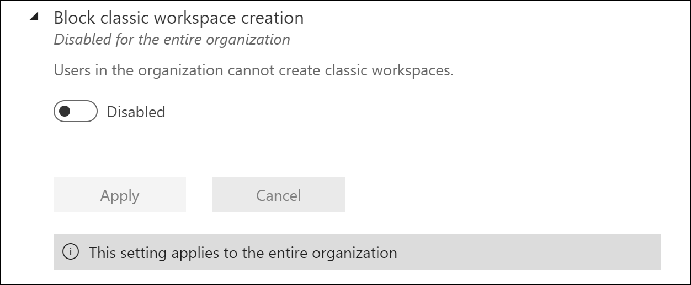

When enabled, newly created Office 365 Groups won't be shown in the Power BI workspaces list. Existing classic workspaces continue to be shown in the list. When the setting is disabled, all Office 365 Groups the user is a member of appear in the workspaces list. Read more about the [new workspace experience workspaces](../collaborate-share/service-new-workspaces.md).

## Information protection

### Apply sensitivity labels from data sources to their data in Power BI (preview)

When this setting is enabled, Power BI datasets that connect to sensitivity-labeled data in supported data sources can inherit those labels, so that the data remains classified and secure when brought into Power BI.  For detail about sensitivity label inheritance from data sources, see [Sensitivity label inheritance from data sources (preview)](service-security-sensitivity-label-inheritance-from-data-sources.md).

To enable sensitivity label inheritance from data sources go to the [Power BI tenant settings](service-admin-portal.md#tenant-settings), and enable the toggle under **Information protection > Apply sensitivity labels from data sources to their data in Power BI (preview)**:

:::image type="content" source="media/service-admin-portal/inherit-from-data-sources-tenant-setting.png" alt-text="Screenshot of Apply sensitivity labels from data sources to their data in Power BI tenant setting.":::

### Restrict content with protected labels from being shared via link with everyone in your organization
When this setting is enabled, users can't generate a sharing link for **People in your organization** for content with protection settings in the sensitivity label.

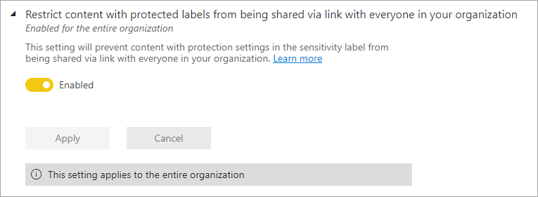

> [!NOTE]
> This setting is disabled if you haven't enabled both the **Allow users to apply sensitivity labels for Power BI content** setting and the **Allow shareable links to grant access to everyone in your organization** setting.

Sensitivity labels with protection settings include encryption or content markings. For example, your organization may have a "Highly Confidential" label that includes encryption and applies a "Highly Confidential" watermark to content with this label. Therefore, when this tenant setting is enabled and a report has a sensitivity label with protection settings, then users can't create sharing links for **People in your organization**: 


To learn more about protection settings for sensitivity labels, check out the Microsoft 365 article [Restrict access to content by using sensitivity labels to apply encryption](/microsoft-365/compliance/encryption-sensitivity-labels).

## Export and sharing settings

### Allow Azure Active Directory guest users to access Power BI

Enabling this setting allows Azure Active Directory Business-to-Business (Azure AD B2B) guest users to access Power BI. If you disable this setting, guest users receive an error when trying to access Power BI. Disabling this setting for the entire organization also prevents users from inviting guests to your organization. Use the specific security groups option to control which guest users can access Power BI.

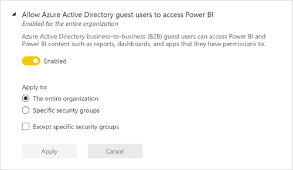

### Invite external users to your organization

The **Invite external users to your organization** setting helps organizations choose whether new external users can be invited to the organization through Power BI sharing, permissions, and subscription experiences. If the setting is disabled, an external user who isn't already a guest user in the organization, can’t be added to the organization through Power BI.

:::image type="content" source="media/service-admin-portal/power-bi-invite-external-users.png" alt-text="Screenshot that shows the Invite external users to your organization setting.":::

> [!IMPORTANT]
> This setting was previously called “Share content with external users”. The revised name reflects more accurately what the setting does.

To invite external users to your organization, a user also needs the Azure Active Directory Guest Inviter role. This setting only controls the ability to invite through Power BI.

### Allow external guest users to edit and manage content in the organization

Azure AD B2B guest users can edit and manage content in the organization. [Learn more](service-admin-azure-ad-b2b.md)

The following image shows the option to Allow Azure Active Directory external guest users to edit and manage content in the organization.

:::image type="content" source="media/service-admin-portal/allow-external-guest-users-azure-ad.png" alt-text="Screenshot that shows the Allow Azure A D guest users to edit and manage content in the organization.":::

In the admin portal, you also control which users have permissions to invite external users to the organization. See [Share content with external users](#export-and-sharing-settings) in this article for details.

### Show Azure Active Directory guests in lists of suggested people

The **Show Azure Active Directory guests in lists of suggested people** setting helps organizations limit visibility of external users in sharing experiences. When disabled, Azure Active Directory (Azure AD) guest users are not shown in people picker suggested users lists. This helps prevent accidental sharing to external users and seeing which external users have been added to your organization through Power BI sharing UIs. 

> [!IMPORTANT]
> When the setting is set to disabled, you can still give permission to a guest user by providing their full email address in people pickers.
  
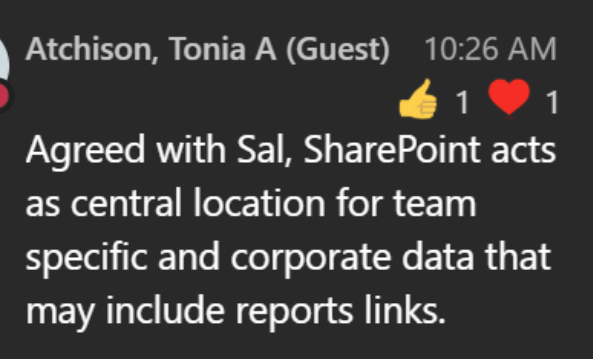


### Publish to web

As a Power BI admin, the **Publish to web** setting gives you options that let users create embed codes to publish reports to the web. This functionality makes the report and its data available to anyone on the web. Learn more about [publishing to the web](../collaborate-share/service-publish-to-web.md).

> [!NOTE]
> Only Power BI admins can allow creating new publish to web embed codes. Organizations may have existing embed codes. See the [Embed codes](service-admin-portal.md#embed-codes) section of the admin portal to review currently published reports.

You can find **Publish to web** under **File** > **Embed report** when the **Publish to web** setting is enabled.

:::image type="content" source="media/service-admin-portal/power-bi-embed-options.png" alt-text="Screenshot that shows the Publish to web option.":::

The **Publish to web** setting in the admin portal gives options for which users can create embed codes.

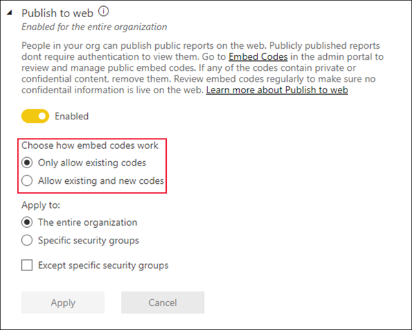

Admins can set **Publish to web** to **Enabled** and **Choose how embed codes work** to **Allow only existing embed codes**. In that case, users can create embed codes, but they have to contact the Power BI admin to allow them to do so.


Users see different options in the UI based on what the **Publish to web** setting is.

|Feature |Enabled for entire organization |Disabled for entire organization |Specific security groups   |
|---------|---------|---------|---------|
|**Publish to web** under report **More options (...)** menu|Enabled for all|Not visible for all|Only visible for authorized users or groups.|
|**Manage embed codes** under **Settings**|Enabled for all|Enabled for all|Enabled for all<br><br>* **Delete** option only for authorized users or groups.<br>* **Get codes** enabled for all.|
|**Embed codes** within admin portal|Status has one of the following values:<br>* Active<br>* Not supported<br>* Blocked|Status displays **Disabled**|Status has one of the following values:<br>* Active<br>* Not supported<br>* Blocked<br><br>If a user isn't authorized based on the tenant setting, status displays **infringed**.|
|Existing published reports|All enabled|All disabled|Reports continue to render for all.|

### Copy and paste visuals

Users in the organization can copy visuals from a tile or report visual and paste them as static images into external applications.

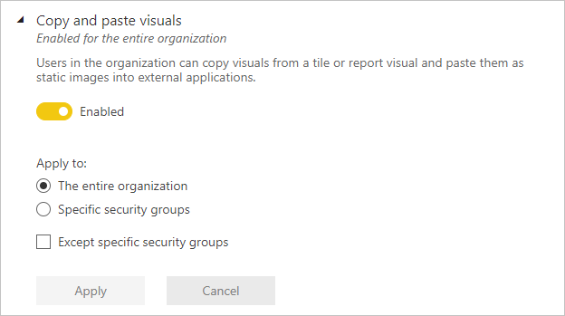

### Export to Excel

Users in the organization can export the data from a visualization to an Excel file.


### Export to .csv

Users in the organization can export data from a tile, visualization, or paginated report to a .csv file.

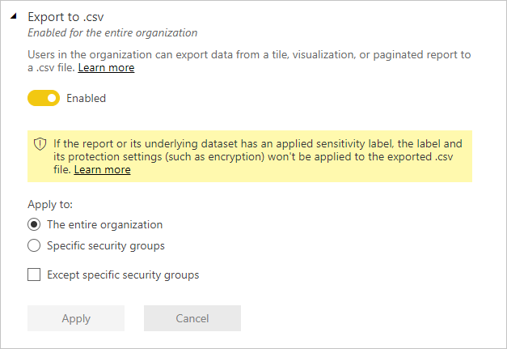

### Download reports

Users in the organization can download .pbix files and paginated reports.


### Allow live connections

Users in the organization can use Power BI service Live Connect. Allowing live connections also allows users to Analyze in Excel.


### Export reports as PowerPoint presentations or PDF documents

Users in the organization can export reports as PowerPoint files or PDF documents.

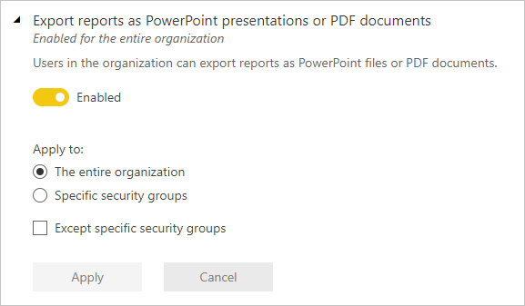

### Export reports as MHTML documents

Users in the organization can export Paginated reports as MHTML documents.


### Export reports as Word documents

Users in the organization can export Paginated reports as Word documents.


### Export reports as XML documents

Users in the organization can export Paginated reports as XML documents.


### Export reports as image files (preview)

Users in the organization can use the export report to file API to export reports as image files.

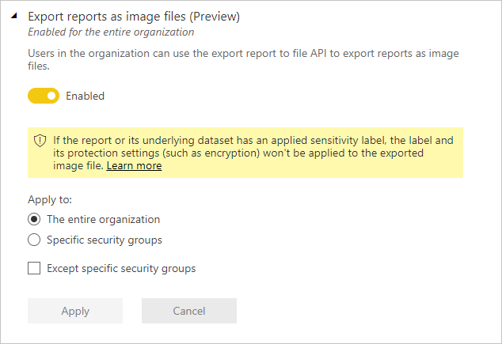

### Print dashboards and reports

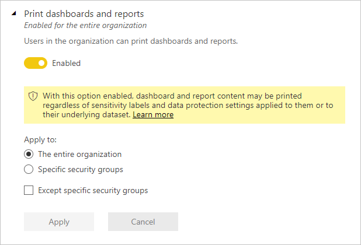

### Certification
Allow users in this org to certify datasets, dataflows, reports, and apps. See [Enable content certification](service-admin-setup-certification.md) for details.

### Email Subscriptions
Users in the organization can create email subscriptions. Learn more about [subscriptions](../collaborate-share/service-report-subscribe.md).


### Featured content

By default, anyone with the Admin, Member, or Contributor role in a workspace in your organization can feature content on Power BI Home. New users will see that content in the the Featured section at the top of their Power BI Home page. Featured content moves down the Home page as users add **Favorites & frequents**, and **Recents**. See [Feature content on colleagues' Power BI Home page](../collaborate-share/service-featured-content.md) for more information.

You can turn off the ability to feature content, and manage it in the Admin portal. See [Manage featured content](#manage-featured-content) in this article to read about controlling featured content in your domain.

### Allow connections to featured tables

This setting lets Power BI admins control who in the organization can use featured tables in the Excel Data Types Gallery. 


>[!NOTE]
>Connections to featured tables are also disabled if the [Allow live connections](#allow-live-connections) setting is set to Disabled.

Read more about [Power BI featured tables in Excel](../collaborate-share/service-excel-featured-tables.md).

### Microsoft Teams integration in the Power BI service

This setting allows organizations to access features that work with Microsoft Teams and the Power BI service. These features include launching Teams experiences from Power BI like chats, the Power BI app for Teams, and getting Power BI notifications from Teams. To completely enable or disable Teams integration, work with your Teams admin.

:::image type="content" source="media/service-admin-portal/power-bi-enable-teams-integration.png" alt-text="Screenshot that shows the Microsoft Teams integration tenant setting in the Power B I admin portal.":::

Read more about [sharing Power BI content to Teams](../collaborate-share/service-share-report-teams.md).

### Allow shareable links to grant access to everyone in your organization
This tenant setting is available for admins looking to disable creating shareable links to **People in your organization**. You can find this option in the Admin portal by navigating to **Tenant settings** > **Export and sharing settings** > **Allow shareable links to grant access to everyone in your organization**.


As with other tenant settings, you can enable sharing links to **People in your organization** for:
- **The entire organization**
- **Specific security groups**
- Or **Except specific security groups**

If this setting is disabled for a user with share permissions to a report, that user can only share the report via link to **Specific people** or **People with existing access**.

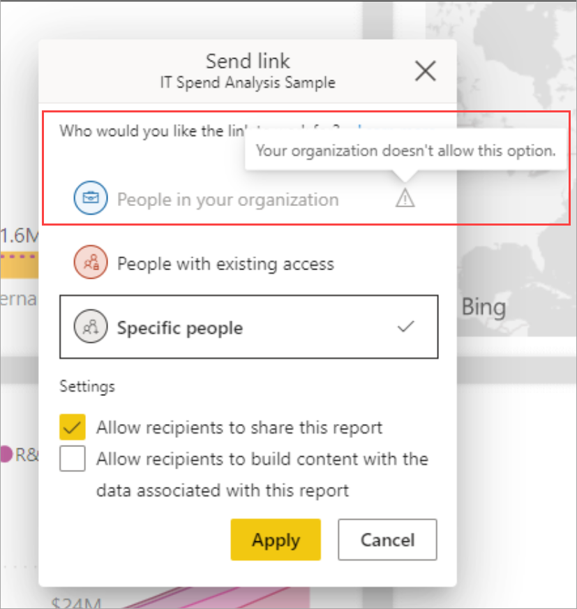

## Discovery settings

[Discoverability](../collaborate-share/service-discovery.md) is a feature that content owners can use to make their endorsed content discoverable by users who don't yet have access to it.

Discoverability on your tenant is controlled by three independent settings located in the discovery settings section of the tenant settings. To get to these settings, go to **Admin portal > Tenant settings > Discovery settings**.

### Make promoted content discoverable

When you enable this setting, users who can promote content will be able to mark their content as discoverable when they are promoting it. You can specify users and/or groups who will be able to mark their content as discoverable if they have the permissions to promote their content. You can also specify users and/or groups to exclude from the specified groups. 

### Make certified content discoverable

When you enable this setting, users who are authorized to certify content will be able to mark that content as discoverable when they are certifying it. You can specify users and/or groups who will be able to mark content as discoverable if they have the permissions to certify it. You can also specify users and/or groups to exclude from the specified groups. 

### Discover content

When you enable this setting, users will be able to find endorsed content that they don't yet have access to. You can specify users and/or groups who will be able to find discoverable content. You can also specify users and/or groups to exclude from the specified groups.

## Content pack and app settings

### Publish content packs and apps to the entire organization

Admins use this setting to decide which users can publish content packs and apps to the entire organization, rather than specific groups. Learn more about [publishing apps](../collaborate-share/service-create-distribute-apps.md).

The following image shows the **My entire organization** option when creating a content pack.


### Create template apps and organizational content packs

Users in the organization can create template apps and organizational content packs that use datasets built on one data source in Power BI Desktop. Learn more about [template apps](../connect-data/service-template-apps-create.md).

### Push apps to end users

Report creators can share apps directly with end users without requiring installation from [AppSource](https://appsource.microsoft.com). Learn more about [automatically installing apps for end users](../collaborate-share/service-create-distribute-apps.md#automatically-install-apps-for-end-users).

## Integration settings

### Allow XMLA endpoints and Analyze in Excel with on-premises datasets

Users in the organization can use Excel to view and interact with on-premises Power BI datasets. This also allows connections to XMLA endpoints. Learn more about [analyzing in Excel](../collaborate-share/service-analyze-in-excel.md).

### Use ArcGIS Maps for Power BI

Users in the organization can use the ArcGIS Maps for Power BI visualization provided by Esri. Learn more about [ArcGIS maps](../visuals/power-bi-visualizations-arcgis.md).

### Use global search for Power BI (Preview)

Users in the organization can use external search features that rely on Azure Search.

### Integration with SharePoint and Microsoft Lists

Users in the organization can create Power BI reports directly from SharePoint and Microsoft Lists. Then they can build Power BI reports on the data in those lists and publish them back to the lists, to be visible to others who can access the list. This setting is in **Tenant settings** > **Integration settings**.

:::image type="content" source="media/service-admin-portal/admin-integration-sharepoint-lists.png" alt-text="Allow integration with SharePoint and Microsoft Lists.":::

This feature is on by default. Even if the feature is disabled, in SharePoint and Microsoft Lists users will still see **Power BI** > **Visualize the list**, and any existing Power BI reports, on the **Integrate** menu. If they select **Visualize the list**, they go to an error page explaining that their admin has disabled the feature.

Learn more about [creating reports from SharePoint and Microsoft Lists](../create-reports/service-quick-create-sharepoint-list.md).

## R and Python visuals settings

### Interact with and share R and Python visuals

Users in the organization can interact with and share visuals created with R or Python scripts. Learn more about [R visuals](../visuals/service-r-visuals.md).

> [!NOTE]
> This setting applies to the entire organization and cannot be limited to specific groups.

## Audit and usage settings

### Create audit logs for internal activity auditing and compliance

Users in the organization can use auditing to monitor actions taken in Power BI by other users in the organization. [Learn more](service-admin-auditing.md)

This setting must be enabled for audit log entries to be recorded. There can be up to a 48-hour delay between enabling auditing and being able to view audit data. If you don't see data immediately, check the audit logs later. There can be a similar delay between getting permission to view audit logs and being able to access the logs.

> [!NOTE]
> This setting applies to the entire organization and cannot be limited to specific groups.

### Usage metrics for content creators

Users in the organization can see usage metrics for dashboards and reports they create. [Learn more](../collaborate-share/service-usage-metrics.md)

### Per-user data in usage metrics for content creators

Usage metrics for content creators will expose display names and email addresses of users who are accessing content. [Learn more](../collaborate-share/service-usage-metrics.md)

Per-user data is enabled for usage metrics by default, and content creator account information is included in the metrics report. If you do not wish to gather this information for all users, you can disable the feature for specified security groups or for an entire organization. Account information for the excluded users will then show in the report as *Unnamed*.

## Dashboard settings

### Data classification for dashboards

Users in the organization can tag dashboards with classifications that indicate dashboard security levels. [Learn more](../create-reports/service-data-classification.md)

> [!NOTE]
> This setting applies to the entire organization and cannot be limited to specific groups.

### Web content on dashboard tiles

Users in the organization can add and view web content tiles on Power BI dashboards. [Learn more](../create-reports/service-dashboard-add-widget.md)

> [!NOTE]
> This may expose your org to security risks via malicious web content.

## Developer settings

### Embed content in apps

Users in the organization can embed Power BI dashboards and reports in Software as a Service (SaaS) applications. Disabling this setting prevents users from being able to use the REST APIs to embed Power BI content within their application. [Learn more](../developer/embedded/embedding.md)

### Allow service principals to use Power BI APIs

Web apps registered in Azure Active Directory (Azure AD) will use an assigned service principal to access Power BI APIs without a signed in user. To allow an app to use service principal authentication, its service principal must be included in an allowed security group. [Learn more](../developer/embedded/embed-service-principal.md)

> [!NOTE]
> Service principals inherit the permissions for all Power BI tenant settings from their security group. To restrict permissions, create a dedicated security group for service principals and add it to the 'Except specific security groups' list for the relevant, enabled Power BI settings.

## Dataflow settings

### Create and use dataflows

Users in the organization can create and use dataflows. For an overview of dataflows, see [Self-service data prep in Power BI](../transform-model/dataflows/dataflows-introduction-self-service.md). To enable dataflows in a Premium capacity, see [Configure workloads](service-admin-premium-workloads.md).

> [!NOTE]
> This setting applies to the entire organization and cannot be limited to specific groups.

## Template apps settings

Three settings control template apps ability to publish or install template apps.

:::image type="content" source="media/service-admin-portal/template-app-settings.png" alt-text="Screenshot that shows the Power B I admin portal template app settings.":::

### Publish Template Apps

Users in the organization can create template apps workspaces. Control which users can publish template apps or distribute them to clients outside your organization by way of [AppSource](https://appsource.microsoft.com) or other distribution methods.


### Install template apps listed on AppSource

Users in the organization can download and install template apps **only** from [AppSource](https://appsource.microsoft.com). Control which specific users or security groups can install template apps from AppSource.

:::image type="content" source="media/service-admin-portal/power-bi-install-template-apps-settings.png" alt-text="Screenshot that shows the Install template apps setting.":::

### Install template apps not listed on AppSource

Control which users in the organization can download and install template apps **not listed on [AppSource](https://appsource.microsoft.com)**.


## Capacity settings

### Power BI Premium

The **Power BI Premium** tab enables you to manage any Power BI Premium capacities (EM or P SKU) that have been purchased for your organization. All users within your organization can see the **Power BI Premium** tab, but they only see contents within it if they are assigned as either a *Capacity admin* or a user that has assignment permissions. If a user does not have any permissions, the following message appears.


### Power BI Embedded

The **Power BI Embedded** tab enables you to view your Power BI Embedded (A SKU) capacities that you've purchased for your customer. Since you can only purchase A SKUs from Azure, you [manage embedded capacities in Azure](../developer/embedded/azure-pbie-create-capacity.md) from **the Azure portal**.

For more information about how to manage Power BI Embedded (A SKU) settings, see [What is Power BI Embedded](../developer/embedded/azure-pbie-what-is-power-bi-embedded.md).

## Embed codes

As an administrator, you can view the embed codes that are generated for your tenant to share reports publicly. You can also revoke or delete codes. [Learn more](../collaborate-share/service-publish-to-web.md)

:::image type="content" source="media/service-admin-portal/power-bi-settings-embed-codes.png" alt-text="Screenshot that shows the embed codes within the Power BI admin portal.":::

## Organizational visuals

All the Power BI visuals admin settings, including Power BI visuals tenant settings, are described in [Manage Power BI visuals admin settings](organizational-visuals.md).

## Azure connections

### Tenant-level storage (preview)

By default, data used with Power BI is stored in internal storage provided by Power BI. With the integration of dataflows and Azure Data Lake Storage Gen2 (ADLS Gen2), you can store your dataflows in your organization's Azure Data Lake Storage Gen2 account. For more information, see [Dataflows and Azure Data Lake integration (Preview)](../transform-model/dataflows/dataflows-azure-data-lake-storage-integration.md).

### Workspace-level storage permissions (preview)

By default, workspace admins can't connect their own storage account. This preview feature lets Power BI administrators turn on a setting that allows workspace admins to connect their own storage account.

To activate this feature, go to **Admin portal > Azure connections > Connect to Azure resources (preview) > Workspace-level storage permissions (preview)**, and check the **Allow workspace admins to connect their own storage account** checkbox.

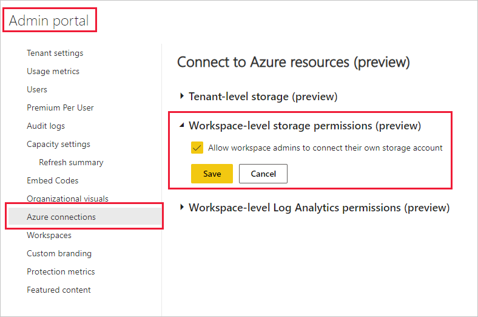


## Workspaces

As an administrator, you can view the workspaces that exist in your organization on the **Workspaces** tab. On this tab, you can perform these actions:

- Refresh the list of workspaces and their details.
- Export the data about the workspaces to a .csv file. 
- See details about a workspace, including its ID, its users and their roles, and its dashboards, reports, and datasets.
- Edit the list of people who have access. This means you can delete the workspace. You can add yourself to a workspace as an admin, then open the workspace and delete it.
- Edit the Name and Description fields.
- Upgrade classic workspaces to the new workspace experience

:::image type="content" source="media/service-admin-portal/power-bi-workspaces-admin-portal.png" alt-text="Screenshot that shows a Power B I workspaces list in the admin portal.":::

Admins can also control users' ability to create new workspace experience workspaces, and classic workspaces. See [Workspace settings](#workspace-settings) in this article for details.

The table columns on the **Workspaces** tab correspond to the properties returned by the [Power BI admin Rest API](/rest/api/power-bi/admin) for workspaces. Personal workspaces are of type **PersonalGroup**, classic workspaces are of type **Group**, and the new workspace experience workspaces are of type **Workspace**. For more information, see [Organize work in the new workspaces](../collaborate-share/service-new-workspaces.md).

On the **Workspaces** tab, you see the *state* for each workspace. The following table gives more details about the meaning of those states.

|State  |Description  |
|---------|---------|
| **Active** | A normal workspace. It doesn't indicate anything about usage or what's inside, only that the workspace itself is "normal". |
| **Orphaned** | A workspace with no admin user. |
| **Deleted** | A deleted workspace. We maintain enough metadata to restore the workspace for up to 90 days. |
| **Removing** | A workspace that is being deleted, but not gone yet. Users can delete their own workspaces, putting things into Removing and eventually Deleted. |

Admins can also manage and recover workspaces, using either the admin portal or PowerShell cmdlets.

:::image type="content" source="media/service-admin-portal/power-bi-workspaces-admin-portal.png" alt-text="Screenshot that shows the Power B I workspaces list in the admin portal.":::

Admins can upgrade classic workspaces to the new workspace experience. Admins can select one or more workspaces with Type **Group** to upgrade. Upgrades are queued and executed asynchronously. It may take several minutes to several days to complete all **Pending** upgrades because the overall rate of admin-initiated upgrades is limited to keep the service running smoothly. The **Workspace upgrade status** column helps admins track the progress of the admin-initiated upgrades. Admins can cancel admin-initiated upgrades when they are **Pending**. To upgrade a workspace immediately, contact the Workspace Admin and have them start the upgrade through the workspace settings pane. [Learn more about workspace upgrade before starting your Power BI admin-initiated workspace upgrade.](../collaborate-share/service-upgrade-workspaces.md).

The following table gives more details about the status of the upgrade.

|Status  |Description  |
|---------|---------|
| **(Blank)** | The workspace is not being upgraded by a Power BI admin. |
| **Pending** | The workspace is queued to be upgraded. The upgrade can be canceled. |
| **In Progress** | The workspace is actively being upgraded. The upgrade can't be canceled. |
| **Completed** | The workspace was upgraded in the last 30 days by a Power BI admin. A workspace admin can go back to classic option during the 30-day period after the workspace was upgraded. |

> [!NOTE]
> There are a few limitations to upgrading workspaces, such as those listed here. Learn more about [upgrading workspaces](../collaborate-share/service-upgrade-workspaces.md) before attempting an upgrade.
> - If the admin for a workspace hasn't accessed Power BI recently (in the last 14 days), the upgrade may fail. Have the workspace admin access Power BI or change to a different admin before trying to upgrade.
> - If the group associated with the workspace doesn't have a group owner in Azure Active Directory or Microsoft 365, the upgrade may fail. Assign a group owner in Azure Active Directory or Microsoft 365 before upgrading.

## Custom branding

As an administrator, you can customize the look of Power BI for your whole organization. Currently there are three main options:


* **Upload Logo**: For best results, upload a logo that's saved as a .png, 10 KB or smaller, and at least 200 x 30 pixels.

* **Upload Cover image**: For best results, upload a cover image that's saved as a .jpg or .png, 1 MB or smaller, and at least 1920 x 160 pixels.

* **Select Theme color**: You can select your theme based on a hex #, RGB, value, or from the provided palette.


For more information, see [Add custom branding to the Power BI service](service-admin-custom-branding.md).

## Protection metrics

After you enable information protection for Power BI, data protection metrics are displayed in the admin portal. The report shows how sensitivity labels help protect your content.

## Manage featured content

As a Power BI admin, you can manage all the reports, dashboards, and apps that have been promoted to the Featured section on Power BI Home across your organization.

- In the Admin portal, select **Featured content**.

Here you see an overview of who featured the content, when it was featured, and all its relevant metadata. If something looks suspicious, or you want to clean up the Featured section, you can delete promoted content as needed.

See [Featured content](#featured-content) in this article for information about enabling featured content.

## Next steps

[Administering Power BI in your Organization](service-admin-administering-power-bi-in-your-organization.md)  
[Understanding the Power BI admin role](service-admin-role.md)  
[Auditing Power BI in your organization](service-admin-auditing.md)  

More questions? [Try asking the Power BI Community](https://community.powerbi.com/)
