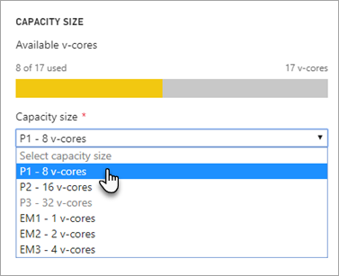

# Configure and manage capacities in Power BI Premium

Managing Power BI Premium involves creating, managing, and monitoring Premium capacities. This article provides step-by-step instructions; for an overview of capacities; see [Managing Premium capacities](service-premium-capacity-manage.md).

Learn how to manage Power BI Premium and Power BI Embedded capacities, which provide dedicated resources for your content.

:::image type="content" source="media/service-admin-premium-manage/powerbi-premium-capacity-settings.png" alt-text="Screenshot that shows the Power B I Premium capacity settings screen.":::

*Capacity* is at the heart of the Power BI Premium and [Power BI Embedded](../developer/embedded/embedded-analytics-power-bi.md#embedding-with-power-bi) offerings. It is a set of resources reserved for exclusive use by your organization. Having a capacity enables you to publish dashboards, reports, and datasets to users throughout your organization without having to purchase per-user licenses for them. It also offers dependable, consistent performance for the content hosted in capacity. For more information, see [What is Power BI Premium?](service-premium-what-is.md).

> [!NOTE]
> Power BI Premium recently released a new version of Premium, called **Premium Gen2**, which is currently in preview. Premium Gen2 will simplify the management of Premium capacities, and reduce management overhead. For more information, see [Power BI Premium Generation 2](service-premium-what-is.md#power-bi-premium-generation-2).

> [!NOTE]
> You can also get Premium Per User (PPU) licenses for individuals, which provides many of the features and capabilities of a Premium capacity, and also incorporates all functionality included with a Power BI Pro license. For more information, see [Power BI Premium Per User](service-premium-per-user-faq.yml).

## Manage capacity

After you have purchased capacity nodes in Microsoft 365, you set up the capacity in the Power BI admin portal. You manage Power BI Premium capacities in the **Capacity settings** section of the portal.

You manage a capacity by selecting the name of the capacity. This takes you to the capacity management screen.

If no workspaces have been assigned to the capacity, you will see a message about [assigning a workspace to the capacity](#assign-a-workspace-to-a-capacity).

### Setting up a new capacity (Power BI Premium)

The admin portal shows the number of *virtual cores* (v-cores) that you have used and that you still have available. The total number of v-cores is based on the Premium SKUs that you have purchased. For example, purchasing a P3 and a P2 results in 48 available cores – 32 from the P3 and 16 from the P2.

If you have available v-cores, set up your new capacity by following these steps.

1. Select **Set up new capacity**.

1. Give your capacity a name.

1. Define who the admin is for this capacity.

1. Select your capacity size. Available options are dependent on how many available v-cores you have. You can't select an option that is larger than what you have available.

    

1. Select **Set up**.

    

Capacity admins, as well as Power BI admins and global administrators, then see the capacity listed in the admin portal.

### Capacity settings

1. In the Premium capacity management screen, under **Actions**, select the **gear icon** to review and update settings. 

    

1. You can see who the service admins are, the SKU/size of the capacity, and what region the capacity is in.

    

1. You can also rename or delete a capacity.

    

> [!NOTE]
> Power BI Embedded capacity settings are managed in the Microsoft Azure portal.

### Change capacity size

Power BI admins and global administrators can change Power BI Premium capacity. Capacity admins who are not a Power BI admin or global administrator don't have this option.

1. Select the capacity name you want to change the size of.

1. Select **Change size**.

    :::image type="content" source="media/service-admin-premium-manage/powerbi-settings-change-capacity-size.png" alt-text="Screenshot that shows the Power BI Change Size button for capacity.":::

1. On the **Change size** screen, upgrade or downgrade your capacity as appropriate.

    

    Administrators are free to create, resize and delete nodes, so long as they have the requisite number of v-cores.

    P SKUs cannot be downgraded to EM SKUs. You can hover over any disabled options to see an explanation.

> [!IMPORTANT]
> If your Power BI Premium capacity is experiencing high resource usage, resulting in performance or reliability issues, you can receive notification emails to identify and resolve the issue. See [capacity and reliability notifications](service-interruption-notifications.md#capacity-and-reliability-notifications) for more information.

### Manage user permissions

You can assign additional capacity admins, and assign users that have *contributor* permissions. Users that have contributor permissions can assign a workspace to a capacity if they are an admin of that workspace. They can also assign their personal *My Workspace* to the capacity. Users with contributor permissions do not have access to the admin portal.

> [!NOTE]
> For Power BI Embedded, capacity admins are defined in the Microsoft Azure portal.

Expand **Contributor permissions**, then add users or groups as appropriate.

:::image type="content" source="media/service-admin-premium-manage/powerbi-contributor-permissions.png" alt-text="Screenshot that shows the Contributor Permissions menu":::

## Assign a workspace to a capacity

There are two ways to assign a workspace to a capacity: in the admin portal; and from a workspace.

### Assign from the admin portal

Capacity admins, along with Power BI admins and global administrators, can bulk assign workspaces in the premium capacity management section of the admin portal. When you manage a capacity, you see a **Workspaces assigned to this capacity** section that allows you to assign workspaces.

:::image type="content" source="media/service-admin-premium-manage/workspaces-assigned-capacity.png" alt-text="Screenshot that shows the Workspace assignment area of capacity management.":::

1. Select **Assign workspaces**.

1. Select an option for **Apply to**.

    

   | Selection | Description |
   | --- | --- |
   | **Workspaces by users** | When you assign workspaces by user, or group, all the workspaces owned by those users are assigned to Premium capacity, including the user's personal workspace. Said users automatically get workspace assignment permissions. This includes workspaces already assigned to a different capacity. |
   | **Specific workspaces** | Enter the name of a specific workspace to assign to the selected capacity. |
   | **The entire organization's workspaces** | Assigning the entire organization's workspaces to Premium capacity assigns all workspaces and My Workspaces, in your organization, to this Premium capacity. In addition, all current and future users will have the permission to reassign individual workspaces to this capacity. |
   | | |

1. Select **Apply**.

### Assign from workspace settings

You can also assign a workspace to a Premium capacity from the settings of that workspace. To move a workspace into a capacity, you must have admin permissions to that workspace, and also capacity assignment permissions to that capacity. Note that workspace admins can always remove a workspace from Premium capacity.

1. Edit a workspace by selecting the ellipsis **(. . .)** then selecting **Edit this workspace**.

    :::image type="content" source="media/service-admin-premium-manage/edit-app-workspace.png" alt-text="Screenshot of the Edit this workspace context menu.":::

1. Under **Edit this workspace**, expand **Advanced**.

1. Select the capacity that you want to assign this workspace to.

    

1. Select **Save**.

Once saved, the workspace and all its contents are moved into Premium capacity without any experience interruption for end users.

## Power BI Report Server product key

On the **Capacity settings** tab of the Power BI admin portal, you will have access to your Power BI Report Server product key. This will only be available for Global Admins or users assigned the Power BI service administrator role and if you have purchase a Power BI Premium SKU.

Selecting **Power BI Report Server key** will display a dialog contain your product key. You can copy it and use it with the installation.

For more information, see [Install Power BI Report Server](../report-server/install-report-server.md).

## Next steps

[Managing Premium capacities](service-premium-capacity-manage.md)

More questions? [Try asking the Power BI Community](https://community.powerbi.com/)

Power BI has introduced Power BI Premium Gen2 as a preview offering, which improves the Power BI Premium experience with improvements in the following:
* Performance
* Per-user licensing
* Greater scale
* Improved metrics
* Autoscaling
* Reduced management overhead

For more information about Power BI Premium Gen2, see [Power BI Premium Generation 2 (preview)](service-premium-what-is.md#power-bi-premium-generation-2).