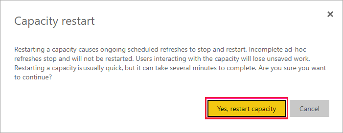

# Restart a Power BI Premium capacity

As a Power BI administrator, you might need to restart a Premium capacity. This article explains how to restart a capacity and addresses several questions about restart and performance.

## Why does Power BI provide this option?

Power BI gives users the ability to perform complex analyses on huge amounts of data. Unfortunately, users can cause performance issues by overloading the Power BI service with jobs, writing overly complex queries, creating circular references, and so on.

Power BI shared capacity offers some protection from such cases by imposing limits on file sizes, refresh schedules, and other aspects of the service. In a Power BI Premium capacity, by contrast, most of those limits are raised. As a result, a single report with a bad DAX expression or a very complex model can cause significant performance issues. When processed, the report can consume all of the resources available on the capacity. 

Power BI is constantly improving in how it protects Premium capacity users against such issues. We are also empowering administrators with the tools to analyze when capacities are overburdened and why. For more information, see our [short training session](https://www.youtube.com/watch?v=UgsjMbhi_Bk&feature=youtu.be) and [longer training session](https://powerbi.tips/2018/07/). At the same time, you need the ability to mitigate significant issues when they occur. The quickest way to mitigate these issues is to restart the capacity.

> [!NOTE]
> Power BI Premium recently released a new version of Premium, called **Premium Gen2**. Premium Gen2 capacities do not require restarts, so this feature is not available in Premium Gen2.
>
> **Embedded Gen2** capacities also don't require restart. To review the Power BI Embedded Gen2 enhancements, refer to [Power BI Embedded Generation 2](../developer/embedded/power-bi-embedded-generation-2.md).

> [!NOTE]
> This process and functionality does not apply to Power BI Premium Per User (PPU) capacities or activities.

## Is the restart process safe? Will I lose any data?

All the saved data, definitions, reports, and dashboards on your capacity remain fully intact after restart. When you restart a capacity, ongoing scheduled and ad-hoc refreshes are stopped temporarily by the refresh engine, in most cases, then they restart due to refresh retry logic built into Power BI. The service attempts to retry any impacted refreshes once the capacity becomes available. The state of refreshes may not change in the user interface during the restart process. 

Users interacting with the capacity will lose unsaved work during a restart process. Users should refresh their browsers after the restart is complete.

## How do I restart a capacity?

Follow these steps to restart a capacity.

1. In the Power BI admin portal, on the **Capacity Settings** tab, navigate to your capacity. 

1. Add the **CapacityRestart** *feature flag* to your capacity URL: `https://app.powerbi.com/admin-portal/capacities/<YourCapacityId>?capacityRestartButton=true`.

1. Under **Advanced Settings** > **CAPACITY RESTART**, select **Restart capacity**.

    

1. In the **Capacity restart** dialog box, select **Yes, restart capacity**.

    

## How can I prevent issues from happening in the future?

The best way to prevent issues is to educate users about efficient data modeling. For more information, see our [training session](https://powerbi.tips/2018/07/).

We also recommend that you [monitor your capacities](service-admin-premium-monitor-capacity.md) regularly to look for trends that indicate underlying issues. We plan regular releases of the monitoring app and other tools so that you can monitor and manage your capacities more effectively.

## Next steps

[What is Power BI Premium?](service-premium-what-is.md)

More questions? [Try asking the Power BI Community](https://community.powerbi.com/)
