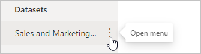
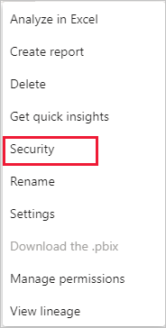
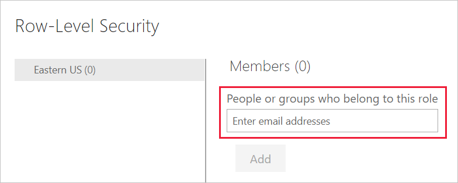
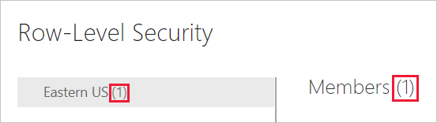
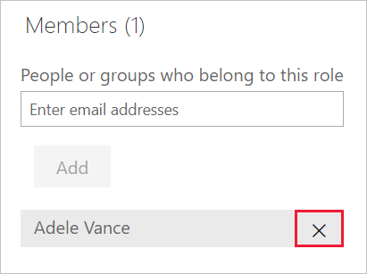
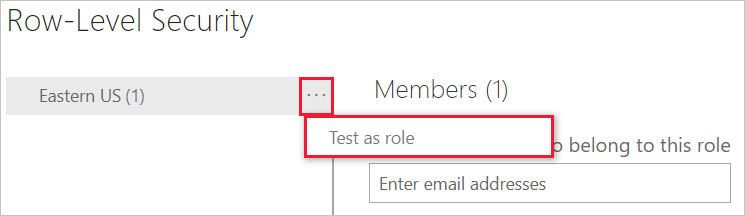
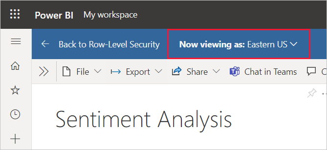
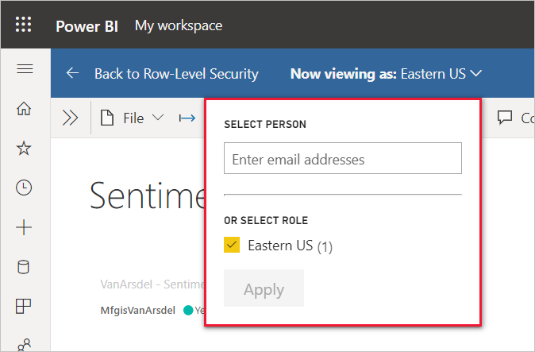

# Row-level security (RLS) with Power BI

Row-level security (RLS) with Power BI can be used to restrict data access for given users. Filters restrict data access at the row level, and you can define filters within roles. In the Power BI service, members of a workspace have access to datasets in the workspace. RLS doesn't restrict this data access. 

You can configure RLS for data models imported into Power BI with Power BI Desktop. You can also configure RLS on datasets that are using DirectQuery, such as SQL Server. For Analysis Services or Azure Analysis Services lives connections, you configure Row-level security in the model, not in Power BI Desktop. The security option will not show up for live connection datasets.

[!INCLUDE [include-short-name](../includes/rls-desktop-define-roles.md)]

By default, row-level security filtering uses single-directional filters, whether the relationships are set to single direction or bi-directional. You can manually enable bi-directional cross-filtering with row-level security by selecting the relationship and checking the **Apply security filter in both directions** checkbox. Select this option when you've also implemented dynamic row-level security at the server level, where row-level security is based on username or login ID.

For more information, see [Bidirectional cross-filtering using DirectQuery in Power BI Desktop](../transform-model/desktop-bidirectional-filtering.md) and the [Securing the Tabular BI Semantic Model](https://download.microsoft.com/download/D/2/0/D20E1C5F-72EA-4505-9F26-FEF9550EFD44/Securing%20the%20Tabular%20BI%20Semantic%20Model.docx) technical article.

[!INCLUDE [include-short-name](../includes/rls-desktop-view-as-roles.md)]

Now that you're done validating the roles in Power BI Desktop, go ahead and publish your report to the Power BI service.

## Manage security on your model

To manage security on your data model, open the workspace where you saved your report in the Power BI service and do the following steps:

1. In the Power BI service, select the **More options** menu for a dataset. This menu appears when you hover on a dataset name, whether you select it from the navigation menu or the workspace page.

    

    

1. Select **Security**.

   

Security will take you to the Role-Level Security page where you add members to a role you created in Power BI Desktop. Only the owners of the dataset will see **Security**. If the dataset is in a Group, only administrators of the group will see the security option.

You can only create or modify roles within Power BI Desktop.

## Working with members

### Add members

In the Power BI service, you can add a member to the role by typing in the email address or name of the user or security group. You can't add Groups created in Power BI. You can add members [external to your organization](../guidance/whitepaper-azure-b2b-power-bi.md#data-security-for-external-partners).

You can use the following groups to set up row level security.

- Distribution Group
- Mail-enabled Group
- Security Group

Note, however, that Office 365 groups are not supported and cannot be added to any roles.

You can also see how many members are part of the role by the number in parentheses next to the role name, or next to Members.

### Remove members

You can remove members by selecting the X next to their name. 

## Validating the role within the Power BI service

You can validate that the role you defined is working correctly in the Power BI service by testing the role.

1. Select **More options** (...) next to the role.
2. Select **Test data as role**.

You'll see reports that are available for this role. Dashboards aren't shown in this view. In the page header, the role being applied is shown.

Test other roles, or a combination of roles, by selecting **Now viewing as**.

You can choose to view data as a specific person or you can select a combination of available roles to validate they're working.

To return to normal viewing, select **Back to Row-Level Security**.
    
> [!NOTE]
> The Test as role feature doesn't work for DirectQuery models with Single Sign-On (SSO) enabled.

[!INCLUDE [include-short-name](../includes/rls-usernames.md)]

## Using RLS with workspaces in Power BI

If you publish your Power BI Desktop report to a [new workspace experience](../collaborate-share/service-new-workspaces.md) in the Power BI service, the RLS roles are applied to members who are assigned to the **Viewer** role in the workspace. Even if  **Viewers** are given Build permissions to the dataset, RLS still applies. For example, if Viewers with Build permissions use [Analyze in Excel](../collaborate-share/service-analyze-in-excel.md), their view of the data will be protected by RLS. Workspace members assigned **Admin**, **Member**, or **Contributor** have edit permission for the dataset and, therefore, RLS doesn’t apply to them. If you want RLS to apply to people in a workspace, you can only assign them the **Viewer** role. Read more about [roles in the new workspaces](../collaborate-share/service-roles-new-workspaces.md).

> [!WARNING]
> If you have configured a *classic* workspace so that members have edit permissions, the RLS roles won't be applied to them. Users can see all of the data. Read more about [classic workspaces](../collaborate-share/service-create-workspaces.md).
>
>

[!INCLUDE [include-short-name](../includes/rls-limitations.md)]

[!INCLUDE [include-short-name](../includes/rls-faq.md)]

## Next steps

- [Restrict data access with row-level security (RLS) for Power BI Desktop](../create-reports/desktop-rls.md)
- [Row-level security (RLS) guidance in Power BI Desktop](../guidance/rls-guidance.md)
- Questions? [Try asking the Power BI Community](https://community.powerbi.com/)
- Suggestions? [Contribute ideas to improve Power BI](https://ideas.powerbi.com/)
