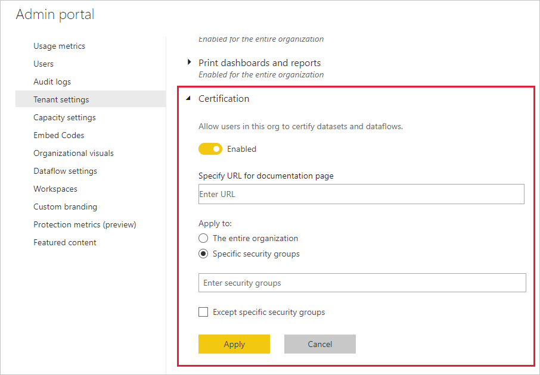

# Enable content certification (preview)

Your organization can certify selected content to identify it an as authoritative source for critical information. Currently, the following content types can be certified:
* Datasets
* Dataflows
* Reports
* Apps

As a Power BI admin, you are responsible for enabling and setting up the certification process for your organization. This means:
* Enabling certification on your tenant.
* Defining a list of security groups whose members will be authorized to certify content.
* Providing a URL that points to the documentation for the organization's content certification process, if such documentation exists.

Certification is part of Power BI's *endorsement* feature. See [Endorsement: Promoting and certifying Power BI content](../collaborate-share/service-endorsement-overview.md) for more information.

## Set up certification

1. In the Admin portal, go to Tenant settings.
1. Under the Export and sharing settings section, expand the Certification section.

   

1. Set the toggle to **Enabled**.
1. If your organization has a published certification policy, provide its URL here. This will become the **Learn more** link in the certification section of the [endorsement settings dialog](../connect-data/service-datasets-promote.md#request-dataset-certification). If you do not supply a link, users who want to request certification of their content will be advised to contact their Power BI administrator.
1. Specify one or more security groups whose members will be authorized to certify content. These authorized certifiers will able to use the Certification button in the certification section of the [endorsement settings dialog](../connect-data/service-datasets-promote.md#request-dataset-certification).
    
    If a security group contains sub-security groups that you do not want to give certification rights to, you can check the **Except specific security groups** box and enter the name(s) of those group(s) in a text box that will appear.
1. Click **Apply**.

## Next steps
* [Promote content](../connect-data/service-datasets-promote.md)
* [Certify content](../connect-data/service-datasets-certify.md)
* [Request content certification](../transform-model/service-dataflows-promote-certify.md#promote-a-dataflow)
* [Read about endorsement in Power BI](../transform-model/service-dataflows-promote-certify.md#certify-a-dataflow)
* Questions? [Try asking the Power BI Community](https://community.powerbi.com/)
