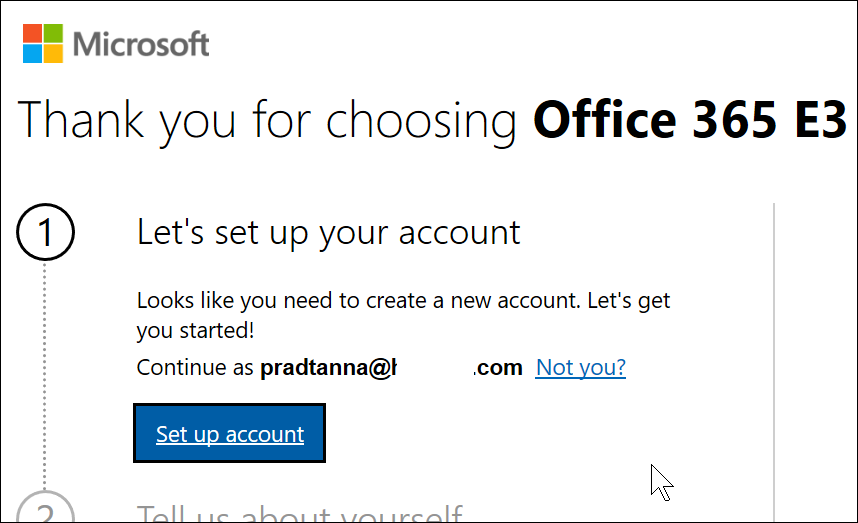

# Signing up for Power BI with a new Microsoft 365 Trial

This article describes an alternative way to sign up for the Power BI service, if you don't already have a work or school email account.

If you're having problems signing up for Power BI with your email address, first make sure it's an [email address that can be used with Power BI](../fundamentals/service-self-service-signup-for-power-bi.md#supported-email-addresses). If that's not successful, sign up for a Microsoft 365 trial and create a work account. Then, use that new work account to sign up for the Power BI service. You'll be able to use Power BI even after the Microsoft 365 trial expires.

## Sign up for a Microsoft 365 trial of Office

Sign up for a Microsoft 365 trial [on the Microsoft 365 web site](https://www.microsoft.com/microsoft-365/business/compare-more-office-365-for-business-plans). If you don't already have an account, Microsoft will walk you through the steps to create one. Since commercial email accounts (such as Hotmail and Gmail) won't work with Microsoft 365, you'll create a new account that will.  That email account will look something like *zalan\@onmicrosoft.com*.

If you select **Office 365 E5**, your trial will include Power BI Pro. The Power BI Pro trial will expire at the same time as your Office 365 E5 trial, which is currently 30 days. If, instead, you select **Office 365 E3**, you'll be able to sign up for Power BI as a *free* user and upgrade to **Premium Per User** for a 60-day trial. For more information about Premium Per User (PPU), see [Power BI Premium Per User](service-premium-per-user-faq.yml).

1. Enter your email address. Microsoft will let you know if that email address will work with Microsoft 365 or if you'll need to create a new email address.  

    If you need a new email address, Microsoft will walk you through the steps. First step, creating a new account. Select **Set up account**.

    

2. Enter details about the new account.

    

3. Create your new email address and password. Create a new sign-in name that looks like you@yourcompany.onmicrosoft.com. This is the sign-in you'll use with your new work or school account and with Power BI.

    

4. That's it!  You now have an email address that you can use to sign up for Power BI. Head on over to [Sign up for the Power BI service as an individual](../fundamentals/service-self-service-signup-for-power-bi.md)

     

    You may have to wait while your new tenant gets created.

## Important considerations

If you have any issues signing in with the new account, try using a private browser session.

By using this signup method, you are creating a new organizational tenant and you'll become the User administrator of the tenant. For more information, see [What is Power BI administration?](service-admin-administering-power-bi-in-your-organization.md). You can add new users to your tenant, then share with them, as described in the [Microsoft 365 admin documentation](https://support.office.com/article/Add-users-individually-to-Office-365---Admin-Help-1970f7d6-03b5-442f-b385-5880b9c256ec).

## Next steps

[What is Power BI administration?](service-admin-administering-power-bi-in-your-organization.md)  
[Power BI licensing in your organization](service-admin-licensing-organization.md)  
[Signing up for Power BI as an individual](../fundamentals/service-self-service-signup-for-power-bi.md)

More questions? [Try asking the Power BI Community](https://community.powerbi.com/)