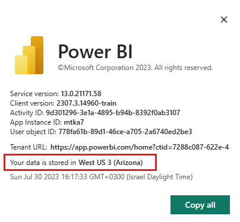

# Where is my Power BI tenant located?

<iframe width="560" height="315" src="https://www.youtube.com/embed/0fOxaHJPvdM?showinfo=0" frameborder="0" allowfullscreen></iframe>

Learn where your Power BI tenant is located and how that location is selected. Learning the location is important, because it can affect the interactions you have with the service.

## How to determine where your Power BI tenant is located

To find the region your tenant is in, follow these steps.

1. In the Power BI service, in the top menu, select help (**?**) then **About Power BI**.

1. Look for the value next to **Your data is stored in**. It's the region where your tenant is located. The value is also the region where your data is stored, unless you're using capacities in different regions for your workspaces.

    

## How the data region is selected

The data region is based on the country/region you selected when you created the tenant during AAD tenant sign-up. The tenant location does not need to match the user location. The selection applies to sign up for both Microsoft 365 and Power BI, because this information is shared. If this is a new tenant, select the appropriate country/region from the list when you sign up.

Power BI picks a data region closest to your selection, which determines where data is stored for your tenant.

> [!IMPORTANT]
> You cannot change the selection after you create the tenant.

More questions? [Try the Power BI Community](https://community.powerbi.com/)
