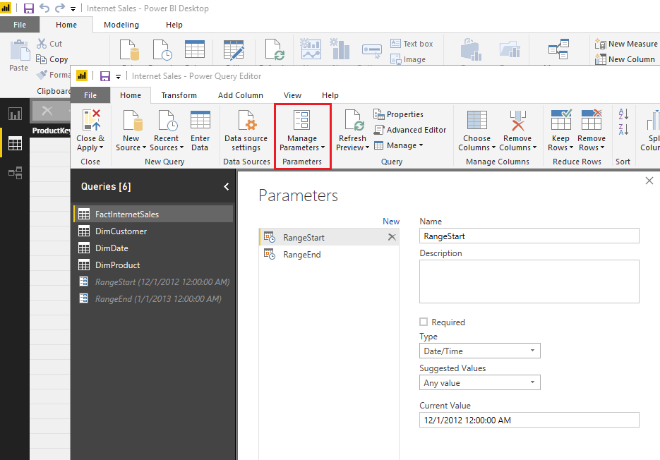

# Incremental refresh in Power BI

Incremental refresh enables very large datasets in Power BI with the following benefits:

> [!div class="checklist"]
> * **Refreshes are faster** - Only data that has changed needs to be refreshed. For example, refresh only the last five days of a ten-year dataset.
> * **Refreshes are more reliable** - Long-running connections to volatile source systems aren't necessary.
> * **Resource consumption is reduced** - Less data to refresh reduces overall consumption of memory and other resources.

Incremental refresh is available for Power BI Pro and Premium subscriptions and datasets.

Specify RangeStart and RangeEnd parameters.
Filter dataset on RangeStart and RangeEnd parameters.
Define incremental refresh policy.
Publish to the service.
Refresh dataset.

## RangeStart and RangeEnd parameters

For incremental refresh, datasets are filtered by using Power Query date/time parameters with the reserved, case-sensitive names **RangeStart** and **RangeEnd**. These parameters are used to filter the data imported into Power BI Desktop, and also to dynamically partition the data into ranges once published to the Power BI service. The parameter values are substituted by the service to filter for each partition. There's no need to set them in dataset settings in the service. Once published, the parameter values are overridden automatically by the Power BI service.

To define the parameters with default values, in the Power Query Editor, select **Manage Parameters**.

With the parameters defined, you can then apply the filter by selecting the **Custom Filter** menu option for a column.

Ensure rows are filtered where the column value *is after or equal to* **RangeStart** and *before* **RangeEnd**. Other filter combinations may result in double counting of rows.

> [!IMPORTANT]
> Verify queries have an equal to (=) on either **RangeStart** or **RangeEnd**, but not both. If the equal to (=) exists on both parameters, a row could satisfy the conditions for two partitions, which could lead to duplicate data in the model. For example,  
> \#"Filtered Rows" = Table.SelectRows(dbo_Fact, each [OrderDate] **>= RangeStart** and [OrderDate] **<= RangeEnd**) could result in duplicate data.

> [!TIP]
> While the data type of the parameters must be date/time, it's possible to convert them to match the requirements of the datasource. For example, the following Power Query function converts a date/time value to resemble an integer surrogate key of the form *yyyymmdd*, which is common for data warehouses. The function can be called by the filter step.
>
> `(x as datetime) => Date.Year(x)*10000 + Date.Month(x)*100 + Date.Day(x)`

Select **Close and Apply** from the Power Query Editor. You should have a subset of the dataset in Power BI Desktop.

## Troubleshooting