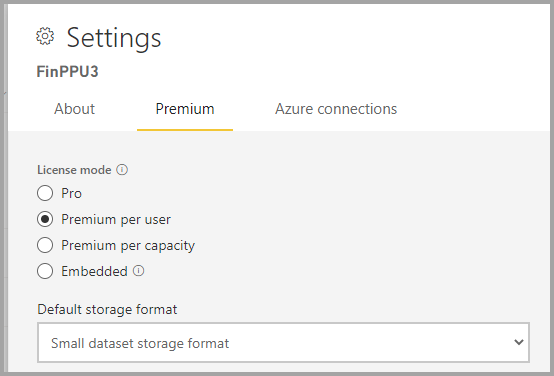

# Managing Premium capacities

Managing Power BI Premium involves creating, managing, and monitoring Premium capacities. This article provides an overview of capacities; see [Configure and manage capacities](service-admin-premium-manage.md) for step-by-step instructions.

## Creating and managing capacities

The **Capacity Settings** page of the Power BI Admin portal displays the number of v-cores purchased and Premium capacities available. The page allows Global administrators or Power BI service administrators to create Premium capacities from available v-cores, or to modify existing Premium capacities.

> [!NOTE]
> Power BI Premium recently released a new version of Premium, called **Premium Gen2**, which is currently in preview. Premium Gen2 will simplify the management of Premium capacities, and reduce management overhead. For more information, see [Power BI Premium Generation 2 (preview)](service-premium-what-is.md#power-bi-premium-generation-2-preview).

> [!NOTE]
> You can also get Premium Per User (PPU) licenses for individuals, which provides many of the features and capabilities of a Premium capacity, and also incorporates all functionality included with a Power BI Pro license. For more information, see [Power BI Premium Per User](service-premium-per-user-faq.yml).

When creating a Premium capacity, administrators are required to define:

- Capacity name (unique within the tenant).
- Capacity admin(s).
- Capacity size.
- Region for data residency.

At least one Capacity Admin must be assigned. Users assigned as Capacity Admins can:

- Assign workspaces to the capacity.
- Manage user permissions, to add additional Capacity Admins or users with assignment permissions (to enable them to assign workspaces to the capacity).
- Manage workloads, to configure maximum memory usage for paginated reports and dataflows workloads.
- Restart the capacity, to reset all operations because of a system overload.

Capacity Admins cannot access workspace content unless explicitly assigned in workspace permissions. They also don't have access to all Power BI admin areas (unless explicitly assigned) such as usage metrics, audit logs, or tenant settings. Importantly, Capacity Admins do not have permissions to create new capacities or scale existing capacities. Admins are assigned on a per capacity basis, ensuring that they can only view and manage capacities to which they are assigned.

Capacity size is selected from an available list of SKU options, which is constrained by the number of available v-cores in the pool. It's possible to create multiple capacities from the pool, which could be sourced from one or more purchased SKUs. For example, a P3 SKU (32 v-cores) could be used to create three capacities: one P2 (16 v-cores), and two P1 (2 x 8 v-cores). The following image shows an example setup for the fictitious Contoso organization consisting of five Premium capacities (3 x P1, and 2 x P3) with each containing workspaces, and several workspaces in shared capacity.

A Premium capacity can be assigned to a region other than the home region of the Power BI tenant, known as multi-geo. Multi-geo provides administrative control over which datacenters within defined geographic regions your Power BI content resides. The rationale for a multi-geo deployment is typically for corporate or government compliance, rather than performance and scale. Report and dashboard loading still involves requests to the home region for metadata. To learn more, see [Multi-Geo support for Power BI Premium](service-admin-premium-multi-geo.md).

Power BI service administrators and Global Administrators can modify Premium capacities. Specifically, they can:

- Change the capacity size to scale-up or scale-down resources.
- Add or remove Capacity Admins.
- Add or remove users that have assignment permissions.
- Add or remove additional workloads.
- Change regions.

Assignment permissions are required to assign a workspace to a specific Premium capacity. The permissions can be granted to the entire organization, specific users, or groups.

By default, Premium capacities support workloads associated with running Power BI queries. Premium capacities also support additional workloads: **AI (Cognitive Services)**, **Paginated Reports**, and **Dataflows**. Each workload requires configuring the maximum memory (as a percentage of total available memory) that can be used by the workload. It's important to understand that increasing maximum memory allocations can impact the number of active models that can be hosted and the throughput of refreshes. 

Memory is dynamically allocated to dataflows, but is statically allocated to paginated reports. The reason for statically allocating the maximum memory is that paginated reports run within a secured contained space of the capacity. Care should be taken when setting paginated reports memory as it reduces available memory for loading models. To learn more, see the [Default memory settings](service-admin-premium-workloads.md#default-memory-settings).

For Premium Gen2, no memory settings or updates are required. All workloads have all the memory they need, within the limits of your capacity SKU.

Deleting a Premium capacity is possible and won't result in the deletion of its workspaces and content. Instead, it moves any assigned workspaces to shared capacity. When the Premium capacity was created in a different region, the workspace is moved to shared capacity of the home region.

### Assigning workspaces to capacities

Workspaces can be assigned to a Premium capacity in the Power BI Admin portal or, for a workspace, in the **Workspace** pane.

Capacity Admins, as well as Global Administrators or Power BI service administrators, can bulk assign workspaces in the Power BI Admin portal. Bulk assigned can apply to:

- **Workspaces by users** - All workspaces owned by those users, including personal workspaces, are assigned to the Premium capacity. This will include the reassignment of workspaces when they are already assigned to a different Premium capacity. In addition, the users are also assigned workspace assignment permissions.

- **Specific workspaces**
- **The entire organization's workspaces** - All workspaces, including personal workspaces, are assigned to the Premium capacity. All current and future users are assigned workspace assignment permissions. This approach is not recommended. A more targeted approach is preferred.

You can enable Premium capabilities in a workspace by setting the proper license mode. To set a license mode, you must be both a workspace admin, and have assignment permissions. To enable Premium capabilities for P and EM SKUs, set the license mode to Premium per capacity. To enable Premium capabilities for A SKU’s, set the license mode to Embedded. To enable Premium capabilities for Premium Per User (PPU), mark the license mode as Premium Per User. To remove a workspace from Premium, mark the workspace license mode as Pro.

Workspace admins can remove a workspace from a capacity (to shared capacity) without requiring assignment permission. Removing workspaces from dedicated capacities effectively relocates the workspace to shared capacity. Note that removing a workspace from a Premium capacity may have negative consequences resulting, for example, in shared content becoming unavailable to Power BI Free licensed users, or the suspension of scheduled refresh when they exceed the allowances supported by shared capacities.

In the Power BI service, a workspace assigned to a Premium capacity is easily identified by the diamond icon that adorns the workspace name.

## Monitoring capacities

Monitoring Premium capacities provides administrators with an understanding of how the capacities are performing. Capacities can be monitored by using the Power BI Admin portal or the **Power BI Premium Capacity Metrics** (Power BI) app.

### Power BI Admin portal

In the Admin portal, for each capacity, the **Health** tab provides summary metrics for the capacity and each enabled workload. Metrics show an average over the past seven days.  

At the capacity level, metrics are cumulative of all enabled workloads. the following metrics are provided:

- **CPU UTILIZATION** - Provides average CPU utilization as a percentage of total available CPU for the capacity.  
- **MEMORY USAGE** - Provides average memory usage (in GB) as a total of available memory for the capacity. 

For each enabled workload, CPU utilization and memory usage are provided, as well as a number of workload specific metrics. For example, for the Dataflow workload, **Total Count** shows total refreshes for each dataflow, and **Average Duration** shows the average duration of refresh for the dataflow.

To learn more about all available metrics for each workload, see [Monitor capacities in the Admin portal](service-admin-premium-monitor-portal.md).

The monitoring capabilities in the Power BI Admin portal are designed to provide a quick summary of key capacity metrics. For more detailed monitoring, it's recommended you use the **Power BI Premium Capacity Metrics** app.

### Power BI Premium Capacity Metrics app

The [Power BI Premium Capacity Metrics app](https://appsource.microsoft.com/en-us/product/power-bi/pbi_pcmm.capacity-metrics-dxt?tab=Overview) is a Power BI app available to capacity admins and is installed like any other Power BI app. It contains a dashboard and report.

When the app opens, the dashboard is loaded to present numerous tiles expressing an aggregated view over all capacities of which the user is a Capacity Admin. The dashboard layout includes five main sections:

- **Overview** - App version, number of capacities and workspaces
- **System Summary** - Memory and CPU metrics
- **Dataset Summary** - Number of datasets, DQ/LC, refresh, and query metrics
- **Dataflow Summary** - Number of dataflows, and dataset metrics
- **Paginated Report Summary** - Refresh and view metrics

The underlying report, from which the dashboard tiles were pinned, can be accessed by clicking on any dashboard tile. It provides a more detailed perspective of each of the dashboard sections and supports interactive filtering. 

Filtering can be achieved by setting slicers by date range, capacity, workspace and workload (report, dataset, dataflow), and by selecting elements within report visuals to cross filter the report page. Cross filtering is a powerful technique to narrow down to specific time periods, capacities, workspaces, datasets, etc. and can be very helpful when performing root cause analysis.

For detailed information about dashboard and report metrics in the app, see [Monitor Premium capacities with the app](service-admin-premium-monitor-capacity.md).

### Interpreting metrics

Metrics should be monitored to establish a baseline understanding of resource usage and workload activity. If the capacity becomes slow, it is important to understand which metrics to monitor, and the conclusions you can make.

Ideally, queries should complete within a second to deliver responsive experiences to report users and enable higher query throughput. It is usually of lesser concern when background processes - including refreshes - take longer times to complete.

In general, slow reports can be an indication of an over-heating capacity. When reports fail to load, this is an indication of an over-heated capacity. In either situation, the root cause could be attributable to many factors, including:

- **Failed queries** certainly indicate memory pressure, and that a model could not be loaded into memory. The Power BI service will attempt to load a model for 30 seconds before failing.

- **Excessive query wait times** can be due to several reasons:
  - The need for the Power BI service to first evict model(s) and then load the to-be-queried model (recall that higher dataset eviction rates alone are not an indication of capacity stress, unless accompanied by long query wait times that indicate memory thrashing).
  - Model load times (especially the wait to load a large model into memory).
  - Long running queries.
  - Too many LC\DQ connections (exceeding capacity limits).
  - CPU saturation.
  - Complex report designs with an excessive number of visuals on a page (recall that each visual is a query).

- **Long query durations** can indicate that model designs are not optimized, especially when multiple datasets are active in a capacity, and just one dataset is producing long query durations. This suggests that the capacity is sufficiently resourced, and that the in-question dataset is sub-optimal or just slow. Long running queries can be problematic as they can block access to resources required by other processes.
- **Long refresh wait times** indicate insufficient memory due to many active models consuming memory, or that a problematic refresh is blocking other refreshes (exceeding parallel refresh limits).

A more detailed explanation of how to use the metrics is covered in the [Optimizing Premium capacities](service-premium-capacity-optimize.md) article.

## Acknowledgments

This article was written by Peter Myers, Data Platform MVP and independent BI expert with [Bitwise Solutions](https://www.bitwisesolutions.com.au/).

## Next steps

> [!div class="nextstepaction"]
> [Optimizing Premium capacities](service-premium-capacity-optimize.md)   
> [!div class="nextstepaction"]
> [Configure workloads in a Premium capacity](service-admin-premium-workloads.md)   

More questions? [Try asking the Power BI Community](https://community.powerbi.com/)

Power BI has introduced Power BI Premium Gen2 as a preview offering, which improves the Power BI Premium experience with improvements in the following:
* Performance
* Per-user licensing
* Greater scale
* Improved metrics
* Autoscaling
* Reduced management overhead

For more information about Power BI Premium Gen2, see [Power BI Premium Generation 2 (preview)](service-premium-what-is.md#power-bi-premium-generation-2-preview).
