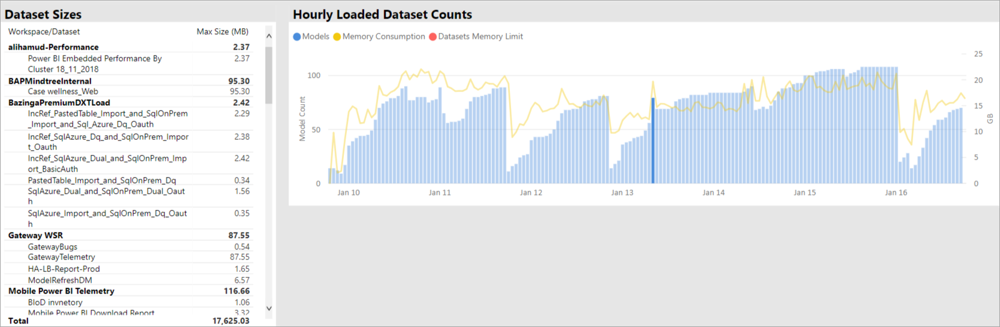
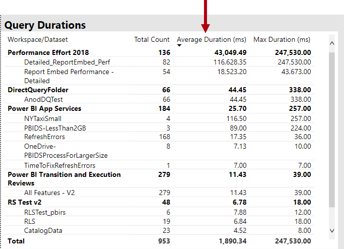
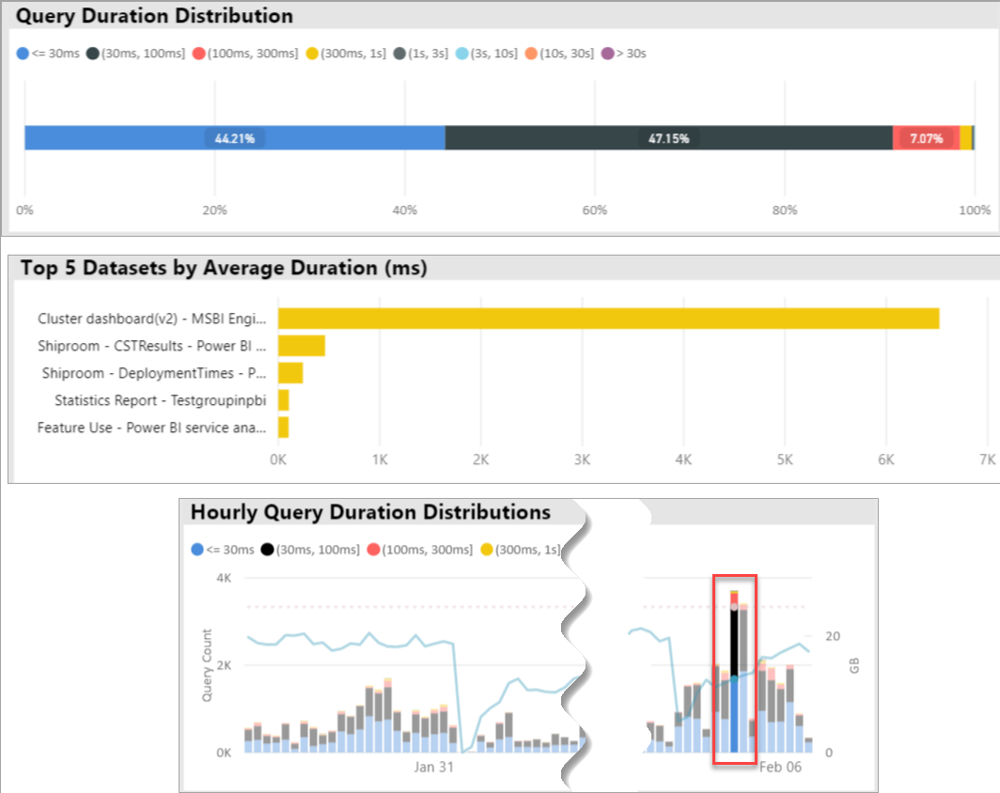
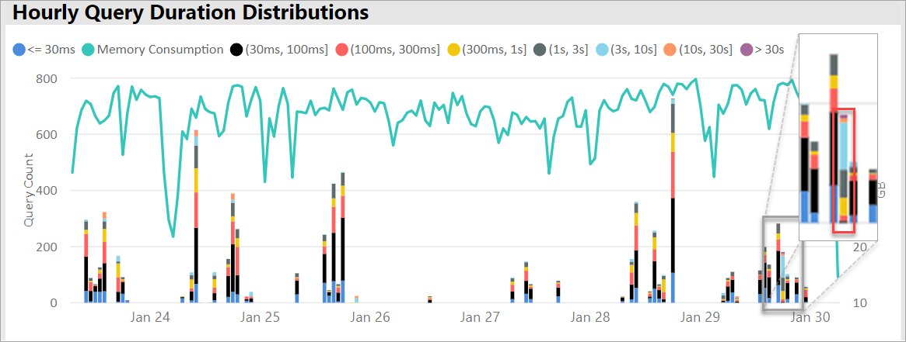
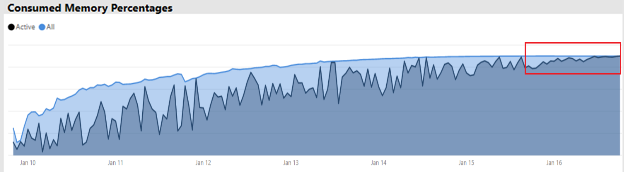

# Premium capacity scenarios

This article describes real-world scenarios where Power BI premium capacities have been implemented. Common issues and challenges are described, also how to identify issues, and help resolve them:

- [Keeping datasets up-to-date](#keeping-datasets-up-to-date)
- [Identifying slow-responding datasets](#identifying-slow-responding-datasets)
- [Identifying causes for sporadically slow-responding datasets](#identifying-causes-for-sporadically-slow-responding-datasets)
- [Determining whether there is enough memory](#determining-whether-there-is-enough-memory)
- [Determining whether there is enough CPU](#determining-whether-there-is-enough-cpu)

The steps, along with chart and table examples are from the **Power BI Premium Capacity Metrics app** that a Power BI administrator will have access to.

> [!NOTE]
> Power BI Premium recently released a new version of Premium, called **Premium Gen2**, which is currently in preview. Premium Gen2 will simplify the management of Premium capacities, and reduce management overhead. For more information, see [Power BI Premium Generation 2](service-premium-what-is.md#power-bi-premium-generation-2).
>
>To review the Power BI Embedded Gen2 enhancements, refer to [Power BI Embedded Generation 2](../developer/embedded/power-bi-embedded-generation-2.md).

## Keeping datasets up to date

In this scenario, an investigation was triggered when users complained that report data sometimes appeared to be old or "stale".

In the app, the admin interacts with the **Refreshes** visual, sorting datasets by the **Max Wait Time** statistics in descending order. This visual helps them reveal datasets having the longest wait times, grouped by workspace name.

In the **Hourly Average Refresh Wait Times** visual, they notice that the refresh wait times peak consistently around 4PM each day.

There are several possible explanations for these results:

- Too many refresh attempts could be occurring at the same time, exceeding the limits defined by the capacity node. In this case, six concurrent refreshes on a P1 with default memory allocation.

- Datasets to be refreshed may be too large to fit into available memory (requiring at least 2x the memory required for full refresh).
- Inefficient Power Query logic may be resulting in a memory usage spike during dataset refresh. On a busy capacity, this spike can occasionally reach the physical limit, failing the refresh and potentially affecting other report view operations on the capacity.
- Frequently queried datasets that need to stay in memory may affect the ability of other datasets to refresh because of limited available memory.

To help investigate, the Power BI administrator can look for:

- Low available memory at the time of data refreshes when available memory is less than 2x the size of the dataset to be refreshed.
- Datasets not being refreshed and not in memory before refresh, yet started to show interactive traffic during heavy refresh times. To see which datasets are loaded into memory at any given time, a Power BI administrator can look at the datasets area of the **Datasets** tab in the app. The admin can then cross-filter to a given time by clicking on one of the bars in the **Hourly Loaded Dataset Counts**. A local spike, shown in the below image, indicates an hour when multiple datasets were loaded into memory, which could delay the start of scheduled refreshes.
- Increased dataset evictions taking place when data refreshes are scheduled to start. Evictions can indicate that there was high memory pressure caused by serving too many different interactive reports before refresh. The **Hourly Dataset Evictions and Memory Consumption** visual can clearly indicate spikes in evictions.

The following image shows a local spike in loaded datasets, which suggests interactive querying delayed the start of refreshes. Selecting a time period in the **Hourly Loaded Dataset Counts** visual will cross-filter the **Dataset Sizes** visual.

The Power BI administrator can attempt to resolve the issue by taking steps to ensure that sufficient memory is available for data refreshes to start by:

- Contacting dataset owners and asking them to stagger and space out data refresh schedules.
- Reducing dataset query load by removing unnecessary dashboards or dashboard tiles, especially content that enforces row-level security.
- Speeding data refreshes by optimizing Power Query logic. Improve modeling calculated columns or tables. Reduce dataset sizes or configure larger datasets to perform incremental data refresh.

## Identifying slow-responding datasets

In this scenario, an investigation began when users complained that certain reports took too long to open. Sometimes the reports would stop responding.

In the app, the Power BI administrator can use the **Query Durations** visual to determine the worst-performing datasets by sorting datasets by descending **Average Duration**. This visual also shows dataset query counts, so you can see how often the datasets are queried.

The administrator can refer to the **Query Duration Distribution** visual, which shows an overall distribution of bucketed query performance (<= 30ms, 0-100ms) for the filtered time period. Generally, queries that take one second or less are considered responsive by most users. Queries that take longer tend to create a perception of bad performance.

The **Hourly Query Duration Distribution** visual allows the Power BI administrator to identify one-hour periods when the capacity performance could have been perceived as poor. The larger the bar segments that represent query durations over one second, the larger the risk that users will perceive poor performance.

The visual is interactive, and when a segment of the bar is selected, the corresponding **Query Durations** table visual on the report page is cross-filtered to show the datasets it represents. This cross-filtering allows the Power BI administrator to easily identify which datasets are responding slowly.

The following image shows a visual filtered by **Hourly Query Duration Distributions**, focusing on the worst-performing datasets in one-hour buckets.

After the poor-performing dataset in a specific one-hour time span is identified, the Power BI administrator can investigate whether poor performance is caused by an overloaded capacity or due to a poorly designed dataset or report. They can refer to the **Query Wait Times** visual, and sort datasets by descending average query wait time. If a large percentage of queries is waiting, a high demand for the dataset is likely the cause of too many query delays. If the average query wait time is substantial (> 100 ms), it may be worth reviewing the dataset and report to see if optimizations can be made. For example, fewer visuals on given report pages or a DAX expression optimization.

There are several possible reasons for query wait time buildup in datasets:

- A suboptimal model design, measure expressions, or even report design - all circumstances that can contribute to long running queries that consume high levels of CPU. This forces new queries to wait until CPU threads become available and can create a convoy effect (think traffic jam), commonly seen during peak business hours. The **Query Waits** page will be the main resource to determine whether datasets have high average query wait times.
- A high number of concurrent capacity users (hundreds to thousands) consuming the same report or dataset. Even well-designed datasets can perform badly beyond a concurrency threshold. This performance problem is indicated by a single dataset showing a dramatically higher value for query counts than other datasets. For example, you may see 300K queries for one dataset compared to <30K queries for all other datasets. At some point the query waits for this dataset will start to stagger, which can be seen in the **Query Durations** visual.
- Many disparate datasets queried concurrently, causing thrashing as datasets frequently cycle in and out of memory. This situation results in users experiencing slow performance when the dataset is loaded into memory. To confirm, the Power BI administrator can refer to the **Hourly Dataset Evictions and Memory Consumption** visual, which may indicate that a high number of datasets loaded into memory are being repeatedly evicted.

## Identifying causes for sporadically slow-responding datasets

In this scenario, an investigation began when users described that report visuals sometimes were slow to respond or could become unresponsive. At other times the report visuals were acceptably responsive.

Within the app, the **Query Durations** section was used to find the culprit dataset in the following way:

- In the Query Durations visual, the admin filtered dataset by dataset (starting at the top datasets queried) and examined the cross filtered bars in the **Hourly Query Distributions** visual.
- When a single one-hour bar showed significant changes in the ratio between all query duration groups vs. other one-hour bars for that dataset (for example, the ratios between the colors changes drastically), it means this dataset demonstrated a sporadic change in performance.
- The one-hour bars showing an irregular portion of poor performing queries, indicated a timespan where that dataset was impacted by a noisy neighbor effect, caused by other datasets' activities.

The image below shows one hour on January 30, where a significant setback in a dataset's performance occurred, indicated by the size of the "(3,10s]" execution duration bucket. Clicking that one-hour bar reveals all the datasets loaded into memory during that time, surfacing possible datasets causing the noisy neighbor effect.

Once a problematic timespan is identified (for example, during Jan. 30th in the image above) the Power BI administrator can remove all dataset filters then filter only by that timespan to determine which datasets were actively queried during this time. The culprit dataset for the noisy neighbor effect is usually the top queried dataset or the one with the longest average query duration.

A solution to this problem could be to distribute the culprit datasets over different workspaces on different Premium capacities, or on shared capacity if the dataset size, consumption requirements, and data refresh patterns are supported.

The reverse could be true as well. The Power BI administrator could identify times when a dataset query performance drastically improves and then look for what disappeared. If certain information is missing at that point, then that may help to point to the causing problem.

## Determining whether there is enough memory

To determine whether there is enough memory for the capacity to complete its workloads, the Power BI administrator can refer to the **Consumed Memory Percentages** visual in the **Datasets** tab of the app. **All** (total) memory represents the memory consumed by datasets loaded into memory, regardless of whether they are actively queried or processed. **Active** memory represents the memory consumed by datasets that are being actively processed.

In a healthy capacity the visual will look like this, showing a gap between All (total) and Active memory:

In a capacity experiencing memory pressure, the same visual will clearly show active memory and total memory converging, meaning that it is impossible to load additional datasets into memory then. In this case, the Power BI administrator can click **Capacity Restart** (in **Advanced Options** of the capacity settings area of the admin portal). Restarting the capacity results in all datasets being flushed from memory and allowing them to reload into memory as required (by queries or data refresh).

> [!NOTE]
> For Premium Gen2 and [Embedded Gen2](../developer/embedded/power-bi-embedded-generation-2.md), memory consumption does not need to be tracked. The only limitation in Premium Gen2 and Embedded Gen2, is on the memory footprint of a single artifact. The footprint cannot exceed the memory available on the capacity. For more information about Premium Gen2, see [Power BI Premium Generation 2 (preview)](service-premium-what-is.md#power-bi-premium-generation-2).

## Determining whether there is enough CPU

In general, a capacity's average CPU utilization should remain below 80%. Exceeding this value means the capacity is approaching CPU saturation.

Effects of CPU saturation are expressed by operations taking longer than they should, due to the capacity performing many CPU contexts switches as it attempts to process all operations. In a Premium capacity with a high number of concurrent queries, this is indicated by high query wait times. A consequence of high query wait times is slower responsiveness than usual. The Power BI administrator can easily identify when the CPU is saturated by viewing the **Hourly Query Wait Time Distributions** visual. Periodic peaks of query wait time counts indicate potential CPU saturation.

A similar pattern can sometimes be detected in background operations if they contribute to CPU saturation. A Power BI administrator can look for a periodic spike in refresh times for a specific dataset, which can indicate CPU saturation at the time (probably because of other ongoing dataset refreshes and/or interactive queries). In this instance, referring to the **System** view in the app may not necessarily reveal that the CPU is at 100%. The **System** view displays hourly averages, but the CPU can become saturated for several minutes of heavy operations, which shows up as spikes in wait times.

There are more nuances to seeing the effect of CPU saturation. While the number of queries that wait is important, query wait time will always happen to some extent without causing discernable performance degradation. Some datasets (with lengthier average query time, indicating complexity or size) are more prone to the effects of CPU saturation than others. To easily identify these datasets, the Power BI administrator can look for changes in the color composition of the bars in the **Hourly Wait Time Distribution** visual. After spotting an outlier bar, they can look for the datasets that had query waits during that time and also look at the average query wait time compared to average query duration. When these two metrics are of the same magnitude and the query workload for the dataset is non-trivial, it is likely that the dataset is impacted by insufficient CPU.

This effect can be especially apparent when a dataset is consumed in short bursts of high frequency queries by multiple users (for example, in a training session), resulting in CPU saturation during each burst. In this case, significant query wait times on this dataset can be experienced as well as impacting on other datasets in the capacity (noisy neighbor effect).

In some cases, Power BI administrators can request that dataset owners create a less volatile query workload by creating a dashboard (which queries periodically with any dataset refresh for cached tiles) instead of a report. This can help prevent spikes when the dashboard is loaded. This solution may not always be possible for given business requirements, however it can be an effective way to avoid CPU saturation, without making changing to the dataset.

> [!NOTE]
> For Premium Gen2 and [Embedded Gen2](../developer/embedded/power-bi-embedded-generation-2.md), CPU time utilization is tracked on a per-artifact level, and is visible in the capacity utilization app. Each artifact displays their total CPU time utilization on a given timespan. For more information about Premium Gen2, see [Power BI Premium Generation 2](service-premium-what-is.md#power-bi-premium-generation-2).

## Acknowledgments

This article was written by Peter Myers, Data Platform MVP and independent BI expert with [Bitwise Solutions](https://www.bitwisesolutions.com.au/).

## Next steps

> [!div class="nextstepaction"]
> [Monitor Premium capacities with the app](service-admin-premium-monitor-capacity.md)    
> [!div class="nextstepaction"]
> [Monitor capacities in the Admin portal](service-admin-premium-monitor-portal.md)   

More questions? [Try asking the Power BI Community](https://community.powerbi.com/)

Power BI has introduced Power BI Premium Gen2 as a preview offering, which improves the Power BI Premium experience with improvements in the following:
* Performance
* Per-user licensing
* Greater scale
* Improved metrics
* Autoscaling
* Reduced management overhead

For more information about Power BI Premium Gen2, see [Power BI Premium Generation 2 (preview)](service-premium-what-is.md#power-bi-premium-generation-2).

