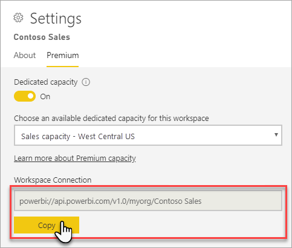
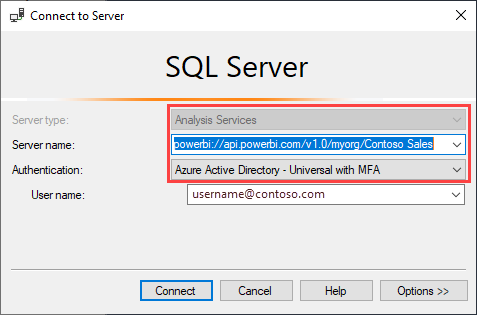
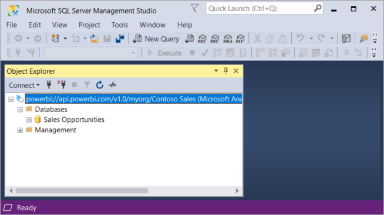
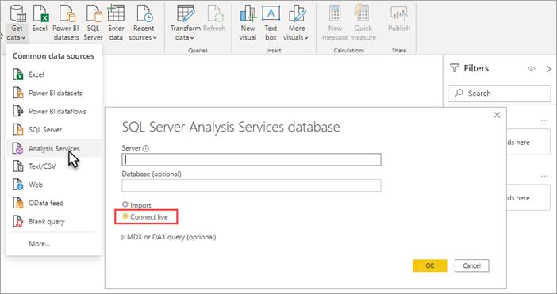

# Dataset connectivity with the XMLA endpoint

Power BI Premium, Premium Per User, and Power BI Embedded workspaces support open-platform connectivity from Microsoft and third-party client applications and tools by using an *XMLA endpoint*.

## What's an XMLA endpoint?

Workspaces use the [XML for Analysis](/analysis-services/xmla/xml-for-analysis-xmla-reference?view=power-bi-premium-current&preserve-view=true) (XMLA) protocol for communications between client applications and the engine that manages your Power BI workspaces and datasets. These communications are through what are commonly referred to as XMLA endpoints. XMLA is the same communication protocol used by the Microsoft Analysis Services engine, which under the hood, runs Power BI's semantic modeling, governance, lifecycle, and data management. Data sent over the XMLA protocol is fully encrypted.

By default, *read-only* connectivity using the endpoint is enabled for the **Datasets workload** in a capacity. With read-only, data visualization applications and tools can query dataset model data, metadata, events, and schema. *Read-write* operations using the endpoint can be enabled providing additional dataset management, governance, advanced semantic modeling, debugging, and monitoring. With read-write enabled, datasets have more parity with Azure Analysis Services and SQL Server Analysis Services enterprise grade tabular modeling tools and processes.

## Terms of Use

Use of the XMLA endpoint is subject to the following:

**Single-user application** - The application uses a single user account or app identity to access a Power BI dataset through the XMLA endpoint. Typical examples are developer tools, admin scripts, and automated processes to perform data modelling and administrative tasks, such as altering the metadata of a dataset, performing a backup or restore operation, or triggering a data refresh. The user account or app identity that the client application uses to access a dataset must have a valid Premium Per User (PPU) license unless the dataset resides on a Premium capacity.

**Multi-user application** - The application provides multiple users with access to a Power BI dataset. For example, a middle-tier application integrating a dataset into a business solution and accessing the dataset on behalf of its business users.

- For Premium Per User (PPU) workspaces, the application must require each user to sign in to Power BI. The application uses each user’s access token to access the datasets. The application is not permitted to use a service account or other app identity to perform tasks on behalf of its users. Each user must use their own Power BI account for opening reports, accessing datasets, and executing queries.
- For Premium workspaces, the application may use a service account or app identity on behalf of the end users without requiring each user to sign in to Power BI.

## Client applications and tools

Here are some of the most common applications and tools used with Azure Analysis Services and SQL Server Analysis Services, and now supported by Power BI Premium datasets:

**Microsoft Excel** – Excel PivotTables are one of the most common tools used to summarize, analyze, explore, and present summary data from Power BI datasets. Read-only is required for query operations. Click-to-Run version of Office 16.0.13612.10000 or higher is required. 

**Visual Studio with Analysis Services projects** – Also known as SQL Server Data Tools, or simply **SSDT**, is an enterprise grade model authoring tool for Analysis Services tabular models. Analysis Services projects extensions are supported on all Visual Studio 2017 and later editions, including the free Community edition. Extension version 2.9.14 or higher is required to deploy tabular models to a Premium workspace. When deploying, the model must be at the 1500 or higher compatibility level. XMLA read-write is required on the datasets workload. To learn more, see [Tools for Analysis Services](/analysis-services/tools-and-applications-used-in-analysis-services?view=power-bi-premium-current&preserve-view=true).

**SQL Server Management Studio (SSMS)** - Supports DAX, MDX, and XMLA queries. Perform fine-grain refresh operations and scripting of dataset metadata by using the [Tabular Model Scripting Language](/analysis-services/tmsl/tabular-model-scripting-language-tmsl-reference) (TMSL). Read-only is required for query operations. Read-write is required for scripting metadata. Requires SSMS version **18.9** or higher. Download [here](/sql/ssms/download-sql-server-management-studio-ssms). 

**SQL Server Profiler** – Installed with SSMS, this tool provides tracing and debugging of dataset events. While officially deprecated for SQL Server, Profiler continues to be included in SSMS and remains supported for Analysis Services and Power BI. Requires SQL Server Profiler version **18.9** or higher. User must specify the dataset ([initial catalog](#initial-catalog)) when connecting with the XMLA endpoint. To learn more, see [SQL Server Profiler for Analysis Services](/analysis-services/instances/use-sql-server-profiler-to-monitor-analysis-services?view=power-bi-premium-current&preserve-view=true).

**Analysis Services Deployment Wizard** – Installed with SSMS, this tool provides deployment of Visual Studio authored tabular model projects to Analysis Services and Premium workspaces. It can be run interactively or from the command line for automation. XMLA read-write is required. To learn more, see [Analysis Services Deployment Wizard](/analysis-services/deployment/deploy-model-solutions-using-the-deployment-wizard?view=power-bi-premium-current&preserve-view=true).

**PowerShell cmdlets** – Analysis Services cmdlets can be used to automate dataset management tasks like refresh operations. XMLA read-write is required. Version **21.1.18256** (for Premium Gen2 capacities, see [Premium Gen2 prerequisites](service-premium-transition-gen1-to-gen2.md#premium-gen2-prerequisites)) or higher of the [SqlServer PowerShell module](https://www.powershellgallery.com/packages/SqlServer/) is required. Azure Analysis Services cmdlets in the Az.AnalysisServices module are not supported for Power BI datasets. To learn more, see [Analysis Services PowerShell Reference](/analysis-services/powershell/analysis-services-powershell-reference?view=power-bi-premium-current&preserve-view=true).

**Power BI Report Builder** - A tool for authoring paginated reports. Create a report definition that specifies what data to retrieve, where to get it, and how to display it. You can preview your report in Report Builder and then publish your report to the Power BI service. XMLA read-only is required. To learn more, see [Power BI Report Builder](../paginated-reports/report-builder-power-bi.md).

**Tabular Editor** - An open-source tool for creating, maintaining, and managing tabular models using an intuitive, lightweight editor. A hierarchical view shows all objects in your tabular model. Objects are organized by display folders with support for multi-select property editing and DAX syntax highlighting. XMLA read-only is required for query operations. Read-write is required for metadata operations. To learn more, see [tabulareditor.github.io](https://tabulareditor.github.io/).

**DAX Studio** – An open-source tool for DAX authoring, diagnosis, performance tuning, and analysis. Features include object browsing, integrated tracing, query execution breakdowns with detailed statistics, DAX syntax highlighting and formatting. XMLA read-only is required for query operations. To learn more, see [daxstudio.org](https://daxstudio.org/).

**ALM Toolkit** - An open-source schema compare tool for Power BI datasets, most often used for application lifecycle management (ALM) scenarios. Perform deployment across environments and retain incremental refresh historical data. Diff and merge metadata files, branches, and repos. Reuse common definitions between datasets. Read-only is required for query operations. Read-write is required for metadata operations. To learn more, see [alm-toolkit.com](http://alm-toolkit.com/).

**Third party** - Includes client data visualization applications and tools that can connect to, query, and consume datasets in Premium workspaces. Most tools require the latest versions of MSOLAP client libraries, but some may use ADOMD. Read-only or read-write XMLA Endpoint is dependent on the operations.

### Client libraries

Client applications and tools don't communicate directly with the XMLA endpoint. Instead, they use *client libraries* as an abstraction layer. These are the same client libraries that applications use to connect to Azure Analysis Services and SQL Server Analysis Services. Microsoft applications like Excel, SQL Server Management Studio (SSMS), and  Analysis Services projects extension for Visual Studio install all three client libraries and update them along with regular application and extension updates. Developers can also use the client libraries to build custom applications. In some cases, particularly with third-party applications, if not installed with the application, it may be necessary to install newer versions of the client libraries. Client libraries are updated monthly. To learn more, see [Client libraries for connecting to Analysis Services](/azure/analysis-services/analysis-services-data-providers).

The minimum required client library versions for Premium Gen2 capacities are listed in the [Premium Gen2 prerequisites](service-premium-transition-gen1-to-gen2.md#premium-gen2-prerequisites).

## Optimize datasets for write operations by enabling large models

When using the XMLA endpoint for dataset management with write operations, it's recommended you enable the dataset for large models. This reduces the overhead of write operations, which can make them considerably faster. For datasets over 1 GB in size (after compression), the difference can be significant. To learn more, see [Large models in Power BI Premium](service-premium-large-models.md).

## Enable XMLA read-write

By default, a Premium capacity has the XMLA Endpoint property setting enabled for read-only. This means applications can only query a dataset. For applications to perform write operations, the XMLA Endpoint property must be enabled for read-write. The XMLA Endpoint property setting for a capacity is configured in the **Datasets workload**. The XMLA Endpoint setting applies to *all workspaces and datasets* assigned to the capacity.

### To enable read-write for a capacity

1. In the Admin portal, select **Capacity settings** > **Power BI Premium** > capacity name.
2. Expand **Workloads**. In the **XMLA Endpoint** setting, select **Read Write**.

    

## Connecting to a Premium workspace

Workspaces assigned to a capacity have a connection string in URL format like this,  
`powerbi://api.powerbi.com/v1.0/[tenant name]/[workspace name]`.

Applications connecting to the workspace use the URL as if it were an Analysis Services server name. For example,  
`powerbi://api.powerbi.com/v1.0/contoso.com/Sales Workspace`.

Users with UPNs in the same tenant (not B2B) can replace the tenant name with `myorg`. For example,  
`powerbi://api.powerbi.com/v1.0/myorg/Sales Workspace`.

B2B users must specify their organization UPN in tenant name. For example,  
`powerbi://api.powerbi.com/v1.0/fabrikam.com/Sales Workspace`.

> [!NOTE]
> To determine the primary domain name and ID of a Power BI tenant, sign into the Azure portal, select Azure Active Directory from the main menu, and then note the information on the Azure Active Directory Overview page. For more information, see [Find the Microsoft Azure AD tenant ID and primary domain name](/partner-center/find-ids-and-domain-names).

### To get the workspace connection URL

In workspace **Settings** > **Premium** > **Workspace Connection**, select **Copy**.

## Connection requirements

### Initial catalog

With some tools, such as SQL Server Profiler, you must specify an *Initial Catalog*, which is the dataset (database) to connect to in your workspace. In the **Connect to Server** dialog, select **Options** > **Connection Properties** > **Connect to database**, enter the dataset name.

### Duplicate workspace names

[New workspaces](../collaborate-share/service-new-workspaces.md) (created using the new workspace experience) in Power BI impose validation to disallow creating or renaming workspaces with duplicate names. Workspaces that haven't been migrated can result in duplicate names. When connecting to a workspace with the same name as another workspace, you may get the following error:

**Cannot connect to powerbi://api.powerbi.com/v1.0/[tenant name]/[workspace name].**

To work around this error, in addition to the workspace name, specify the ObjectIDGuid, which can be copied from the workspace objectID in the URL. Append the objectID to the connection URL. For example,  
'powerbi://api.powerbi.com/v1.0/myorg/Contoso Sales - 9d83d204-82a9-4b36-98f2-a40099093830'.

### Duplicate dataset name

When connecting to a dataset with the same name as another dataset in the same workspace, append the dataset guid to the dataset name. You can get both dataset name and guid when connected to the workspace in SSMS.

### Delay in datasets shown

When connecting to a workspace, changes from new, deleted, and renamed datasets can take up to a few minutes to appear.

### Unsupported datasets

The following datasets aren't accessible by the XMLA endpoint. These datasets won't appear under the workspace in SSMS or in other tools:

- Datasets based on a live connection to an Azure Analysis Services or SQL Server Analysis Services model. 
- Datasets based on a live connection to a Power BI dataset in another workspace. To learn more, see [Intro to datasets across workspaces](../connect-data/service-datasets-across-workspaces.md).
- Datasets with Push data by using the REST API.
- Excel workbook datasets.

### Server/workspace alias

Server name aliases, supported in Azure Analysis Services are not supported for Premium workspaces.

## Security

In addition to the XMLA Endpoint property being enabled read-write by the capacity admin, the tenant-level setting **Allow XMLA endpoints and Analyze in Excel with on-premises datasets** must be enabled in the admin portal. If you need to generate Analyze in Excel (AIXL) files that connect to the XMLA Endpoint, the tenant-level setting **Allow live connections** should also be enabled. These settings are both enabled by default.

**Allow XMLA endpoints and Analyze in Excel with on-premises datasets** is an integration setting.

:::image type="content" source="media/service-premium-connect-tools/allow-xmla-endpoints.png" alt-text="Integration setting allow XMLA endpoints.":::

The following table describes the implications of the setting **Export data** for XMLA and Analyze in Excel (AIXL):

|Setting  |Allow XMLA endpoints and Analyze in Excel with on-premises datasets = **disabled**  |Allow XMLA endpoints and Analyze in Excel with on-premises datasets = **enabled**  |
|---------|---------|---------|
|Allow Live Connections toggle = disabled     |XMLA *disallowed*, Analyze in Excel *disallowed*, AIXL for on-prem datasets *disallowed*         |XMLA *allowed*, Analyze in Excel *disallowed*, AIXL for on-prem datasets *allowed*         |
|Allow Live Connections toggle = enabled     | XMLA *disallowed*, Analyze in Excel *allowed*, AIXL for on-prem datasets *disallowed*        | XMLA *allowed*, Analyze in Excel *allowed*, AIXL for on-prem datasets *allowed*        |

**Allow live connections** is an export and sharing setting.

:::image type="content" source="media/service-premium-connect-tools/allow-live-connections.png" alt-text="Export and sharing setting allow live connections.":::

Access through the XMLA endpoint will honor security group membership set at the workspace/app level.

Workspace contributors and above have write access to the dataset and are therefore equivalent to Analysis Services database admins. They can deploy new datasets from Visual Studio and execute TMSL scripts in SSMS.

Operations that require Analysis Services server admin permissions (rather than database admin) such as server-level traces and user impersonation using the [EffectiveUserName](/analysis-services/instances/connection-string-properties-analysis-services?view=power-bi-premium-current&preserve-view=true#bkmk_auth) connection-string property are not supported in Premium workspaces at this time.

Other users who have [Build permission](../connect-data/service-datasets-build-permissions.md) on a dataset are equivalent to Analysis Services database readers. They can connect to and browse datasets for data consumption and visualization. Row-level security (RLS) rules are honored and they cannot see internal dataset metadata.

### Model roles

With the XMLA endpoint, roles can be defined for a dataset, role membership can be defined for Azure Active Directory (AAD) users, and row-level security (RLS) filters can be defined. Model roles in Power BI are used only for RLS. Use the Power BI security model to control permissions beyond RLS.

For tabular model projects authored in Visual Studio, roles can be defined by using Role Manager in the model designer. For datasets in Power BI, roles can be defined by using SSMS to create role objects and define role properties. In most cases, however, role object definitions can be scripted by using TMSL to create or modify the [Roles object](/analysis-services/tmsl/roles-object-tmsl?view=power-bi-premium-current&preserve-view=true). TMSL scripts can be executed in SSMS or with the [Invoke-ASCmd](/powershell/module/sqlserver/invoke-ascmd?view=sqlserver-ps&preserve-view=true) PowerShell cmdlet.

The following limitations apply when working with dataset roles through the XMLA endpoint:

- The only permission for a *role* that can be set for datasets is Read permission. Other permissions are granted using the Power BI security model.
- Service Principals, which require workspace Member or Admin permissions cannot be added to roles.
- Build permission for a dataset is required for read access through the XMLA endpoint, regardless of the existence of dataset roles.
- The “Roles=” connection string property can be used to test downgrading role members with Write permissions to Read permissions. The member account must still be a member of the relevant RLS role. This is different than using Impersonation with SQL Server Analysis Services or Azure Analysis Services where if the account is a server admin, the RLS role membership is assumed. For Premium workspaces, since there is no server admin, the account must belong to a role in order for RLS to be applied.

To learn more, see [Roles in tabular models](/analysis-services/tabular-models/roles-ssas-tabular).

### Setting data-source credentials

Metadata specified through the XMLA endpoint can create connections to data sources, but cannot set data-source credentials. Instead, credentials can be set in the dataset settings page in the Power BI Service.

### Service principals

Service principals are an Azure Active Directory app registration you create within your tenant to perform unattended resource and service level operations. They're a unique type of user identity with an app name, application ID, tenant ID, and client secret or certificate for a password. Power BI Premium uses the same service principal functionality as Power BI Embedded.

Service principals can also be used with the XMLA endpoint to automate dataset management tasks such as provisioning workspaces, deploying models, and dataset refresh with:

- PowerShell
- Azure Automation
- Azure Logic Apps
- Custom client applications

To learn more, see [Automate Premium workspace and dataset tasks with service principals](service-premium-service-principal.md).

## Deploy model projects from Visual Studio (SSDT)

Deploying a tabular model project in Visual Studio to a Premium workspace is much the same as deploying to an Azure or SQL Server Analysis Services server. The only differences are in the Deployment Server property specified for the project, and how data source credentials are specified so processing operations can import data from data sources into the new dataset on the workspace.

To deploy a tabular model project authored in Visual Studio, you must first set the workspace connection URL in the project **Deployment Server** property. In Visual Studio, in **Solution Explorer**, right-click the project > **Properties**. In the **Server** property, paste the workspace connection URL.

When the Deployment Server property has been specified, the project can then be deployed.

**When deployed the first time**, a dataset is created in the workspace by using metadata from the model.bim. As part of the deployment operation, after the dataset has been created in the workspace from model metadata, processing to load data into the dataset from data sources will fail.

Processing fails because unlike when deploying to an Azure or SQL Server Analysis Server instance, where data source credentials are prompted for as part of the deployment operation, when deploying to a Premium workspace data source credentials cannot be specified as part of the deployment operation. Instead, after metadata deployment has succeeded and the dataset has been created, data source credentials are then specified in the Power BI Service in dataset settings. In the workspace, select **Datasets** > **Settings** > **Data source credentials** > **Edit credentials**.

When data source credentials are specified, you can then refresh the dataset in the Power BI service, configure schedule refresh, or process (refresh) from SQL Server Management Studio to load data into the dataset.

The deployment **Processing Option** property specified in the project in Visual Studio is observed. However, if a data source has not yet had credentials specified in the Power BI service, even if the metadata deployment succeeds, processing will fail. You can set the property to **Do Not Process**, preventing an attempt to process as part of the deployment, but you might want to set the property back to **Default** because once the data source credentials are specified in the data source settings for the new dataset, processing as part of subsequent deployment operations will then succeed.

## Connect with SSMS

Using SSMS to connect to a workspace is just like connecting to an Azure or SQL Server Analysis Services server. The only difference is you specify the workspace URL in server name, and you must use **Active Directory - Universal with MFA** authentication.

### Connect to a workspace by using SSMS

1. In SQL Server Management Studio, select **Connect** > **Connect to Server**.

2. In **Server Type**, select **Analysis Services**. In **Server name**, enter the workspace URL. In **Authentication**, select **Active Directory - Universal with MFA**, and then in **User name**, enter your organizational user ID.

    

When connected, the workspace is shown as an Analysis Services server, and datasets in the workspace are shown as databases.  

To learn more about using SSMS to script metadata, see [Create Analysis Services scripts](/analysis-services/instances/create-analysis-services-scripts-in-management-studio?view=power-bi-premium-current&preserve-view=true) and [Tabular Model Scripting Language (TMSL)](/analysis-services/tmsl/tabular-model-scripting-language-tmsl-reference?view=power-bi-premium-current&preserve-view=true).

## Dataset refresh

The XMLA endpoint enables a wide range of scenarios for fine-grain refresh capabilities using SSMS, automation with PowerShell, [Azure Automation](/azure/automation/automation-intro), and [Azure Functions](/azure/azure-functions/functions-overview) using TOM. You can, for example, refresh certain [incremental refresh](../connect-data/incremental-refresh-overview.md) historical partitions without having to reload all historical data.

Unlike configuring refresh in the Power BI service, refresh operations through the XMLA endpoint are not limited to 48 refreshes per day, and the [scheduled refresh timeout](../connect-data/refresh-troubleshooting-refresh-scenarios.md#scheduled-refresh-timeout) is not imposed.

Date, time, and status for dataset refresh operations that include a write transaction through the XMLA endpoint are recorded and shown in dataset Refresh history.

:::image type="content" source="media/service-premium-connect-tools/refresh-history-via-xmla.png" alt-text="Refresh history  via XMLA endpoint":::

## Dynamic Management Views (DMV)

Analysis Services [DMVs](/analysis-services/instances/use-dynamic-management-views-dmvs-to-monitor-analysis-services) provide visibility of dataset metadata, lineage, and resource usage. DMVs available for querying in Power BI through the XMLA endpoint are limited to, at most, those that require database-admin permissions. Some DMVs for example are not accessible because they require Analysis Services server-admin permissions.

## Power BI Desktop authored datasets

### Enhanced metadata

XMLA write operations on datasets authored in Power BI Desktop and published to a Premium workspace require enhanced metadata. To learn more, see [Enhanced dataset metadata](../connect-data/desktop-enhanced-dataset-metadata.md).

> [!CAUTION]
> At this time, a write operation on a dataset authored in Power BI Desktop will prevent it from being downloaded back as a PBIX file. Be sure to retain your original PBIX file.

### Data-source declaration

When connecting to data sources and querying data, Power BI Desktop uses Power Query M expressions as inline data source declarations. While supported in Premium workspaces, Power Query M inline data-source declaration is not supported by Azure Analysis Services or SQL Server Analysis Services. Instead, Analysis Services data modeling tools like Visual Studio create metadata using *structured* and/or *provider* data source declarations. With the XMLA endpoint, Premium also supports structured and provider data sources, but not as part of Power Query M inline data source declarations in Power BI Desktop models. To learn more, see [Understanding providers](/azure/analysis-services/analysis-services-datasource#understanding-providers).

### Power BI Desktop in live connect mode

Power BI Desktop can connect to a Power BI Premium dataset using a live connection. When using a live connection, data doesn't need to be replicated locally, making it easier for users to consume semantic models. There are two ways users can connect:

By selecting **Power BI datasets**, and then selecting a dataset to create a report. This is the **recommended** way for users to connect live to datasets. This method provides an improved discover experience showing the endorsement level of datasets. Users don't need to find and keep track of workspace URLs. To find a dataset, users simply type in the dataset name or scroll to find the dataset they're looking for.

The other way users can connect is by using **Get Data** > **Analysis Services**, specify a Power BI Premium workspace name as a URL,  select **Connect live**, and then in Navigator, select a dataset . In this case, Power BI Desktop uses the XMLA endpoint to connect live to the dataset as though it were an Analysis Services data model. 

Organizations that have existing reports connected live to Analysis Services data models intending to migrate to Premium datasets only have to change the server name URL in **Transform data** > **Data source settings**.

## Audit logs

When applications connect to a workspace, access through XMLA endpoints is logged in the Power BI audit logs with the following operations:

|Operation friendly name   |Operation name   |
|---------|---------|
|Connected to Power BI dataset from an external application      |  ConnectFromExternalApplication        |
|Requested Power BI dataset refresh from an external application      | RefreshDatasetFromExternalApplication        |
|Created Power BI dataset from an external application      |  CreateDatasetFromExternalApplication        |
|Edited Power BI dataset from an external application     |  EditDatasetFromExternalApplication        |
|Deleted Power BI dataset from an external application      |  DeleteDatasetFromExternalApplication        |

To learn more, see [Auditing Power BI](service-admin-auditing.md).

## See also

More questions? [Try asking the Power BI Community](https://community.powerbi.com/)
