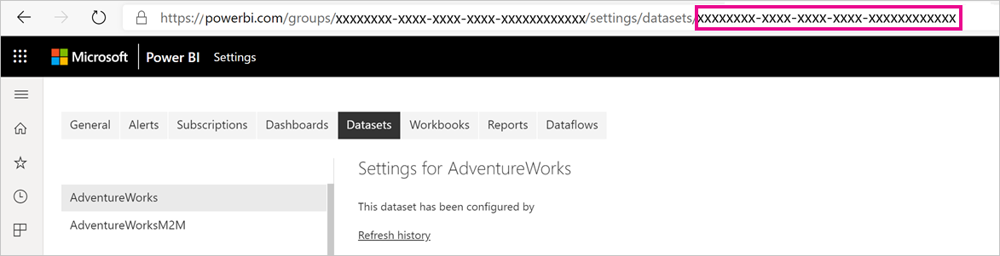

# Large datasets in Power BI Premium

Power BI datasets can store data in a highly compressed, in-memory cache for optimized query performance to enable fast user interactivity over large datasets. Large datasets, beyond the default 10 GB limit, can be enabled for datasets in Premium capacities with the **Large dataset storage format** setting. When enabled, the size of the dataset is instead limited by the Premium capacity size, which is similar to how Azure Analysis Services works in terms of model size limitations. To learn more about capacity sizes in Power BI Premium, see Capacity nodes. You can set up large datasets for all Premium P SKUs and Embedded A SKUs; but they work only with the [new workspaces](../collaborate-share/service-create-the-new-workspaces.md).

If you're planning to use XMLA based tools for write operations on a dataset, be sure to enable the **Large dataset storage format** setting, even for datasets that you wouldn't necessarily characterize as large datasett. When enabled, the large dataset storage format can improve XMLA write operations performance.

Large datasets in the service don't affect the PBIX upload size, which is still limited to 10 GB. Instead, datasets grow beyond 10 GB in the service on refresh. You can use incremental refresh to configure a dataset to grow beyond 10 GB.

## To enable large datasets

1. Create a model in Power BI Desktop and configure [incremental refresh](service-premium-incremental-refresh.md).

1. Publish the model as a dataset to the Power BI Premium service.

1. In dataset **Settings**, expand **Large dataset storage format**, click the slider to **On**, and then click **Apply**.
    :::image type="content" source="media/service-premium-large-models/enable-large-dataset.png" alt-text="Enable large dataset slider":::

1. Invoke a refresh to load historical data based on the incremental refresh policy. The first refresh could take a while to load the history. Subsequent refreshes should be faster because they are incremental.

## Set default storage format

1. In your workspace, click **Settings** > **Premium**.
1. In **Default storage format**, select **Large dataset storage format**, and then click **Save**.
:::image type="content" source="media/service-premium-large-models/default-storage-format.png" alt-text="Enable default storage format":::

### PowerShell cmdlets

You can also enable large dataset storage format by using PowerShell. You must have capacity admin and workspace admin privileges to run the PowerShell cmdlets.

1. Find the dataset ID (GUID). On the **Datasets** tab for the workspace, under the dataset settings, you can see the ID in the URL.

    

1. From a PowerShell admin prompt, install the [MicrosoftPowerBIMgmt](/powershell/module/microsoftpowerbimgmt.data/) module.

    ```powershell
    Install-Module -Name MicrosoftPowerBIMgmt
    ```

1. Run the following cmdlets to sign in and check the dataset storage mode.

    ```powershell
    Login-PowerBIServiceAccount

    (Get-PowerBIDataset -Scope Organization -Id <Dataset ID> -Include actualStorage).ActualStorage
    ```

    The response should be the following. The storage mode is ABF (Analysis Services backup file), which is the default.

    ```
    Id                   StorageMode

    --                   -----------

    <Dataset ID>         Abf
    ```

1. Run the following cmdlets to set the storage mode. It can take a few seconds to convert to Premium Files.

    ```powershell
    Set-PowerBIDataset -Id <Dataset ID> -TargetStorageMode PremiumFiles

    (Get-PowerBIDataset -Scope Organization -Id <Dataset ID> -Include actualStorage).ActualStorage
    ```

    The response should be the following. The storage mode is now set to Premium Files.

    ```
    Id                   StorageMode
    
    --                   -----------
    
    <Dataset ID>         PremiumFiles
    ```

You can check the status of dataset conversions to and from Premium Files by using the [Get-PowerBIWorkspaceMigrationStatus](/powershell/module/microsoftpowerbimgmt.workspaces/get-powerbiworkspacemigrationstatus) cmdlet.

## Dataset eviction

Power BI uses dynamic memory management to evict inactive datasets from memory. Power BI evicts datasets so it can load other datasets to address user queries. Dynamic memory management allows the sum of dataset sizes to be significantly greater than the memory available on the capacity, but a single dataset must fit into memory. For more info on dynamic memory management, see [How capacities function](service-premium-what-is.md#how-capacities-function).

You should consider the impact of eviction on large models. Despite relatively fast dataset load times, there could still be a noticeable delay for users if they have to wait for large evicted datasets to be reloaded. For this reason, in its current form, the large models feature is recommended primarily for capacities dedicated to enterprise BI requirements rather than capacities mixed with self-service BI requirements. Capacities dedicated to enterprise BI requirements are less likely to frequently trigger eviction and need to reload datasets. Capacities for self-service BI on the other hand can have many small datasets that are more frequently loaded in and out of memory.

## Checking dataset size

After loading historical data, you can use [SSMS](/sql/ssms/download-sql-server-management-studio-ssms) through the [XMLA endpoint](service-premium-connect-tools.md) to check the estimated dataset size in the model properties window.


You can also check the dataset size by running the following DMV queries from SSMS. Sum the DICTIONARY\_SIZE and USED\_SIZE columns from the output to see the dataset size in bytes.

```sql
SELECT * FROM SYSTEMRESTRICTSCHEMA
($System.DISCOVER_STORAGE_TABLE_COLUMNS,
 [DATABASE_NAME] = '<Dataset Name>') //Sum DICTIONARY_SIZE (bytes)

SELECT * FROM SYSTEMRESTRICTSCHEMA
($System.DISCOVER_STORAGE_TABLE_COLUMN_SEGMENTS,
 [DATABASE_NAME] = '<Dataset Name>') //Sum USED_SIZE (bytes)
```

## Limitations and considerations

Keep in mind the following restrictions when using large datasets:

- **Multi-geo support**: Datasets enabled for Premium Files will fail on capacities where [multi-geo](service-admin-premium-multi-geo.md) is also enabled.

- **Download to Power BI Desktop**: If a dataset is stored on Premium Files, [downloading as a .pbix](../create-reports/service-export-to-pbix.md) file will fail.
- **Supported regions**: Large datasets are supported in all Azure regions that support Premium Files Storage. To learn more, see [Products available by region](https://azure.microsoft.com/global-infrastructure/services/?products=storage), and consult the table in the following section.


## Availability in regions

Large datasets in Power BI are only available in certain Azure regions that support [Azure Premium Files Storage](/azure/storage/files/storage-files-planning#storage-tiers).

The following list provides regions where large datasets in Power BI are available. Regions not in the following list are not supported for large models:

|Azure region  |Azure region abbreviation  |
|---------|---------|
|Australia East     | australiaeast        |
|Australia Southeast     | australiasoutheast        |
|Central US     | centralus        |
|East Asia     | eastasia        |
|East US     | eastus        |
|East US 2     | eastus2        |
|Japan East     | japaneast        |
|Japan West     | japanwest        |
|Korea Central     | koreacentral        |
|Korea South     | koreasouth        |
|North Central US     | northcentralus        |
|North Europe     | northeurope        |
|South Central US     | southcentralus        |
|Southeast Asia     | southeastasia        |
|UK South     | uksouth        |
|UK West     | ukwest        |
|West Europe     | westeurope        |
|West US     | westus        |
|West US 2     | westus2        |

## Next steps

The following links provide information that can be useful for working with large models:

* [Azure Premium Files Storage](/azure/storage/files/storage-files-planning#storage-tiers)
* [Configure Multi-Geo support for Power BI Premium](service-admin-premium-multi-geo.md)
* [Bring your own encryption keys for Power BI](service-encryption-byok.md)
* [How capacities function](service-premium-what-is.md#how-capacities-function)
* [Incremental refresh](service-premium-incremental-refresh.md).

Power BI has introduced Power BI Premium Gen2 as a preview offering, which improves the Power BI Premium experience with improvements in the following:
* Performance
* Per-user licensing
* Greater scale
* Improved metrics
* Autoscaling
* Reduced management overhead

For more information about Power BI Premium Gen2, see [Power BI Premium Generation 2 (preview)](service-premium-what-is.md#power-bi-premium-generation-2-preview).