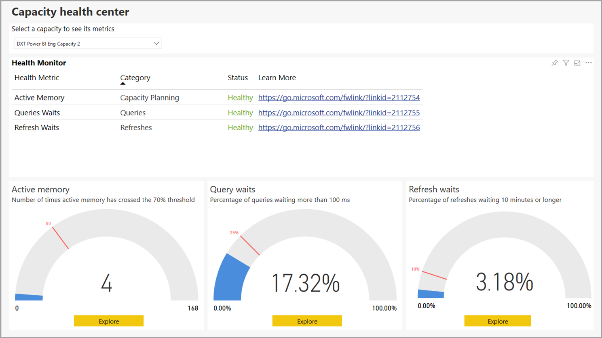
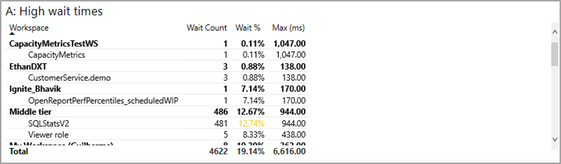
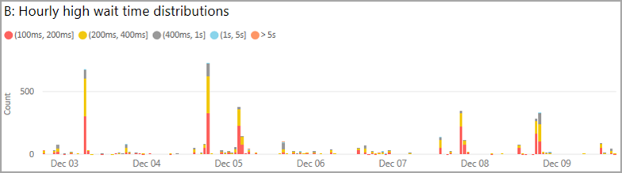

# Power BI Premium Metrics app

You can use the **Power BI Premium Metrics app** to manage the health and capacity of your Power BI Premium subscription. With the app, administrators use the app's **Capacity health center** to see and interact with indicators that monitor the health of their premium capacity. The Metrics app consists of the landing page, called the **Capacity Health Center**, and details about three important metrics:

* Active memory
* Query waits
* Refresh waits

The following sections describe the landing page, and the three metrics report pages, in detail. 

> [!IMPORTANT]
> If your Power BI Premium capacity is experiencing high resource usage, resulting in performance or reliability issues, you can receive notification emails to identify and resolve the issue. This can be a streamlined way to troubleshoot overloaded capacities. See [capacity and reliability notifications](service-interruption-notifications.md#capacity-and-reliability-notifications) for more information.

> [!NOTE]
> Power BI Premium recently released a new version of Premium, called **Premium Gen2**, which is currently in preview. Premium Gen2 will simplify the management of Premium capacities, and reduce management overhead. In particular, it greatly reduces the metrics administrators must monitor (CPU only) to ensure performance and users’ experience. For more information, see [Power BI Premium Generation 2 (preview)](service-premium-what-is.md#power-bi-premium-generation-2-preview).

> [!NOTE]
> The metrics app cannot be used to monitor Premium Per User (PPU) activities or capacity.

## Premium capacity health center

When you open the **Power BI Premium metrics app** you're presented with the **Capacity health center**, which provides an overview of the health of your Power BI Premium capacity.

From the landing page, you can select the Power BI Premium capacity you want to view, in case your organization has multiple Premium subscriptions. To view a Premium capacity, select the dropdown near the top of the page called **Select a capacity to see its metrics**.

The three KPIs show the current health of the selected Premium capacity, based on the settings applied to each of the three KPIs. 

To view specifics about each KPI, select the **Explore** button at the bottom of each KPI's visual, and its detail page is displayed. The following sections describe each KPI and the details its page provides.

## The active memory metric

The **active memory** metric is part of the *capacity planning* category, which is a good health indicator to evaluate your capacity's resource consumption for usage, so you can adjust the capacity as necessary to plan capacity scale. 

**Active memory** is the memory used to process datasets that are currently in use, and which therefore will not be evicted when memory is needed. The active memory metric indicates whether your capacity can handle additional load, or of already nearing or over capacity, the capacity's current load. The active memory currently being consumed means less memory is available to support additional refreshes and queries. 

The **active memory** KPI measures how many times the capacity's active memory has crossed the 70% threshold 50 times (the marker is set to 30% of the last seven days), which indicates that the capacity is approaching a point when users may begin seeing performance issues with queries.

The gauge visual shown in this section reveals that, in the last seven days from the time the report was last refreshed, the capacity has crossed the 70% threshold four times, split by hourly buckets. The maximum value of the gauge, 168, represents the last seven days, in hours.

To learn the details of the active memory KPI, click the **Explore** button to see a report page that provides specific visualizations of its detailed metrics, along with a troubleshooting guide shown on the right column of the page. 

There are two scenarios explained, which you can show on the report page by selecting **Scenario 1** or **Scenario 2** on the page. 

The troubleshooting guides, associated with each scenario, provide detailed explanations about what the metrics mean, so you can better understand the state of the capacity, and what can be done to mitigate any issues. 

Those two scenarios are described in the following sections.

### Scenario one - current load is too high 

To determine whether there's enough memory for the capacity to complete its workloads, consult the first visual on the page: **A: Consumed Memory Percentages**, which displays the memory consumed by datasets that are being actively processed, and thus, cannot be evicted.

The alarm threshold, which is the red dotted line, marks incidents of 90% memory consumption.

The warning threshold, which is the yellow dotted line, marks incidents of 70% memory consumption. 

The black dotted line indicates the memory usage trendline, based on the current capacity's memory usage over the course of the graph timeline.

High occurrences of active memory above the alarm threshold (red dotted line) and memory trendline (black dotted line) indicates memory capacity pressure, possibly preventing additional datasets from being loaded into memory during that time. 

When you see such cases, you should look carefully at the other charts on the page to better determine what and why so much memory is so frequently being consumed, and how to load balance or optimize, or if necessary, scale up the capacity. 

The second visual on the page, **B: Hourly loaded active datasets** displays the counts of the maximum number of datasets that were loaded in memory, in hourly buckets. 

The third visual, **C: Why datasets are in memory** is a table that lists the dataset by workspace name, dataset name, datasets uncompressed size in memory, explains the reason it's loaded in memory (such as, being refreshed or queried against, or both).

#### Diagnosing scenario one

Consistent high active memory utilization may result in forcing datasets that are actively being used to be evicted, or can prevent new datasets from able to load. The following steps can help you diagnose problems

1. Have a look at chart *A: Consumed memory percentages*

    **a.** If Chart A shows the alarm threshold (90%) is crossed many times and/or for consecutive hours, then your capacity is running low on memory too frequently. In the chart below, we can see the warning threshold (70%) was crossed four times.

    

    **b.** The chart titled *B: Hourly loaded active datasets* shows the maximum number of unique datasets loaded in memory by hourly buckets. Selecting a bar in the visual will cross filter the reasons datasets are in memory visual.  

         

    **c.** Consult the **Why datasets are in memory** table to see a list of the datasets that were loaded in memory. Sort by *Dataset Size (MB)* to highlight the datasets taking up the most memory. Capacity operations are classified as either *interactive* or *background*. Interactive operations include rendering requests and responding to user interactions (filtering, Q&A querying, and so on). Total queries and total refreshes provide an idea of whether there are interactive (queries) heavy or background (refreshes) operations done on the dataset. It's important to understand that interactive operations are always prioritized over background operations to ensure the best possible user experience. If there are insufficient resources, background operations are added to a queue, and are processed once resources free up. Background operations, such as dataset refreshes and AI functions, can be stopped mid-process by the Power BI service and added to a queue.
    
      

#### Remedies for scenario one

You can take the following steps to remedy the problems associated with scenario one:

1. **Scale up the capacity** - scaling up the capacity to the next SKU will make available twice the amount of memory than the current SKU, thus alleviating any memory pressure the capacity is currently experiencing.

2. **Move datasets to another capacity** - if you have another capacity that has more memory available, you can move the workspaces that contain the larger datasets to that capacity.

### Scenario two - future load will exceed limits

To determine whether there's enough memory for the capacity to complete its workloads, you can refer to the **A: Consumed Memory Percentages** visual on the top of the page, representing the memory consumed by datasets that are being actively processed so cannot be evicted. The black dotted line highlights the trends. In a capacity experiencing memory pressure, the same visual will clearly show the memory trendline (black dotted line) upwards, meaning that it is possibly preventing additional datasets from being loaded into memory at that point in time. The trend line, the black dashed line, shows the trend of growth based on the seven days of data. 

#### Diagnosing scenario two

To diagnose scenario two, determine if the trend line is showing an upward trend towards warning or alarm thresholds. 

1. Consider **Chart A:**

    

    **a.** If the chart shows an upward slope, that indicates that memory consumption has increased over the past seven days.

    **b.** Assume the current growth, and predict when the trend line will cross the warning threshold (the yellow dashed line).

    **c.** Keep checking the trend line at least every two days, to see if the trend continuing.

#### Remedies for scenario two

You can take the following steps to remedy the problems associated with scenario two:

1. **Scale up the capacity** - scaling up the capacity to the next SKU will make available twice the amount of memory than the current SKU, thus alleviating any memory pressure the capacity is currently experiencing.

2. **Move datasets to another capacity** - if you have another capacity that has more memory available, you can move the workspaces that contain the larger datasets to that capacity.

## The query waits metric

The **Queries** category indicates whether users could experience report visuals that are slow to respond, or could become unresponsive. **Query waits** is the time the query takes to start execution from the time it was triggered. This KPI measures whether 25% or more of the selected capacity's queries are waiting 100 milliseconds or longer to execute. Query waits occur when there's not enough available CPU to execute all pending queries. 

The gauge in this visual shows that in the last seven days from the time the report was last refreshed, 17.32% of the queries waited more than 100 milliseconds. 

To learn details of Query waits KPI, click the **Explore** button to display a report page with visualization of relevant metrics, and a troubleshooting guide in the right column of the page. The troubleshooting guide has two scenarios, each providing detailed explanations of the metric, the state of the capacity, and what you can do to mitigate the issue.

We discuss each query waits scenario, in turn, in the following sections.

### Scenario one - long running queries consume CPU

In scenario one, long running queries are taking up too much CPU. 

You can investigate whether poor report performance is caused by an overloaded capacity, or due to a poorly designed dataset or report. There are several reasons why a query can run for an extended period, which is defined as taking more than 10 seconds to finish executing. Dataset size and complexity, as well as query complexity are just a few examples of what can cause a long running query. 

On the report page, the following visuals appear: 

* The top table titled **A: High wait times** lists the datasets with queries that are waiting. 
* **B: Hourly high wait time distributions** shows the distribution of high wait times. 
* The chart titled **C: Hourly long query counts** displays the count of long running queries that were executed split by hourly buckets.
* The last visual, table **D: Long running queries**, lists the long running queries and their stats.

There are steps you can take to diagnose and remedy issues with query wait times, described next.

#### Diagnosing scenario one

First, you can determine if long running queries are occurring when your queries are waiting. 

Look at **Chart B**, which shows the count of queries that are waiting more than 100 ms. Select one of the columns that shows a high number of waits.

When you click on a column with high wait times, **Chart C** is filtered to show the count of long-running queries that executed during that time, shown in the following image:

And in addition, **Chart D** is also filtered to show the queries that were long running during that selected time period.

#### Remedies for scenario one

Here are steps you can take to remedy issues from scenario one:

1. **Run PerfAnalyzer to optimize reports and datasets** - the performance analyzer for reports will show the effect of every interaction on a page, including how long each visual takes to refresh and where the time is spent.

2. **Scale up the capacity** - scaling up the capacity to the next SKU will make available twice the amount of CPU thus alleviating any CPU pressure that may be causing the queries to run longer.

3. **Move datasets to another capacity** - if you have another capacity that has more CPU available, you can move the workspaces that contain the datasets that contain the queries that are waiting to the other capacity.

### Scenario two - too many queries

In scenario two, too many queries are executing.

When the number of queries to execute exceeds the limits of the capacity, queries are placed in a queue until resources are available to execute them. If the size of the queue grows too large, queries in that queue can end up waiting more than 100 milliseconds.

#### Diagnosing scenario two

From **Table A** select a dataset that has a high percentage of wait time.

Once you've selected a dataset with a high wait time, **Chart B** is filtered to show the wait time distributions for queries on that dataset, over the past seven days. Next, select one of the columns from **Chart B**.

**Chart C** is then filtered to show the queue length at the time selected from Chart B.

If the length of the queue has crossed the threshold of 20, then it's likely that the queries in the selected dataset are delayed, due to too many queries trying to execute at the same time.

#### Remedies for scenario two

You can take the following steps to remedy the problems associated with scenario two:

1. **Scale up the capacity** - scaling up the capacity to the next SKU will make available twice the amount of memory than the current SKU, thus alleviating any memory pressure the capacity is currently experiencing.

2. **Move datasets to another capacity** - if you have another capacity that has more memory available, you can move the workspaces that contain the larger datasets to that capacity.

## The refresh waits metric

The **Refresh waits** metric provides insights to when users could be experiencing report data that's old or stale. **Refresh waits** is the time a given data refresh waited to start execution, from the time it was triggered on demand, or scheduled to run. This KPI measures whether 10% or more of pending refresh requests are waiting 10 minutes or longer. Waiting generally occurs when there's insufficient available memory or CPU.

This gauge shows that in the last seven days from the last refresh report refresh, 3.18% of the refreshes waited more than 10 minutes. 

To learn the details of the **Refresh waits** KPI, click the **Explore** button, which presents a page with metrics and a troubleshooting guide on the right column of the report page. The guide provides detailed explanations about the metrics on the page, and helps you  understand the state of the capacity, and what you can do to mitigate any issues.

There are two scenarios explained, which you can show on the report page by selecting Scenario 1 or Scenario 2 on the page. We discuss each scenario in turn, in the following sections.

### Scenario one - not enough memory

In scenario one, there isn't enough available memory to load the dataset. There are two situations that result in a refresh being throttled during low memory conditions:

1. Not enough memory to load the dataset.
2. The refresh was canceled due to a higher priority operation. 

The priority for loading datasets is the following:

1. Interactive query
2. On-demand refresh
3. Scheduled refresh

If there isn't enough memory to load a dataset for an interactive query, scheduled refreshes are stopped and their datasets unloaded until sufficient memory become available. If that doesn't free up enough memory, then on-demand refreshes are stopped and their datasets are unloaded.

#### Diagnosing scenario one

To diagnose scenario one, first determine whether throttling is due to insufficient memory. The steps to do so are the following.

1. Select the dataset you're interested in from **Table A** by clicking on it: 

    

    a. When a dataset is selected in **Table A**, **Chart B** is filtered to show when waiting occurred.

    

    b. **Chart C** is then filtered to show any throttling, explained in the next step. 

2. Look at the results in the now-filtered **Chart C**. If the chart shows out of memory throttling occurred at the times the dataset was waiting, then the dataset was waiting due to low memory conditions.

    

3. Finally, check **Chart D**, which shows the types of refreshes that were occurring, scheduled versus on-demand. Any on-demand refreshes occurring at the same time could be the cause of the throttling.

    

#### Remedies for scenario one

You can take the following steps to remedy the problems associated with scenario one:

1. **Scale up the capacity** - scaling up the capacity to the next SKU will make available twice the amount of memory than the current SKU, thus alleviating any memory and CPU pressure the capacity is currently experiencing.

2. **Move datasets to another capacity** - if your wait times are being caused by memory pressure and you have another capacity that has more memory available, you can move the workspaces that contain the datasets that are waiting to the other capacity.

3. **Spread out scheduled refreshes** - spreading out the refreshes will help to avoid too many refreshes attempting to execute concurrently.

### Scenario two - not enough CPU for refresh

In scenario two, there isn't enough available CPU to carry out the refresh. 

For capacities, Power BI limits the number of refreshes that can happen concurrently. This number is equal to the number of back-end cores x 1.5. For example, a P1 capacity, which has four back-end cores, can run 6 refreshes concurrently. Once the maximum number of concurrent refreshes has been reached, other refreshes will wait until an executing refresh finishes.

#### Diagnosing scenario two

To diagnose scenario two, first determine whether throttling is due to running into the maximum concurrency for refreshes. The steps to do so are the following.

1. Select the dataset you're interested in from **Table A** by clicking on it: 

    

    a. When a dataset is selected in **Table A**, **Chart B** is filtered to show when waiting occurred.

    

    b. **Chart C** is then filtered to show any throttling, explained in the next step. 

2. Look at the results in the now-filtered **Chart C**. If the chart shows *max concurrency* occurred at the times the dataset was waiting, then the dataset was waiting due to not enough available CPU.

    

3. Finally, check **Chart D**, which shows the types of refreshes that were occurring, scheduled versus on-demand. Any on-demand refreshes occurring at the same time could be the cause of the throttling.

    

#### Remedies for scenario two

1. **Scale up the capacity** - scaling up the capacity to the next SKU will make available twice the amount of memory than the current SKU, and twice the number of concurrent refreshes than the current SKU, thus alleviating any memory and CPU pressure the capacity is currently experiencing.

2. **Move datasets to another capacity** - if your wait times are being caused by maximum concurrency being reached and you have another capacity that has available concurrency, you can move the workspaces that contain the datasets that are waiting to the other capacity.

3. **Spread out scheduled refreshes** - spreading out the refreshes will help to avoid too many refreshes attempting to execute concurrently.

## Next steps

* [What is Power BI Premium?](service-premium-what-is.md)
* [Microsoft Power BI Premium whitepaper](https://aka.ms/pbipremiumwhitepaper)
* [Planning a Power BI Enterprise Deployment whitepaper](https://aka.ms/pbienterprisedeploy)
* [Extended Pro Trial activation](../fundamentals/service-self-service-signup-for-power-bi.md)
* [Power BI Embedded FAQ](../developer/embedded/embedded-faq.yml)

More questions? [Try asking the Power BI Community](https://community.powerbi.com/)

Power BI has introduced Power BI Premium Gen2 as a preview offering, which improves the Power BI Premium experience with improvements in the following:
* Performance
* Per-user licensing
* Greater scale
* Improved metrics
* Autoscaling
* Reduced management overhead

For more information about Power BI Premium Gen2, see [Power BI Premium Generation 2 (preview)](service-premium-what-is.md#power-bi-premium-generation-2-preview).