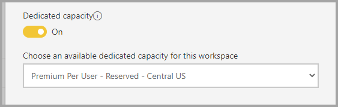
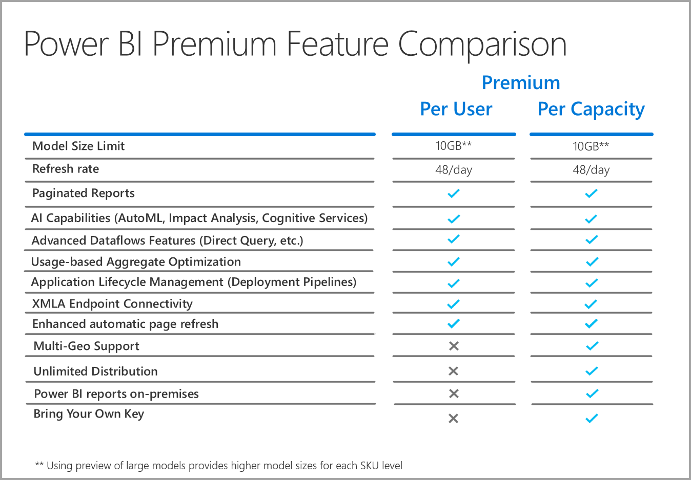

# Power BI Premium Per User FAQ (preview)

Power BI **Premium Per User** allows organizations to license Premium features on a per-user basis. Premium Per User (PPU) includes all Power BI Pro license capabilities, and also adds features such as paginated reports, AI, and other capabilities that are only available to Premium subscribers. 

This article provides answers to common questions about Premium Per User licensing. All information in this article is subject to change, and refinement, as Premium Per User moves through its preview period and is released for general availability (GA). 

This article groups questions and answers into the following categories:
* [General](#general-questions)
* [Administration](#administrative-questions)
* [End-user Experience](#end-user-experience-questions)

## General questions

1.	**What is Premium Per User (PPU)?**

    Premium Per User (PPU) is a new way to license premium features on a per user basis. It includes all Power BI Pro license capabilities, along with features like paginated reports, AI, and other capabilities only available in Premium today.

2.	**When will it be available for purchase?**

    Development is ongoing, and we do not anticipate PPU releasing to GA until spring of 2021. Until general availability, the public preview is available to all organizations and is free of charge.

3.	**Do I need a Power BI Pro AND a Premium Per User license?**

    No, you get all the capabilities of Power BI Pro with Premium Per User license.

4.	**How do I get a trial?**

    There is an in-product trial experience and a trial experience available through Microsoft 365. Any user, assuming their organization has not restricted PPU, can access the in-product trial experience by turning on Premium Per User for a workspace. Trial experiences through Microsoft 365 can be enabled through the portal just like Power BI Pro trials are initiated today.  

5.	**What features are available in Premium per user?**

    The feature comparison grid is as follows:    

    

6.	**My organization already has Power BI Premium. Do I now need a Premium Per User license to publish content to my capacity?**
    
    Your organization may choose to supplement their Premium capacity with Premium Per User licenses, but Premium Per User is not required to publish content to existing capacities.  

## Administrative questions

1.	**How do I enable Premium Per User (PPU) for my tenant?**
    
    Once a license is provisioned for PPU for the tenant, PPU features are available in any workspace for which you turn them on. For the preview, simply enable the Premium Per User features in the capacity dropdown by selecting the Premium per user item, as shown in the following image.

    

2.	**Does this work like a Premium capacity? Can you turn features on/off?**

    No, there is no management of memory or CPU for PPU; it works like Power BI Pro does today in that respect. Your tenant admin can manage select feature settings, but they can’t disable workloads like paginated reports, just like you can’t turn off dashboards today. 

3.	**Where do I manage the Premium per user settings that are exposed?**

    A new menu option in the tenant settings for Premium Per User enables admins to manage those settings.

4.	**Can I limit which users can create PPU workspaces?**

    Yes, in the same way you can currently limit which users can create workspaces.

5.	**Can tenant admins see which workspaces are marked as Premium Per User?**

    Yes, these are called out in the workspaces menu item in the tenant admin screen, where it shows you which workspaces are marked as Premium Per User.

6.	**Can I move workspaces between Premium Per User and Premium capacities?**

    Yes. For General Availability (GA), you will be required to perform a full refresh of any datasets or dataflows that live in the workspace once you move it back to Premium capacity. This requirement prevents abuse by companies looking to work around the CPU charging mechanism of Premium Gen2.

7.	**Are the capacity APIs available for Premium Per User?**

    A limited set of the APIs are available to allow movement of workspaces, but you cannot do things like turn off workloads, and other such activities.  

8.	**How can I prevent users from exporting paginated reports, as these aren’t currently controlled in the tenant settings?**

    We are enabling controls such as these at a tenant level, ensuring all formats can be restricted if you choose. These settings will also affect all paginated report workloads running on Premium or Embedded capacities.

## End user experience questions

1.	**If I’ve marked a workspace as Premium Per User, how will other users know?**
    
    A new icon has been introduced to show which workspaces are Premium Per User, as shown in the following image:

        

2.	**Who can access content in a Premium Per User workspace/app?**

    Any user must have a Premium Per User license to view content in a Premium Per User workspace. This includes scenarios where users are accessing the content through the XMLA endpoint, Analyze in Excel, Composite Models, and so on. You may grant access to users to the workspace who don’t have a PPU license yet, but they will receive a message saying they can’t access the content. They will be prompted for trial license if they are eligible. If they aren’t eligible, they need to be assigned a license by their tenant admin.

3.	**What content can people with which license type see when it is shared with them?**

    The following chart describes who can see which kinds of content with PPU:

       

4.	**Can I use Premium Per User for embedded use cases?**

    Premium Per User will work in the same way embedded use cases work when you use a Pro license. You can embed the content and each user will need a PPU license to view it.

5.	**What happens to my PPU workspace if my trial expires?**

    Users will still have access to the workspace, however, content that requires that license type will be unavailable. You either need to move the workspace to a Premium capacity, or simply the turn the requirement off. 
6.	**How much total storage do I get with Premium Per User?**

    The entire tenant will have the same 100 TB limit that a Premium capacity has, in terms of storage.

7.	**Will the export API be available for Premium Per User?**

    Yes, but there will be significant throttling limits there compared to a Premium capacity for both report types.  

8.	**How will e-mail subscriptions work in PPU?**

    Anyone with a PPU license or a Pro license can receive the subscription and any attachment it includes, provided the attachment is the same for all users. Pro users will not be able to view the content in the product portal. If additional subscription capabilities are introduced that allow for different data views for different recipients, a PPU license (or Premium capacity) will be required to use those capabilities.

9.	**Can I exceed the 48 refreshes through the portal through the refresh API?**

    Refreshes are not restricted this at this time.  

10.	**Can I use the Power BI Premium Capacity metrics app to monitor Premium Per User usage?**

    The Power BI Premium Capacity Metrics App doesn’t work with Premium Gen2, and therefore wouldn’t allow you to view any PPU items.  

11.	**Can I host a Power BI dataset to a PPU workspace, build a report against it, publish in a non-PPU workspace, and allow users to access this report without needing a PPU license?**

    No. Since the dataset resides in a Premium Per User workspace, it will not be viewable for users without a license, even though they can access the report in the non-PPU workspace.

12.	**Can I refresh multiple 10 GB data models at the same time?**

    You are subject to the same limitations that are imposed for parallel refreshes in Premium Gen2.

13.	**Can I share content hosted in Premium Per User via Publish to Web?**

    Publish to Web behaves in the same way it does with content hosted in Premium capacity today.

14.	**Can I have a dataflow run in a Premium per user workspace, be imported into a Power BI dataset in another workspace, and users who consume that content not need a Premium per user license?**

    As long as the Power BI report author has a Premium Per User license, this is possible during the preview period for PPU.

**Next steps**

* [What is Power BI Premium?](service-premium-what-is.md)
* [Microsoft Power BI Premium whitepaper](https://aka.ms/pbipremiumwhitepaper)
* [Planning a Power BI Enterprise Deployment whitepaper](https://aka.ms/pbienterprisedeploy)
* [Extended Pro Trial activation](../fundamentals/service-self-service-signup-for-power-bi.md)
* [Power BI Embedded FAQ](../developer/embedded/embedded-faq.md)

More questions? [Try asking the Power BI Community](https://community.powerbi.com/)
