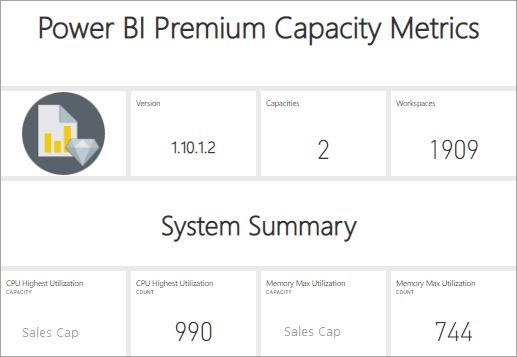
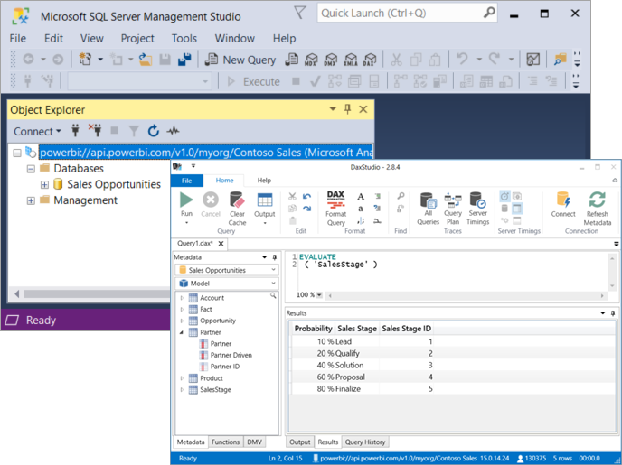

# What is Power BI Premium?

You can use Power BI Premium to access features and capabilities only available in Premium, and offer greater scale and performance for Power BI content in your organization. Power BI Premium enables more users in your organization to get the most out of Power BI with better performance and responsiveness. For example, with Power BI Premium, you and your organization's users get the following capabilities:

> [!div class="checklist"]
> * Greater scale and performance for your Power BI reports
> * Flexibility to license by capacity
> * Best-in-class features for data visualization and insight-extraction such as AI-driven analysis, composable and reusable dataflows, and paginated reports
> * Unify self-service and enterprise BI with a variety of Premium-only capabilities that support heavier workloads and require enterprise scale
> * Built-in license to extend on-premises BI with Power BI Report Server
> * Support for data residency by region (Multi-Geo) and customer-managed encryption keys for data at rest (BYOK)
> * Ability to share Power BI content with anyone (even outside your organization) without purchasing a per-user license

 

This article introduces key features in Power BI Premium. Where necessary, links to additional articles with more detailed information are provided. For more information about Power BI Pro and Power BI Premium, see the _Power BI features comparison_ section of [Power BI pricing](https://powerbi.microsoft.com/pricing/).

## Power BI Premium Generation 2

Power BI Premium recently released a new version of Power BI Premium, **Power BI Premium Generation 2**, referred to as **Premium Gen2** for convenience. Premium Gen2 is currently in preview, and is available for Premium subscribers to use during the preview period. You can select to use the original version of Premium, or switch to using Premium Gen2. You can only use one or the other for your Premium capacity.

For more information about Premium Gen2, see [What is Power BI Premium Gen2?](service-premium-gen2-what-is.md)

## Subscriptions and licensing

Power BI Premium is a tenant-level Microsoft 365 subscription available in two SKU (Stock-Keeping Unit) families:

- **P** SKUs (P1-P5) for embedding and enterprise features, requiring a monthly or yearly commitment, billed monthly, and includes a license to install Power BI Report Server on-premises.

- **EM** SKUs (EM1-EM3) for _organizational_ embedding, requiring a yearly commitment, billed monthly. EM1 and EM2 SKUs are available only through volume licensing plans. You can't purchase them directly.

### Purchasing

Power BI Premium subscriptions are purchased by administrators in the Microsoft 365 admin center. Specifically, only Global administrators or Billing Administrators can purchase SKUs. When purchased, the tenant receives a corresponding number of v-cores to assign to capacities, known as *v-core pooling*. For example, purchasing a P3 SKU provides the tenant with 32 v-cores. To learn more, see [How to purchase Power BI Premium](service-admin-premium-purchase.md).

#### Power BI Premium Per User

Power BI **Premium Per User** allows organizations to license Premium features on a per-user basis. Premium Per User (PPU) includes all Power BI Pro license capabilities, and adds features such as paginated reports, AI, and other capabilities that are only available to Premium subscribers. 
For more information about Premium per user, including a feature comparison and other information, see the [Power BI Premium Per User](service-premium-per-user-faq.yml) article. 

## Reserved capacities

With Power BI Premium, you get *reserved capacities*. In contrast to a shared capacity where workloads' analytics processing run on computational resources shared with other customers, a reserved capacity is for exclusive use by an organization. It's isolated with reserved computational resources, which provide dependable and consistent performance for hosted content. Note that the processing of the following types of Power BI content is stored in shared capacity rather than your reserved capacity:

* Excel workbooks (unless data is first imported into Power BI Desktop)
* [Push datasets](/rest/api/power-bi/pushdatasets)
* [Streaming datasets](../connect-data/service-real-time-streaming.md#set-up-your-real-time-streaming-dataset-in-power-bi)
* [Q&A](../create-reports/power-bi-tutorial-q-and-a.md)

Workspaces reside within capacities. Each Power BI user has a personal workspace known as **My Workspace**. Additional workspaces known as **workspaces** can be created to enable collaboration. By default, workspaces, including personal workspaces, are created in the shared capacity. When you have Premium capacities, both My Workspaces and workspaces can be assigned to Premium capacities.

Capacity administrators automatically have their my workspaces assigned to Premium capacities.

### Capacity nodes

As described in the [Subscriptions and Licensing](#subscriptions-and-licensing) section, there are two Power BI Premium SKU families: **EM** and **P**. All Power BI Premium SKUs are available as capacity *nodes*, each representing a set amount of resources consisting of processor, memory, and storage.  In addition to resources, each SKU has operational limits on the number of DirectQuery and Live Connection connections per second, and the number of parallel model refreshes. While there is a lot of overlap in features for the two SKU families, only the P Premium SKU gives free users the ability to consume content hosted in the Premium capacity.  EM SKUs are used for embedding content.

Processing is achieved by a set number of v-cores, divided equally between backend and frontend.

**Backend v-cores** are responsible for core Power BI functionality, including query processing, cache management, running R services, model refresh, and server-side rendering of reports and images. Backend v-cores are assigned a fixed amount of memory that is primarily used to host models, also known as active datasets.

**Frontend v-cores** are responsible for the web service, dashboard and report document management, access rights management, scheduling, APIs, uploads and downloads, and generally for everything related to the user experiences.

Storage is set to **100 TB per capacity node**.

The resources and limits of each Premium SKU (and equivalently sized A SKU) are described in the following table:

| Capacity Nodes | Total v-cores | Backend v-cores | RAM (GB) | Frontend v-cores | DirectQuery/Live Connection (per sec) | Model Refresh Parallelism |
| --- | --- | --- | --- | --- | --- | --- |
| EM1/A1 | 1 | 0.5 | 3 | 0.5 | 3.75 | 1 |
| EM2/A2 | 2 | 1 | 5 | 1 | 7.5 | 2 |
| EM3/A3 | 4 | 2 | 10 | 2 | 15 | 3 |
| P1/A4 | 8 | 4 | 25 | 4 | 30 | 6 |
| P2/A5 | 16 | 8 | 50 | 8 | 60 | 12 |
| P3/A6 | 32 | 16 | 100 | 16 | 120 | 24 |
| P4/A7 [1](#limit)| 64 | 32 | 200 | 32 | 240 | 48 |
| P5/A8 [1](#limit)| 128 | 64 | 400 | 64 | 480 | 96 |
| | | | | | | |

<a name="limit">1</a> - By special request only. For very large models greater than 100 GB.

>[!NOTE]
>Using a single larger SKU (e.g. one P2 SKU) can be preferable to combining smaller SKUs (e.g. two P1 SKUs). For example, you can use larger models and achieve better parallelism with the P2.

### Capacity workloads

Capacity workloads are services made available to users. By default, Premium and Azure capacities support only a dataset workload associated with running Power BI queries. The dataset workload cannot be disabled. Additional workloads can be enabled for [AI (Cognitive Services)](https://powerbi.microsoft.com/blog/easy-access-to-ai-in-power-bi-preview/), [Dataflows](../transform-model/dataflows/dataflows-introduction-self-service.md), and [Paginated reports](../paginated-reports/paginated-reports-save-to-power-bi-service.md). These workloads are supported in Premium subscriptions only. 

Each additional workload allows configuring the maximum memory (as a percentage of total capacity memory) that can be used by the workload. Default values for maximum memory are determined by SKU. You can maximize your capacity's available resources by enabling only those additional workloads when they're used. And you can change memory settings only when you have determined default settings aren't meeting your capacity resource requirements. Workloads can be enabled and configured for a capacity by capacity admins using **Capacity settings** in the [Admin portal](service-admin-portal.md) or using the [Capacities REST APIs](/rest/api/power-bi/capacities).  

To learn more, see [Configure workloads in a Premium capacity](service-admin-premium-workloads.md). 

### How capacities function

At all times, the Power BI service makes the best use of capacity resources while not exceeding limits imposed on the capacity.

Capacity operations are classified as either *interactive* or *background*. Interactive operations include rendering requests and responding to user interactions (filtering, Q&A querying, etc.). Background operations include dataflow and import model refreshes, and dashboard query caching.

It's important to understand that interactive operations are always prioritized over background operations to ensure the best possible user experience. If there are insufficient resources, background operations are added to a waiting queue until resources free up. Background operations, like dataset refreshes, can be interrupted mid-process by the Power BI service, added to a queue, and retried later on.

Import models must be fully loaded into memory so they can be queried or refreshed. The Power BI service uses sophisticated algorithms to manage memory usage fairly, but in rare cases, the capacity can get overloaded if there are insufficient resources to meet customers' real-time demands. While it's possible for a capacity to store many import models in persistent storage (up to 100 TB per Premium capacity), not all the models necessarily reside in memory at the same time, otherwise their in-memory dataset size can easily exceed the capacity memory limit. Besides the memory required to load the datasets, additional memory is needed for execution of queries and refresh operations.

Import models are therefore loaded and removed from memory according to usage. An import model is loaded when it is queried (interactive operation), or if it needs to be refreshed (background operation).

The removal of a model from memory is known as *eviction*. It's an operation Power BI can perform quickly depending on the size of the models. If the capacity isn't experiencing any memory pressure and the model isn't idle (i.e., actively in-used), the model can reside in memory without being evicted. When Power BI determines there is insufficient memory to load a model, the Power BI service will attempt to free up memory by evicting inactive models, typically defined as models loaded for interactive operations which have not been used in the last three minutes. If there are no inactive models to evict, the Power BI service attempts to evict models loaded for background operations. A last resort, after 30 seconds of failed attempts, is to fail the interactive operation. In this case, the report user is notified of failure with a suggestion to try again shortly. In some cases, models may be unloaded from memory due to service operations.

It's important to stress that dataset eviction is a normal behavior on the capacity. The capacity strives to balance memory usage by managing the in-memory lifecycle of models in a way that is transparent to users. A high eviction rate does not necessarily mean the capacity is insufficiently resourced. It can, however, become a concern if the performance of queries or refreshes degrades due to the overhead of loading and evicting models repeatedly within a short span of time.

Refreshes of import models are always memory intensive as models must be loaded into memory. Additional intermediate memory is also required for processing. A full refresh can use approximately double the amount of memory required by the model because Power BI maintains an existing snapshot of the model in memory until the processing operation is completed. This allows the model to be queried even when it's being processed. Queries can be sent to the existing snapshot of the model until the refresh has completed and the new model data is available.

Incremental refresh performs partition refresh instead of a full model refresh, and will typically be faster and require less memory, and can substantially reduce the capacity's resource usage. Refreshes can also be CPU-intensive for models, especially those with complex Power Query transformations, or calculated tables or columns that are complex or are based on a large volume of data.

Refreshes, like queries, require the model be loaded into memory. If there is insufficient memory, the Power BI service will attempt to evict inactive models, and if this isn't possible (as all models are active), the refresh job is queued. Refreshes are typically CPU-intensive, even more so than queries. For this reason, a limit on the number of concurrent refreshes, calculated as the ceiling of 1.5 x the number of backend v-cores, is imposed. If there are too many concurrent refreshes, the scheduled refresh is queued until a refresh slot is available, resulting in the operation taking longer to complete. On-demand refreshes such as those triggered by a user request or an API call will retry three times. If there still aren't enough resources, the refresh will then fail.

### Regional support

When creating a new capacity, global administrators and Power BI service administrators can specify a region where workspaces assigned to the capacity will reside. This is known as **Multi-Geo**. With Multi-Geo, organizations can meet data residency requirements by deploying content to datacenters in a specific region, even if it's different than the region where the Microsoft 365 subscription resides. To learn more, see [Multi-Geo support for Power BI Premium](service-admin-premium-multi-geo.md).

### Capacity management

Managing Premium capacities involves creating or deleting capacities, assigning admins, assigning workspaces, configuring workloads, monitoring, and making adjustments to optimize capacity performance. 

Global administrators and Power BI service administrators can create Premium capacities from available v-cores, or modify existing Premium capacities. When a capacity is created, capacity size and geographic region are specified, and at least one capacity admin is assigned. 

When capacities are created, most administrative tasks are completed in the [Admin portal](service-admin-portal.md).

Capacity admins can assign workspaces to the capacity, manage user permissions, and assign other admins. Capacity admins can also configure workloads, adjust memory allocations, and if necessary, restart a capacity, resetting operations if a capacity becomes overloaded.

Capacity admins can also make sure a capacity is running smoothly. They can monitor capacity health right in the Admin portal or by using the Premium capacity metrics app.

To learn more about creating capacities, assigning admins, and assigning workspaces, see [Managing Premium capacities](service-premium-capacity-manage.md). To learn more about roles, see [Administrator roles related to Power BI](service-admin-administering-power-bi-in-your-organization.md#administrator-roles-related-to-power-bi).

### Monitoring

Monitoring Premium capacities provides administrators with an understanding of how capacities are performing. Capacities can be monitored by using the Admin portal and the [Power BI Premium Capacity Metrics app](https://app.powerbi.com/groups/me/getapps/services/capacitymetrics).

Monitoring in the portal provides a quick view with high-level metrics indicating loads placed and the resources utilized by your capacity, averaged, over the past seven days. 

The **Power BI Premium Capacity Metrics** app provides the most in-depth information into how your capacities are performing. The app provides a high-level dashboard and more detailed reports.

From the app's dashboard, you can click a metric cell to open an in-depth report. Reports provide in-depth metrics and filtering capability to drill down on the most important information you need to keep your capacities running smoothly.

To learn more about monitoring capacities, see [Monitoring in the Power BI Admin portal](service-admin-premium-monitor-portal.md) and [Monitoring with the Power BI Premium Capacity Metrics app](service-admin-premium-monitor-capacity.md).

### Optimizing capacities

Making the best use of your capacities is critical to assuring users get the performance and you're getting the most value for your Premium investment. By monitoring key metrics, administrators can determine how best to troubleshoot bottlenecks and take necessary action. To learn more, see [Optimizing Premium capacities](service-premium-capacity-optimize.md) and [Premium capacity scenarios](service-premium-capacity-scenarios.md).

### Capacities REST APIs

The Power BI REST APIs include a collection of [Capacities APIs](/rest/api/power-bi/capacities). With the APIs, admins can programmatically manage many aspects of your Premium capacities, including enabling and disabling workloads, assigning workspaces to a capacity, and more.

## Large datasets

Depending on the SKU, Power BI Premium supports uploading Power BI Desktop (.pbix) model files up to a maximum of **10 GB** in size. When loaded, the model can then be published to a workspace assigned to a Premium capacity. The dataset can then be refreshed to up to **12 GB** in size.

### Size considerations

Large datasets can be resource-intensive. You should have at least a P1 or an A4 SKU for any datasets larger than 1 GB. Although publishing large datasets to workspaces backed by A SKUs up to A3 could work, refreshing them will not.

The following table shows the recommended SKUs for .pbix file upload or publish to the Power BI service:

   |SKU  |Size of .pbix   |
   |---------|---------|
   |P1    | < 3 GB        |
   |P2    | < 6 GB        |
   |P3, P4, P5    | up to 10 GB  |

The Power BI Embedded A4 SKU is equal to the P1 SKU, A5 = P2 and A6 = P3.

### Large dataset storage format

If you enable the [Large dataset storage format](service-premium-large-models.md) setting for a dataset, the .pbix file size limitations still apply to file upload or publish. The upload size limit is unaffected by the large dataset storage format. However, when published to the service, with incremental refresh and large dataset storage format enabled, datasets can grow much larger than these limits. With large dataset storage format, the dataset size is limited only by the Power BI Premium capacity size.

Power BI datasets can store data in a highly compressed, in-memory cache for optimized query performance enabling fast user interactivity over large datasets. Previously, datasets in Power BI Premium have been limited to 10 GB after compression. With large models, the limitation is removed and dataset sizes are limited only by the capacity size, or a maximum size set by the administrator. Enabling such large dataset sizes enables Power BI dataset sizes to align better to Azure Analysis Services model sizes.

Your .pbix files represent data in a *highly compressed state*. The data will likely expand when loaded in memory, and from there it may expand several more times during data refresh.

Scheduled refresh of large datasets can take a long time and be resource-intensive. It's important to not schedule too many overlapping refreshes. It's recommended [incremental refresh](../connect-data/incremental-refresh-overview.md) is configured, because it's faster, more reliable, and consumes fewer resources.

The initial report load of large datasets can take a long time if it has been a while since the last time the dataset was used. A loading bar for longer-loading reports displays the load progress.

While the per-query memory and time constraints are much higher in Premium capacity, it's recommended you use filters and slicers to limit visuals to display only what is necessary.

## Incremental refresh

Incremental refresh provides an integral part of having and maintaining large datasets in Power BI Premium and Power BI Pro. Incremental refresh has many benefits, for example, refreshes are faster because only data that has changed needs to be refreshed. Refreshes are more reliable because it's unnecessary to maintain long-running connections to volatile data sources. Resource consumption is reduced because less data to refresh reduces overall consumption of memory and other resources. Incremental refresh policies are defined in **Power BI Desktop**, and applied in the service. To learn more, see [Incremental refresh for datasets](../connect-data/incremental-refresh-overview.md).

## Paginated reports

Paginated reports, supported on all EM, A and P SKU's in Premium Gen2, are based on Report Definition Language (RDL) technology in SQL Server Reporting Services. While based on RDL technology, it's not the same as Power BI Report Server, which is a downloadable reporting platform you can install on-premises, also included with Power BI Premium. Paginated reports are formatted to fit well on a page that can be printed or shared. Data is displayed in a table, even if the table spans multiple pages. By using the free [**Power BI Report Builder**](https://aka.ms/pbireportbuilder) Windows Desktop application, users author paginated reports and publish them to the service.

In Power BI Premium, Paginated reports are a workload that must be enabled for a capacity by using the Admin portal. Capacity admins can enable and then specify the amount of memory as a percentage of the capacity's overall memory resources. Unlike other types of workloads, Premium runs paginated reports in a contained space within the capacity. The maximum memory specified for this space is used whether or not the workload is active. The default is 20%. 

## Premium features unique to Dataflows

Dataflows are supported for Power BI Pro, Premium Per User (PPU), and Power BI Premium users. Some features are only available with a Power BI Premium subscription or Premium Per User (PPU) license. This article describes and details the Premium Per User (PPU) and Premium-only features and their uses.

To learn more, see [Premium features unique to Dataflows](../transform-model/dataflows/dataflows-premium-features.md).

## Deployment Pipelines

The deployment pipelines tool enables BI creators to manage the lifecycle of organizational content. It's an efficient and reusable tool for creators in an enterprise with Premium capacity. Deployment pipelines enable creators to develop and test Power BI content in the Power BI service, before the content is consumed by users. The content types include reports, paginated reports, dashboards, and datasets.

To learn more, see [Introduction to Deployment Pipelines](../create-reports/deployment-pipelines-overview.md).

## Power BI Report Server
 
Included with Power BI Premium, Power BI Report Server is an *on-premises* report server with a web portal. You can build your BI environment on-premises and distribute reports behind your organization's firewall. Report Server gives users access to rich, interactive, and enterprise reporting capabilities of SQL Server Reporting Services. Users can explore visual data and quickly discover patterns to make better, faster decisions. Report Server provides governance on your own terms. If and when the time comes, Power BI Report Server makes it easy to migrate to the cloud, where your organization can take full advantage of all Power BI Premium functionality.

To learn more, see [Power BI Report Server](../report-server/get-started.md).

## Unlimited content sharing

With P Premium SKUs, anyone, whether they're inside or outside your organization can view your Power BI content including paginated and interactive reports without purchasing individual licenses. P SKUs allow free Power BI users to consumer Power BI apps and shared content, in the Power BI service. EM Premium SKUs do not support unlimited content sharing, though they do support embedding in applications.

Premium enables widespread distribution of content by Pro users without requiring Pro or Premium Per User (PPU) licenses for recipients who view the content. Pro or Premium Per User (PPU) licenses are required for content creators. Creators connect to data sources, model data, and create reports and dashboards that are packaged as workspace apps. Users without a Pro or Premium Per User (PPU) license can still access a workspace that's in Power BI Premium capacity, as long as they only have a Viewer role. A Pro or PPU license is required for other roles. 

To learn more, see [Power BI licensing](service-admin-licensing-organization.md).

## Analysis Services in Power BI Premium

Under the hood, the enterprise proven Microsoft **Analysis Services VertiPaq engine** powers Power BI Premium workspaces and datasets. Analysis Services provides programmability and client application and tool support through client libraries and APIs that support the open-standard XMLA protocol. By default, Power BI Premium capacity dataset workloads support *read-only* operations from Microsoft and third-party client applications and tools through an **XMLA endpoint**. Capacity admins can also choose to disable or allow *read/write* operations through the endpoint.

With read-only access, Microsoft tools like SQL Server Management Studio (SSMS) and SQL Server Profiler, and third-party apps such as DAX Studio and data visualization applications, can connect to and query Premium datasets by using XMLA, DAX, MDX, DMVs, and Trace events. With read/write access, enterprise data modeling tools like Visual Studio with Analysis Services projects extension or the open source Tabular Editor can deploy tabular models as a dataset to a Premium workspace. And with tools like SSMS, admins can use Tabular Model Scripting Language (TMSL) to script metadata changes and advanced data refresh scenarios. 

> [!CAUTION]
> The [XMLA endpoint and 3rd party tools](troubleshoot-xmla-endpoint.md) enable organizations to create perspectives. Power BI does not honor perspectives when building reports on top of Live connect models or reports. Instead, Power BI points to the main model once published to the Power BI service, showing all elements in the data model. If your Azure Analysis Services model uses perspectives, you should not move or migrate those models to Power BI Premium. 

To learn more, see [Dataset connectivity with the XMLA endpoint](service-premium-connect-tools.md).

## Next steps

> [!div class="nextstepaction"]
> [Managing Premium capacities](service-premium-capacity-manage.md)
> [Azure Power BI Embedded Documentation](https://azure.microsoft.com/services/power-bi-embedded/)
> [What is Power BI Premium Gen2?](service-premium-gen2-what-is.md)

More questions? [Try asking the Power BI Community](https://community.powerbi.com/)
