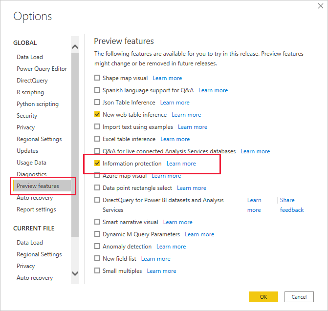

# How to apply sensitivity labels in Power BI

Microsoft Information Protection sensitivity labels on your reports, dashboards, datasets, and dataflows can guard your sensitive content against unauthorized data access and leakage. Labeling your data correctly with sensitivity labels ensures that only authorized people can access your data. This article shows you how to apply sensitivity labels to your content.

To be able to apply sensitivity labels in Power BI:
* You must have a Power BI Pro license and edit permissions on the content you wish to label.
* You must belong to a security group that has permissions to apply sensitivity labels, as described in the article entitled [Enable sensitivity labels in Power BI](./service-security-enable-data-sensitivity-labels.md).
* All [licensing and other requirements](./service-security-enable-data-sensitivity-labels.md#licensing-and-requirements) must have been met.

For more information about sensitivity labels in Power BI, see [Sensitivity labels in Power BI](service-security-sensitivity-label-overview.md).

## Apply sensitivity labels in the Power BI service

When data protection is enabled on your tenant, sensitivity labels appear in the sensitivity column in the list view of dashboards, reports, datasets, and dataflows.

**To apply or change a sensitivity label on a report or dashboard**
1. Click **More options (...)**.
1. Select **Settings**.
1. In the settings side pane choose the appropriate sensitivity label.
1. Save the settings.

The following image illustrates these steps on a report

**To apply or change a sensitivity label on a dataset or dataflow**

1. Click **More options (...)**.
1. Select **Settings**.
1. In the settings side pane choose the appropriate sensitivity label.
1. Apply the settings.

The following two images illustrate these steps on a dataset.

Choose **More options (...)** and then **Settings**.

On the settings page, open the sensitivity label section, choose the desired sensitivity label, and click **Apply**.

## Apply sensitivity labels in Power BI Desktop (preview)

To use sensitivity labels in Power BI Desktop:

* You must have a [Power BI Pro license](./service-admin-purchasing-power-bi-pro.md).
* Sensitivity labels must be enabled for your organization. Contact your Power BI admin if you aren't sure about this.
* You must belong to a security group that has permissions to apply sensitivity labels, as described in [Enable sensitivity labels in Power BI](./service-security-enable-data-sensitivity-labels.md).
* All [licensing and other requirements](./service-security-enable-data-sensitivity-labels.md#licensing-and-requirements) must have been met.
* The information protection preview feature switch in Power BI Desktop must be turned on. If you see the sensitivity button on the home tab, the preview feature is on. If you don't see the button, go to **File > Options and settings > Options > Preview features**, and check the box next to **Information protection**.

    

    If you don't see the Information protection preview option, the information protection preview feature may be blocked for your organization. In this case contact your Power BI administrator.

    >[!NOTE]
    >After turning on the information protection preview feature, you must restart Desktop in order to start using sensitivity labels.
* You must be signed in.

To apply a sensitivity label on the file you're working on, click the sensitivity button in the home tab and choose the desired label from the menu that appears.

>[!NOTE]
> If you've turned on the sensitivity labels feature in Preview features but still don't see the sensitivity button, it may indicate that you don't have an appropriate license or that you do not belong to security group that has permissions to apply sensitivity labels, as described in [Enable sensitivity labels in Power BI](./service-security-enable-data-sensitivity-labels.md).

After you've applied the label, it will be visible in the status bar.

**Notes**
* When you publish a .pbix file to the Power BI service from Desktop, or when you upload a .pbix file to the Power BI service directly using **Get data**, the .pbix file's label gets applied to both the report and the dataset that are created in the service. If the .pbix file you’re publishing or uploading replaces existing assets (i.e. assets that have the same name as the .pbix file) the .pbix file's label will overwrite any labels on those assets.
* When using "Download to .pbix" in the Power BI service, if the report and dataset being downloaded both have labels, and those labels are different, the label that will be applied to the .pbix file is the more restrictive of the two.

## Remove sensitivity labels
To remove a sensitivity label from a report, dashboard, dataset, or dataflow, follow the same procedure used for applying labels, but choose **(None)** when prompted to classify the sensitivity of the data.

>[!NOTE]
> It is currently not possible to remove a label in Power BI Desktop. 

## Considerations and limitations

See [Sensitivity labels in Power BI](service-security-sensitivity-label-overview.md#limitations) for the list of sensitivity label limitations in Power BI.

## Next steps

This article described how to apply sensitivity labels in Power BI. The following articles provide more details about data protection in Power BI. 

* [Overview of sensitivity labels in Power BI](./service-security-sensitivity-label-overview.md)
* [Enable sensitivity labels in Power BI](./service-security-enable-data-sensitivity-labels.md)
* [Using Microsoft Cloud App Security controls in Power BI](./service-security-using-microsoft-cloud-app-security-controls.md)