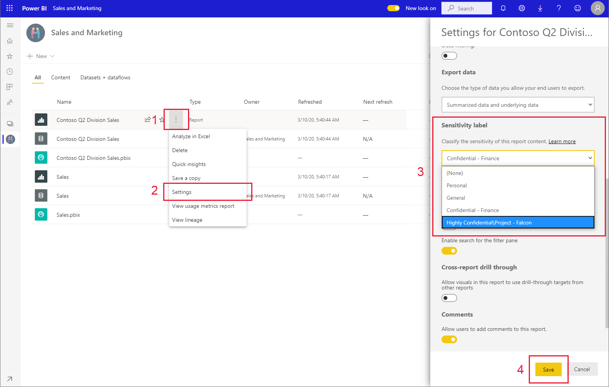

# How to apply sensitivity labels in Power BI

Microsoft Information Protection sensitivity labels on your reports, dashboards, datasets, and dataflows can guard your sensitive content against unauthorized data access and leakage. Labeling your data correctly with sensitivity labels ensures that only authorized people can access your data. This article shows you how to apply sensitivity labels to your content.

To be able to apply sensitivity labels in Power BI:
* You must have a Power BI Pro license and edit permissions on the content you wish to label.
* You must belong to a security group that has permissions to apply sensitivity labels, as described in the article entitled [Enable sensitivity labels in Power BI](./service-security-enable-data-sensitivity-labels.md).
* All [licensing and other requirements](./service-security-enable-data-sensitivity-labels.md#licensing-and-requirements) must have been met.

For more information about sensitivity labels in Power BI, see [Sensitivity labels in Power BI](service-security-sensitivity-label-overview.md).

## Applying sensitivity labels

When data protection is enabled on your tenant, sensitivity labels appear in the sensitivity column in the list view of dashboards, reports, datasets, and dataflows.

**To apply or change a sensitivity label on a report or dashboard**
1. Click **More options (...)**.
1. Select **Settings**.
1. In the settings side pane choose the appropriate sensitivity label.
1. Save the settings.

The following image illustrates these steps on a report

**To apply or change a sensitivity label on a dataset or dataflow**

1. Click **More options (...)**.
1. Select **Settings**.
1. In the settings side pane choose the appropriate sensitivity label.
1. Apply the settings.

The following two images illustrate these steps on a dataset.

Choose **More options (...)** and then **Settings**.

On the settings page, open the sensitivity label section, choose the desired sensitivity label, and click **Apply**.

## Removing sensitivity labels
To remove a sensitivity label from a report, dashboard, dataset, or dataflow, follow the [same procedure used for applying labels](#applying-sensitivity-labels), but choose **(None)** when prompted to classify the sensitivity of the data. 

## Considerations and limitations

See [Sensitivity labels in Power BI](service-security-sensitivity-label-overview.md#limitations) for the list of sensitivity label limitations in Power BI.

## Next steps

This article described how to apply sensitivity labels in Power BI. The following articles provide more details about data protection in Power BI. 

* [Overview of sensitivity labels in Power BI](./service-security-sensitivity-label-overview.md)
* [Enable sensitivity labels in Power BI](./service-security-enable-data-sensitivity-labels.md)
* [Using Microsoft Cloud App Security controls in Power BI](./service-security-using-microsoft-cloud-app-security-controls.md)