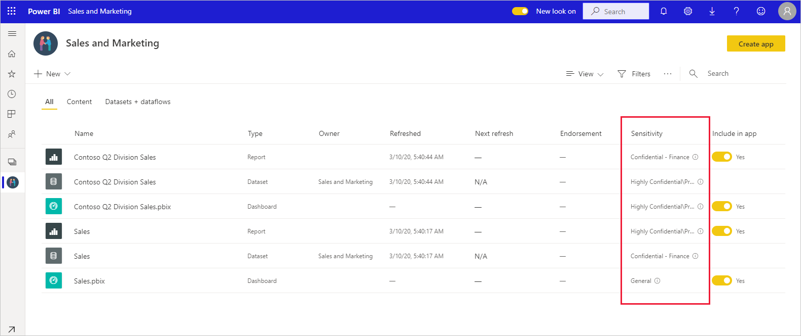
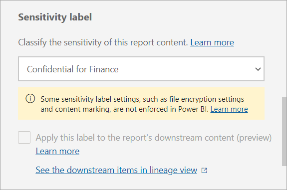
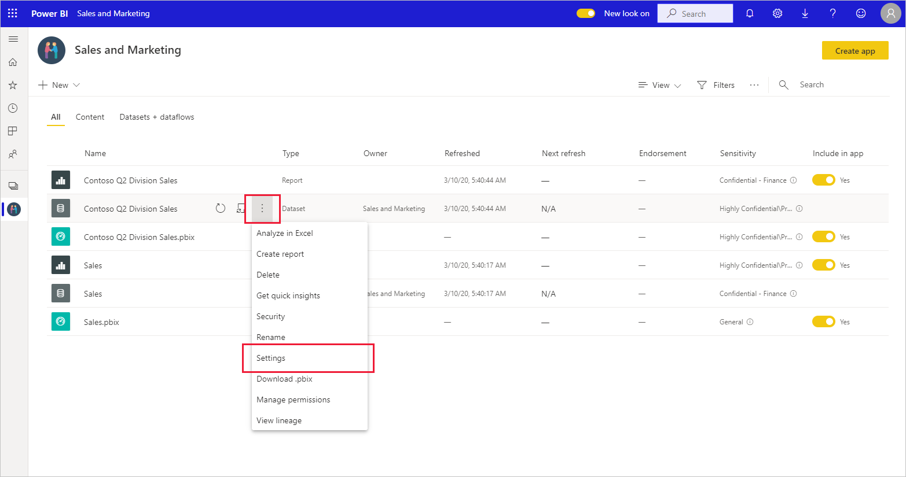
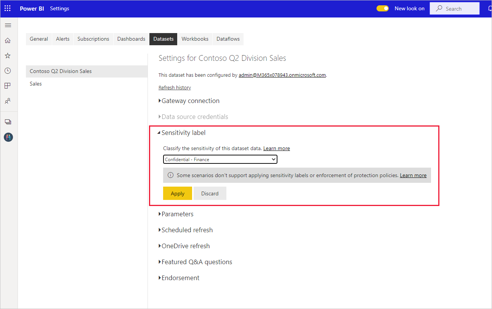
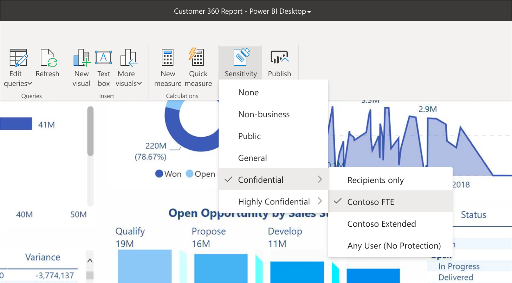
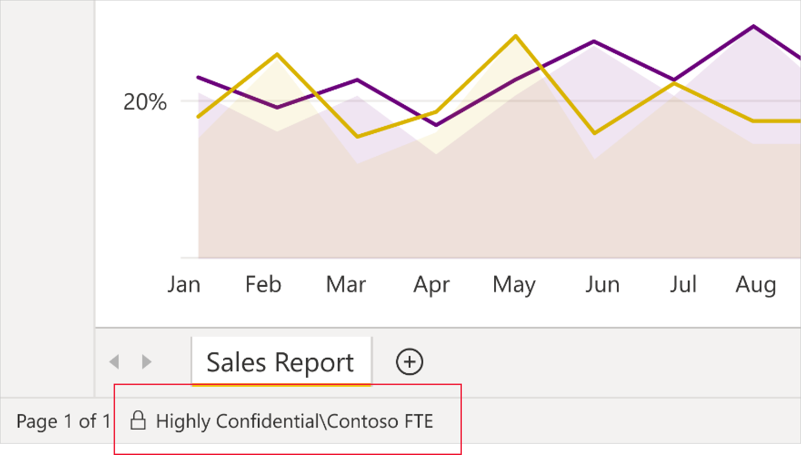

# How to apply sensitivity labels in Power BI

Microsoft Information Protection sensitivity labels on your reports, dashboards, datasets, dataflows, and .pbix files can guard your sensitive content against unauthorized data access and leakage. Labeling your data correctly with sensitivity labels ensures that only authorized people can access your data. This article shows you how to apply sensitivity labels in the Power BI service and in Power BI Desktop.

For more information about sensitivity labels in Power BI, see [Sensitivity labels in Power BI](service-security-sensitivity-label-overview.md).

## Apply sensitivity labels in the Power BI service

In the Power BI service, you can apply sensitivity labels to reports, dashboards, datasets, and dataflows.

To be able to apply sensitivity labels in the Power BI service:
* You must have a [Power BI Pro or Premium Per User (PPU) license](./service-admin-purchasing-power-bi-pro.md) and edit permissions on the content you wish to label.
* Sensitivity labels must be enabled for your organization. Contact your Power BI admin if you aren’t sure about this.
* You must belong to a security group that has permissions to apply sensitivity labels, as described in [Enable sensitivity labels in Power BI](./service-security-enable-data-sensitivity-labels.md).
* All [licensing and other requirements](./service-security-enable-data-sensitivity-labels.md#licensing-and-requirements) must have been met.

When data protection is enabled on your tenant, sensitivity labels appear in the sensitivity column in the list view of dashboards, reports, datasets, and dataflows.

**To apply or change a sensitivity label on a report or dashboard**

1. Go to **Settings**.
1. In the settings side pane, go to the Sensitivity label section and choose the appropriate sensitivity label.
1. Save the settings.

The following image illustrates these steps on a report

>[!NOTE]
>If the label is greyed out, you may not have the correct [usage rights](service-security-sensitivity-label-change-enforcement.md) to change the label. If you need to change a sensitivity label and can’t, either ask the person who applied the label in the first place to modify it, or contact the Microsoft 365/Office security administrator and request the necessary [usage rights](service-security-sensitivity-label-change-enforcement.md) for the label.

**To apply or change a sensitivity label on a dataset or dataflow**

1. Go to **Settings**.
1. Select the datasets or dataflows tab, whichever is relevant.
1. Expand the sensitivity labels section and choose the appropriate sensitivity label.
1. Apply the settings.

The following two images illustrate these steps on a dataset.

Choose **More options (...)** and then **Settings**.

On the settings datasets tab, open the sensitivity label section, choose the desired sensitivity label, and click **Apply**.

>[!NOTE]
>If the label is greyed out, you may not have the correct [usage rights](service-security-sensitivity-label-change-enforcement.md) to change the label. If you need to change a sensitivity label and can’t, either ask the person who applied the label in the first place to modify it, or contact the Microsoft 365/Office security administrator and request the necessary [usage rights](service-security-sensitivity-label-change-enforcement.md) for the label.

## Apply sensitivity labels in Power BI Desktop

To use sensitivity labels in Power BI Desktop:
* You must have a [Power BI Pro or Premium Per User (PPU) license](./service-admin-purchasing-power-bi-pro.md).
* Sensitivity labels must be enabled for your organization. Contact your Power BI admin if you aren't sure about this.
* You must belong to a security group that has permissions to apply sensitivity labels, as described in [Enable sensitivity labels in Power BI](./service-security-enable-data-sensitivity-labels.md).
* All [licensing and other requirements](./service-security-enable-data-sensitivity-labels.md#licensing-and-requirements) must have been met.
* You must be signed in.

Watch a short video on applying sensitivity labels and then try it out yourself.

> [!VIDEO https://www.microsoft.com/videoplayer/embed/RE4M5Gj]

To apply a sensitivity label on the file you're working on, click the sensitivity button in the home tab and choose the desired label from the menu that appears.

>[!NOTE]
> If the sensitivity button is greyed out, it may indicate that you don't have an appropriate license or that you do not belong to a security group that has permissions to apply sensitivity labels, as described in [Enable sensitivity labels in Power BI](./service-security-enable-data-sensitivity-labels.md).
>
>If a particular label you wish to change is greyed out, you may not have the correct [usage rights](service-security-sensitivity-label-change-enforcement.md) to change that label. If you need to change a sensitivity label and can’t, either ask the person who applied the label in the first place to modify it, or contact the Microsoft 365/Office security administrator and request the necessary [usage rights](service-security-sensitivity-label-change-enforcement.md) for the label.

After you've applied the label, it will be visible in the status bar.

### Sensitivity labels when uploading or downloading .pbix files to/from the service
* When you publish a .pbix file to the Power BI service from Desktop, or when you upload a .pbix file to the Power BI service directly using **Get data**, the .pbix file's label gets applied to both the report and the dataset that are created in the service. If the .pbix file you’re publishing or uploading replaces existing assets (i.e. that have the same name as the .pbix file), a dialog will prompt you to choose whether to keep the labels on those assets or to have the .pbix file's label overwrite those labels. If the .pbix file is unlabeled, the labels in the service will be retained.
* When using "Download to .pbix" in the Power BI service, if the report and dataset being downloaded both have labels, and those labels are different, the label that will be applied to the .pbix file is the more restrictive of the two.

## Remove sensitivity labels

### Service
To remove a sensitivity label from a report, dashboard, dataset, or dataflow, follow the [same procedure used for applying labels in the Power BI service](#apply-sensitivity-labels-in-the-power-bi-service), but choose **(None)** when prompted to classify the sensitivity of the data.

### Desktop
To remove a sensitivity label from a .pbix file, reselect the label in the sensitivity drop down menu.

## Considerations and limitations

See [Sensitivity labels in Power BI](service-security-sensitivity-label-overview.md#limitations) for the list of sensitivity label limitations in Power BI.

## Next steps

This article described how to apply sensitivity labels in Power BI. The following articles provide more details about data protection in Power BI. 

* [Overview of sensitivity labels in Power BI](./service-security-sensitivity-label-overview.md)
* [Enable sensitivity labels in Power BI](./service-security-enable-data-sensitivity-labels.md)
* [Using Microsoft Cloud App Security controls in Power BI](./service-security-using-microsoft-cloud-app-security-controls.md)
