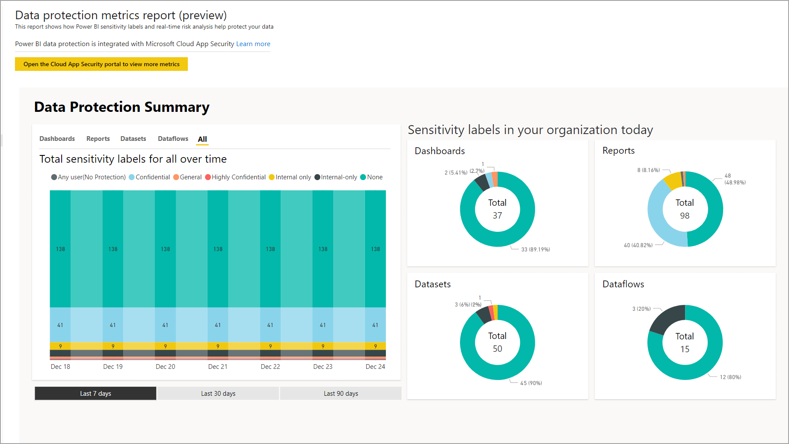
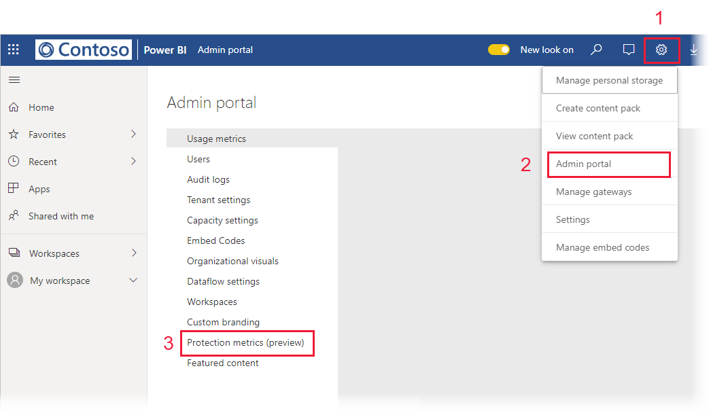

# Data protection metrics report

## What is the data protection metrics report?

The data protection metrics report is a dedicated report that [Power BI administrators](./service-admin-role.md) can use to  monitor and track sensitivity label usage and adoption in their tenant.

The report features:

* A 100% stacked column chart that shows daily sensitivity label usage in the tenant for the last 7, 30, or 90 days. This chart makes it easy to track the relative usage of the different label types over time.
* Doughnut charts that show the current state of sensitivity label usage in the tenant for dashboards, reports, datasets, and dataflows.
* A link to the Defender for Cloud Apps portal where Power BI alerts, users-at-risk, activity logs, and other information is available. For more information, see [Using Microsoft Defender for Cloud Apps controls in Power BI](./service-security-using-microsoft-cloud-app-security-controls.md).

The report refreshes every 24 hours.

## Viewing the data protection metrics report

You must have a [Power BI administrator role](./service-admin-role.md) to open and view the report.
To view the report, go to **Settings > Admin portal**, and choose **Protection metrics**.

The first time you open the data protection metrics report, it may take a few seconds to load. A report and a dataset entitled **Data protection metrics (automatically generated)** will be created in your private environment under "My workspace". We do not recommend viewing it here - this is not the full-featured report. Rather, view the report in the Admin portal as described above.

> [!CAUTION]
> Do not change the report or dataset in any way, since new versions of the report are rolled out from time to time and any changes you've made to the original report will be overwritten if you update to the new version.

## Report updates

Improved versions of the data protection metrics report are released periodically. When you open the report, if a new version is available you will be asked if you want to open the new version. If you say "yes", the new version of the report will load and overwrite the old version. Any changes you might have made to the old report and/or dataset will be lost. You can choose not to open the new version, but in that case you will not benefit from the new version's improvements.

## Notes and considerations

* In order for the data protection metrics report to be successfully generated, [information protection](./service-security-enable-data-sensitivity-labels.md) must be enabled on your tenant and [sensitivity labels should have been applied](./service-security-apply-data-sensitivity-labels.md).
* In order to access Defender for Cloud Apps information, your organization must have the appropriate [Defender for Cloud Apps license](./service-security-using-microsoft-cloud-app-security-controls.md#cloud-app-security-licensing).
* If you decide to share information from the data protection metrics report with a user who is not a Power BI administrator, be aware that this report contains sensitive information about your organization.
* The data protection metrics report is a special kind of report and does not show up in "Shared with me", "Recents", and "Favorites" lists.
* The data protection metrics report is not available to [external users (Azure Active Directory B2B guest users)](./service-admin-azure-ad-b2b.md).

## Next steps

* [Sensitivity labels in Power BI](./service-security-sensitivity-label-overview.md)
* [Using Microsoft Defender for Cloud Apps controls in Power BI](service-security-using-microsoft-cloud-app-security-controls.md)
* [Understanding the Power BI service administrator role](service-admin-role.md)
* [Enable sensitivity labels in Power BI](service-security-enable-data-sensitivity-labels.md)
