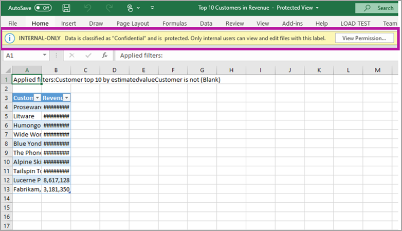

# Data protection in Power BI

Modern enterprises have strict business regulations and requirements about how to handle and protect sensitive data. To provide control and visibility over such data, Power BI Power BI is integrated with Microsoft Information Protection and Microsoft Cloud App Security. This enables you to:
* Use Microsoft Information Protection [sensitivity labels](https://docs.microsoft.com/microsoft-365/compliance/sensitivity-labels?view=o365-worldwide) to classify and label content (dashboards, reports, datasets and dataflows) in the Power BI service, using the same taxonomy used to classify and protect files in Office 365.
* Apply Microsoft Information Protection sensitivity labels and protection to data when it is exported to Excel, PowerPoint, or PDF files.
* Use Microsoft Cloud App Security to monitor activities in Power BI, investigate security issues, and protect content in Power BI with Microsoft Cloud App Security Conditional Access App Control.

**Important notes**
* Sensitivity labeling **does not** affect access to content within Power BI – access to content within Power BI is managed solely by Power BI permissions. While the labels are visible, any associated encryption settings (configured in either the [Microsoft 365 security center](https://security.microsoft.com/) or the [Microsoft 365 compliance center](https://compliance.microsoft.com/)) are not applied. They are applied only to data that is exported to Excel, PowerPoint, and PDF files.
* Sensitivity labels and file encryption **are not** applied in any export path other than export to Excel, PowerPoint, and PDF. The Power BI tenant admin can disable any or all export paths that don’t support the application of sensitivity labels and their associated file encryption settings.

## Sensitivity labels in Power BI

Sensitivity labels are created and managed in either the [Microsoft 365 security center](https://security.microsoft.com/) or the [Microsoft 365 compliance center](https://compliance.microsoft.com/).

To access sensitivity labels in either of these centers, navigate to **Classification > Sensitivity labels**. These sensitivity labels can be used by multiple Microsoft services such Azure Information Protection, Office apps, and Office 365 services.

> [!Important]
> If your organization uses Azure Information Protection sensitivity labels, you need to [migrate](https://docs.microsoft.com/azure/information-protection/configure-policy-migrate-labels) them to one of the previously listed services in order for the labels to be used in Power BI.

> [!NOTE]
> Sensitivity labels are only supported for tenants in public clouds; they are not supported for tenants in clouds such as sovereign clouds.

## How sensitivity labels work in Power BI

When you apply a sensitivity label to a Power BI dashboard, report, dataset or dataflow, it's similar to applying a tag on that resource that has the following benefits:
* **Customizable** - you can create categories for different levels of sensitive content in your organization, such as Personal, Public, General, Confidential, and Highly Confidential.
* **Clear text** - since the label is in clear text, it's easy for users to understand how to treat the content according to sensitivity label guidelines.
* **Persistent** - after a sensitivity label has been applied to content, it accompanies that content when it is exported to  Excel, PowerPoint and PDF files, and becomes the basis for applying and enforcing policies.

This means that the sensitivity label follows the content when it is exported to Excel, PowerPoint, and PDF files, and becomes the basis for applying and enforcing policies.

Power BI tenant admins can control [export to Excel](service-admin-portal.md#export-to-excel) and [export to PowerPoint and PDF](service-admin-portal.md#export-reports-as-powerpoint-presentations-or-pdf-documents) in the [Power BI admin portal](service-admin-portal.md).

## Sensitivity label example

Here's a quick example of how a sensitivity label in Power BI can work.

1.	In the Power BI service, a **Highly Confidential - Internal Only** sensitivity label is applied to a report.
   

1. When data is exported to an Excel file from this report, the sensitivity label and protection are applied to the exported Excel file.

   

In Microsoft Office applications, a sensitivity label appears as a tag on the email or document, similar to what is shown in the image above.

You can also assign a classification to content (like a sticker) that persists and roams with the content as it's used and shared throughout Power BI. You can use this classification to generate usage reports and see activity data for your sensitive content. Based on this information, you can always choose later to apply protection settings.

## Using sensitivity labels in Power BI

Before your sensitivity labels can be enabled in Power BI, you must first complete the following prerequisites: 

* Make sure that sensitivity labels have been defined in either the [Microsoft 365 security center](https://security.microsoft.com/) or the [Microsoft 365 compliance center](https://compliance.microsoft.com/). 
* [Enable Sensitivity labels](service-security-enable-data-sensitivity-labels.md) in Power BI.
* Make sure users have the appropriate license;
  * To apply or view labels in Power BI, users must have an Azure Information Protection Premium P1 or Premium P2 license. Microsoft Azure Information Protection can be purchased either standalone or through one of the Microsoft licensing suites. See [Azure Information Protection pricing](https://azure.microsoft.com/pricing/details/information-protection/) for detail.
  * To apply labels to Power BI resources, a user must have a Power BI Pro license in addition to one of the Azure Information Protection licenses mentioned above. 

## Protect content using Microsoft Cloud App Security

You can protect content in Power BI against unintended leaks or breaches by using Microsoft Cloud App Security. Once Microsoft Cloud App Security is set and configured, security administrators can monitor user access and activity, perform real-time risk analysis, and set label-specific controls.

For example, organizations can use Microsoft Cloud App Security to configure a policy that prevents users from downloading sensitive data from Power BI to unmanaged devices. Such a configuration allows users to remain productive and connect to Power BI from anywhere, while using Microsoft Cloud App Security to prevent compromising user actions, all in real time. 

### Requirements

Before your sensitivity labels can use Microsoft Cloud App Security, the following prerequisites must be met: 

* Cloud App Security and Azure Information Protection [must be enabled for your tenant](https://docs.microsoft.com/cloud-app-security/azip-integration).
* The app [must be connected to Microsoft Cloud App Security](https://docs.microsoft.com/cloud-app-security/enable-instant-visibility-protection-and-governance-actions-for-your-apps).

## Licensing

* Applying and viewing Microsoft Information Protection sensitivity labels in Power BI requires an Azure Information Protection Premium P1 or Premium P2 license. Microsoft Azure Information Protection can be purchased either standalone or through one of the Microsoft licensing suites. See [Azure Information Protection pricing](https://azure.microsoft.com/pricing/details/information-protection/) for detail.
* Viewing and applying labels in Office apps has [licensing requirements](https://docs.microsoft.com/microsoft-365/compliance/get-started-with-sensitivity-labels#subscription-and-licensing-requirements-for-sensitivity-labels).

## Considerations and limitations

The following list provides some limitations of sensitivity labels in Power BI:

* Sensitivity labels can be applied only on dashboards, reports, datasets and dataflows.
* Sensitivity label and protection on exported files is enforced only for Excel, PowerPoint and PDF files. It is not supported for Analyze in Excel, export to .csv, dataset downloads (.pbix), Power BI Service Live Connect, or any other export format.
* A user who exports a file from Power BI has permissions to access and edit that file according to the sensitivity label settings. The user who exports the data does not get owner permissions to the file. 
* Sensitivity labels are currently not available for [paginated reports]( https://docs.microsoft.com/power-bi/paginated-reports-report-builder-power-bi) and workbooks.
* Sensitivity labels on Power BI assets are visible in the workspace list, lineage, Favorites, Recent, and Apps views; labels are not currently visible in the "shared with me" view. Note, however, that a label applied to a Power BI asset, even if not visible, will always persist on data exported to Excel, PowerPoint, and PDF files.
* Sensitivity labels are only supported for tenants in the global (public) cloud. Sensitivity labels are not supported for tenants in other clouds.
* Data sensitivity labels are not supported for template apps. Sensitivity labels set by the template app creator are removed when the app is extracted and installed, and sensitivity labels added to artifacts in an installed template app by the app consumer are lost (reset to nothing) when the app is updated.
* Power BI does not support sensitivity labels of the **[Do Not Forward](https://docs.microsoft.com/microsoft-365/compliance/encryption-sensitivity-labels?view=o365-worldwide#let-users-assign-permissions)**, **[user-defined](https://docs.microsoft.com/microsoft-365/compliance/encryption-sensitivity-labels?view=o365-worldwide#let-users-assign-permissions)**, and **[HYOK](https://docs.microsoft.com/azure/information-protection/configure-adrms-restrictions)** protection types. The Do Not Forward and user-defined protection types refer to labels defined in the Office 365 Security & Compliance Center.

## Next steps

This article provided an overview of data protection in Power BI. The following articles provide more details about data protection in Power BI. 

* [Enable data sensitivity labels in Power BI](service-security-enable-data-sensitivity-labels.md)
* [Apply data sensitivity labels in Power BI](../designer/service-security-apply-data-sensitivity-labels.md)
* [Using Microsoft Cloud App Security controls in Power BI](service-security-using-microsoft-cloud-app-security-controls.md)
* [Data protection metrics report](service-security-data-protection-metrics-report.md)