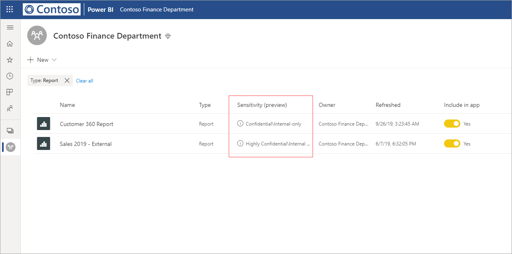

# Data protection in Power BI (preview)

Modern enterprises have strict business regulations and requirements about how to handle and protect their sensitive data. Power BI can integrate with Microsoft Information Protection and Microsoft Cloud App Security to provide greater control and visibility over sensitive data in Power BI. 

With Data protection for Power BI, you can do the following:

* Use Microsoft’s sensitivity labels to classify and label content in the Power BI service (dashboards, reports, dataset and dataflows), using the same taxonomy used to classify and protect files in Office 365. 

* Enforce protection settings such as encryption or watermarks when exporting data from the Power BI service to files by applying the content’s sensitivity label and protection (Excel, PowerPoint and PDF). 

  For example, your users can apply a Confidential label to a report in Power BI. Then, when the data is exported to an Excel file, Power BI will apply the Confidential label to the file. The label can encrypt the content and apply a Confidential watermark.

* Use Microsoft Cloud App Security to monitor activities in Power BI, investigate security issues, and protect content in Power BI with Microsoft Cloud App Security Conditional Access App Control. 

## Sensitivity labels in Power BI

Sensitivity labels are created and managed in either the [Microsoft 365 security center](https://security.microsoft.com/) or the [Microsoft 365 compliance center](https://compliance.microsoft.com/).

To access sensitivity labels in either of these centers, navigate to  **Classification > Sensitivity labels**. These sensitivity labels can be used by multiple Microsoft services such Azure Information Protection, Office apps, and Office 365 services.

> [!IMPORTANT]
> Azure Information Protection customers will need to migrate the labels to one of the previously listed services in order for sensitivity labels to be used in Power BI. In addition, sensitivity labels are only supported in public clouds, and are not supported for tenants in clouds, such as sovereign clouds.
>
> Learn more about [migrating sensitivity labels to Microsoft Information Protection](https://docs.microsoft.com/azure/information-protection/configure-policy-migrate-labels).

## How sensitivity labels work

When you apply a sensitivity label to a Power BI dashboard, report, dataset or dataflow, it’s similar to applying a *tag* to that resource that brings with it the following benefits:
* **Customizable** - you can create categories for different levels of sensitive content in your organization, such as Personal, Public, General, Confidential, and Highly Confidential.
* **Clear text** - since the label is in clear text, it’s easy for users to understand how to treat the content according to sensitivity label guidelines.
* **Persistent** - after a sensitivity label has been applied to content, it goes with that content when it is exported to the following supported file types: Excel, PowerPoint and PDF. 

  This means that the sensitivity label follows the content, including its protection settings, and becomes the basis for applying and enforcing policies. 

## Sensitivity label example 

Here's a quick example of how a sensitivity label in Power BI can work.

1. In the Power BI service, a **Highly Confidential - Internal Only** sensitivity label is applied to a report.

   

2. When data is exported to an Excel file from this report, the sensitivity label and protection are applied to the exported Excel file.

   

In Microsoft Office applications, a sensitivity label appears as a tag on the email or document, similar to the image above.

You can also assign a classification to content (like a sticker) that persists and roams with the content as it's used and shared. You can use this classification to generate usage reports and see activity data for your sensitive content. Based on this information, you can always choose later to apply protection settings.

## Using sensitivity labels in Power BI

Before your sensitivity labels can be enabled in Power BI, you must first complete the following prerequisites: 

* Make sure that sensitivity labels have been defined in either the [Microsoft 365 security center](https://security.microsoft.com/) or the [Microsoft 365 compliance center](https://compliance.microsoft.com/). 
* [Enable Sensitivity labels](service-security-enable-data-sensitivity-labels.md) (Preview) in Power BI.
* Make sure users have the appropriate license;
  * To apply or view labels in Power BI, users must have an Azure Information Protection Premium P1 or Premium P2 license. Microsoft Azure Information Protection can be purchased either standalone or through one of the Microsoft licensing suites. See [Azure Information Protection pricing](https://azure.microsoft.com/pricing/details/information-protection/) for detail.
  * To apply labels to Power BI resources, a user must have a Power BI Pro license in addition to one of the Azure Information Protection licenses mentioned above. 

## Protect content using Microsoft Cloud App Security

You can protect content in Power BI against unintended leaks or breaches by using Microsoft Cloud App Security. Once Microsoft Cloud App Security is set and configured, security administrators can monitor user access and activity, perform real-time risk analysis, and set label-specific controls.

For example, organizations can use Microsoft Cloud App Security to configure a policy that prevents users from downloading sensitive data from Power BI to unmanaged devices. Such a configuration allows users to remain productive and connect to Power BI from anywhere, while using Microsoft Cloud App Security to prevent compromising user actions, all in real-time. 

### Requirements

Before your sensitivity labels can use Microsoft Cloud App Security, the following prerequisites must be met: 

* Cloud App Security and Azure Information Protection [must be enabled for your tenant](https://docs.microsoft.com/cloud-app-security/azip-integration).
* The app [must be connected to Microsoft Cloud App Security](https://docs.microsoft.com/cloud-app-security/enable-instant-visibility-protection-and-governance-actions-for-your-apps).

## Considerations and limitations

The following list provides some limitations of sensitivity labels in Power BI:

* Applying and viewing Microsoft Information Protection sensitivity labels in Power BI requires an Azure Information Protection Premium P1 or Premium P2 license. Microsoft Azure Information Protection can be purchased either standalone or through one of the Microsoft licensing suites. See [Azure Information Protection pricing](https://azure.microsoft.com/pricing/details/information-protection/) for detail.
* Sensitivity labels can be applied only on dashboards, reports, datasets and dataflows.
* Label and protection controls enforcement on exported files is supported only for Excel, PowerPoint and PDF files. Label and protection are not enforced when data is exported to .CSV files, Subscribe to email, Embed visuals and print.
* A user who exports a file from Power BI has permissions to access and edit that file according to the sensitivity label settings. The user who exports the data does not get owner permissions to the file. 
* Sensitivity labels are currently not available for [paginated reports]( https://docs.microsoft.com/power-bi/paginated-reports-report-builder-power-bi) and workbooks.
* Sensitivity labels on Power BI assets are visible only in the workspace list and lineage views; labels are not currently visible in the favorites, shared with me, recents, or app views. Note, however, that a label applied to a Power BI asset, even if not visible, will always persist on data exported to Excel, PowerPoint, and PDF files.
* The sensitivity label *file Encryption setting*, configured in either the [Microsoft 365 security center](https://security.microsoft.com/) or the [Microsoft 365 compliance center](https://compliance.microsoft.com/), applies only on files that are *exported from* Power BI; it is not enforced *within* Power BI.
* [HYOK protection](https://docs.microsoft.com/azure/information-protection/configure-adrms-restrictions) is not supported for labels applied in Power BI.
* Viewing and applying labels in Office apps has [licensing requirements](https://docs.microsoft.com/microsoft-365/compliance/sensitivity-labels-office-apps#subscription-and-licensing-requirements-for-sensitivity-labels).
* Sensitivity labels are only supported for tenants in the global (public) cloud. Sensitivity labels are not supported for tenants in other clouds.
* Sensitivity labels are not supported for [external users (Azure Active Directory B2B guest users)](../service-admin-azure-ad-b2b.md). This means that external users cannot view labels and will be blocked from exporting data to Excel, PDF, and PPTX files. Remove the label to enable external users to export data to those file types.

## Next steps

This article provided an overview of data protection in Power BI. The following articles provide more details about data protection in Power BI. 

* [Enable data sensitivity labels in Power BI](service-security-enable-data-sensitivity-labels.md)
* [Apply data sensitivity labels in Power BI](../designer/service-security-apply-data-sensitivity-labels.md)
* [Using Microsoft Cloud App Security controls in Power BI](service-security-using-microsoft-cloud-app-security-controls.md)
* [Data protection metrics report](service-security-data-protection-metrics-report.md)