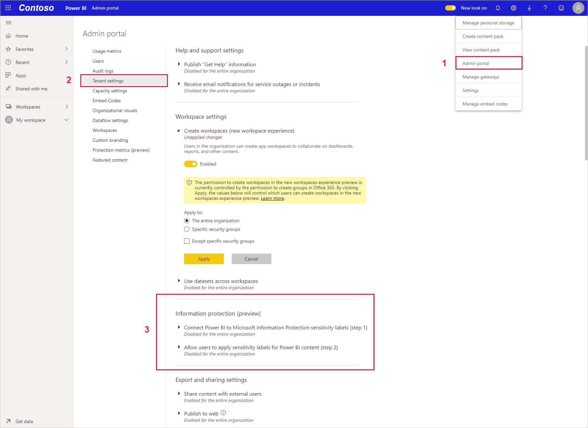
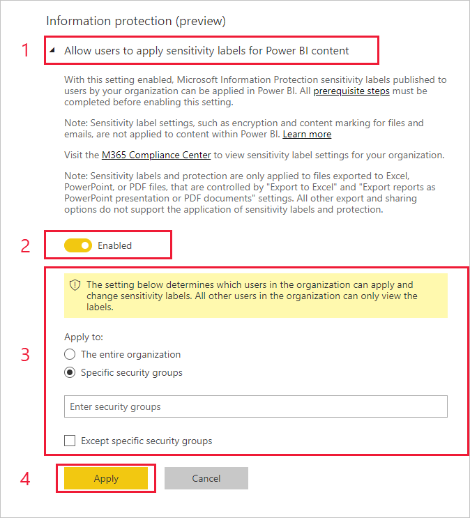

# Enable sensitivity labels in Power BI

In order for [Microsoft Information Protection sensitivity labels](/microsoft-365/compliance/sensitivity-labels) to be used in Power BI, they must be enabled on the tenant. This article shows Power BI admins how to do this. For an overview about sensitivity labels in Power BI, see [Sensitivity labels in Power BI](service-security-sensitivity-label-overview.md). For information about applying sensitivity labels in Power BI, see [Applying sensitivity labels](./service-security-apply-data-sensitivity-labels.md)

When sensitivity labels are enabled:

* Specified users and security groups in the organization can classify and [apply sensitivity labels](./service-security-apply-data-sensitivity-labels.md) to their Power BI content. In the Power BI service, this means their reports, dashboards, datasets, and dataflows. In Power BI Desktop, it means their .pbix files.
* In the service, all members of the organization will be able to see those labels. In Desktop, only members of the organization who have the labels published to them will be able to see the labels.

Enabling sensitivity labels requires an Azure Information Protection license. See [Licensing and requirements](#licensing-and-requirements) for detail.

#### Give us your feedback

The product team would love to get your **[feedback](https://forms.office.com/pages/responsepage.aspx?id=v4j5cvGGr0GRqy180BHbR-PPBJBIRPlBpEYIBVrF5lRUREtUREJJRzJZSzcyM1pZWU9LOUdSVkFKWC4u)** about Power BI's information protection capabilities and its integration with Microsoft Information Protection sensitivity labels. Help us meet your information protection needs! Thanks!

## Licensing and requirements

* An Azure Information Protection Premium P1 or Premium P2 license is required to apply or view Microsoft Information Protection sensitivity labels in Power BI. Azure Information Protection can be purchased either standalone or through one of the Microsoft licensing suites. See [Azure Information Protection pricing](https://azure.microsoft.com/services/information-protection/) for detail.

    > [!NOTE]
    > If your organization uses Azure Information Protection sensitivity labels, they need to be migrated to the Microsoft Information Protection Unified Labeling platform in order for the them to be used in Power BI. [Learn more about migrating sensitivity labels](/azure/information-protection/configure-policy-migrate-labels).

* To be able to apply labels to Power BI content and files, a user must have a Power BI Pro or Premium Per User (PPU) license in addition to one of the Azure Information Protection licenses mentioned above.

* Office apps have their own [licensing requirements for viewing and applying sensitivity labels](/microsoft-365/compliance/get-started-with-sensitivity-labels#subscription-and-licensing-requirements-for-sensitivity-labels).

* Before enabling sensitivity labels on your tenant, make sure that sensitivity labels have been defined and published for relevant users and groups. See [Create and configure sensitivity labels and their policies](/microsoft-365/compliance/create-sensitivity-labels) for detail.

* Customers in China must enable rights management for the tenant and add the Microsoft Information Protection Sync Service service principle, as described in steps 1 and 2 under [Configure Azure Information Protection for customers in China](/microsoft-365/admin/services-in-china/parity-between-azure-information-protection?view=o365-21vianet&preserve-view=true#configure-aip-for-customers-in-china).

* Using sensitivity labels in Desktop requires the Desktop December 2020 release and later.

    > [!NOTE]
    > If you try to open a protected .pbix file with a Desktop version earlier than December 2020, it will fail, and you will be prompted to upgrade your Desktop version.

## Enable sensitivity labels

Sensitivity labels must be enabled on the tenant before they can be used in both the service and in Desktop. This section describes how to enable them in the tenant settings.

To enable sensitivity labels on the tenant, go to the Power BI **Admin portal**, open the **Tenant settings** pane, and find the **Information protection** section.

In the **Information Protection** section, perform the following steps:
1. Open **Allow users to apply sensitivity labels for Power BI content**.
1. Enable the toggle.
1. Define who can apply and change sensitivity labels in Power BI assets. By default, everyone in your organization will be able to apply sensitivity labels. However, you can choose to enable setting sensitivity labels only for specific users or security groups. With either the entire organization or specific security groups selected, you can exclude specific subsets of users or security groups.

   * When sensitivity labels are enabled for the entire organization, exceptions are typically security groups.
   * When sensitivity labels are enabled only for specific users or security groups, exceptions are typically specific users.  
    This approach makes it possible to prevent certain users from applying sensitivity labels in Power BI, even if they belong to a group that has permissions to do so.

1. Press **Apply**.

> [!IMPORTANT]
> Only Power BI Pro users who have *create* and *edit* permissions on the asset, and who are part of the relevant security group that was set in this section, will be able to set and edit the sensitivity labels. Users who are not part of this group won't be able to set or edit the label.

## Troubleshooting

Power BI uses Microsoft Information Protection sensitivity labels. Thus if you encounter an error message when trying to enable sensitivity labels, it might be due to one of the following:

* You do not have an Azure Information Protection [license](#licensing-and-requirements).
* Sensitivity labels have not been [migrated](#enable-sensitivity-labels) to the Microsoft Information Protection version supported by Power BI.
* No Microsoft Information Protection sensitivity labels have been [defined in the organization](#enable-sensitivity-labels).

## Considerations and limitations

See [Sensitivity labels in Power BI](service-security-sensitivity-label-overview.md#considerations-and-limitations) for the list of sensitivity label limitations in Power BI.

## Next steps

This article described how to enable sensitivity labels in Power BI. The following articles provide more details about data protection in Power BI.

* [Overview of sensitivity labels in Power BI](service-security-sensitivity-label-overview.md)
* [How to apply sensitivity labels in Power BI](./service-security-apply-data-sensitivity-labels.md)
* [Using Microsoft Defender for Cloud Apps controls in Power BI](service-security-using-defender-for-cloud-apps-controls.md)
* [Protection metrics report](service-security-data-protection-metrics-report.md)
