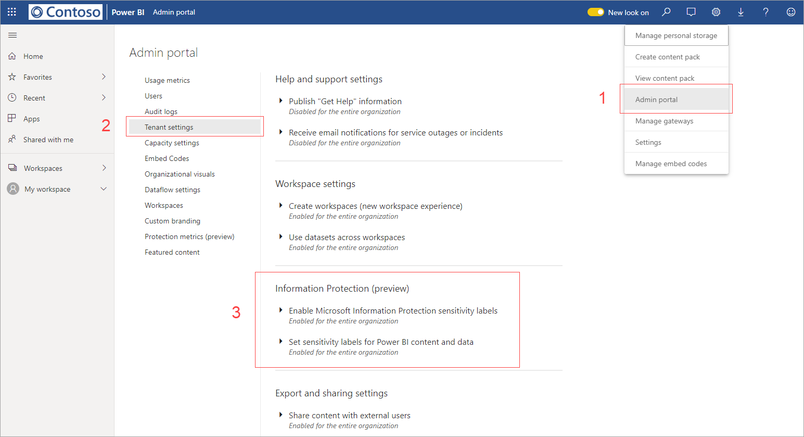

# Enable data sensitivity labels in Power BI (preview)

When [Microsoft Information Protection data sensitivity labels](https://docs.microsoft.com/microsoft-365/compliance/sensitivity-labels) are enabled in Power BI, the following applies:

* Certain users and security groups in an organization can classify and [apply sensitivity labels](../designer/service-security-apply-data-sensitivity-labels.md) to their Power BI dashboards, reports, datasets, and dataflows (hereafter referred to as *assets*).
* All members of the organization can see those labels.

Data sensitivity labels promote data protection by making Power BI authors and consumers aware of data sensitivity, while providing them information about what the classification means and how data that has that classification should be handled.

When Power BI data that has a data sensitivity label is exported to an Excel, PowerPoint, or PDF file, its data sensitivity label goes with it. This means that a user who doesn’t have permission access to labeled data, because of sensitivity labels policies, won’t be able to open the files *outside* of Power BI (in Excel, PowerPoint, or PDF apps).

Enabling data sensitivity labels requires an Azure Information Protection license. See [Licensing](#licensing) for more details.

## Enable data sensitivity labels

To enable the use of Microsoft Information Protection data sensitivity labels in Power BI, go to the Power BI Admin portal, open the Tenant settings pane, and find the Information protection section.

In the **Information Protection** section, perform the following steps:
1.	Enable the **Enable Microsoft Information Protection sensitivity labels** toggle and press **Apply**. This step *only* makes the sensitivity labels visible to your entire organization; it does not apply any labels. To define who can apply those labels in Power BI, you need to complete Step 2.
2.	Define who can apply and change sensitivity labels in Power BI assets. This step involves three actions:
    1.	Enable the **Set sensitivity labels for Power BI content and data** toggle.
    2.	Select the relevant security group(s). By default, everyone in your organization will be able to apply sensitivity labels. However, you can choose to enable setting sensitivity labels only for specific users or security groups. With either the entire organization or specific security groups selected, you can exclude specific subsets of users or security groups.
    * When sensitivity labels are enabled for the entire organization, exceptions are typically security groups.
    * When sensitivity labels are enabled only for specific users or security groups, exceptions are typically specific users.  
    This approach makes it possible to prevent certain users from applying sensitivity labels in Power BI, even if they belong to a group that has permissions to do so.
    
    3. Press **Apply**.

> [!IMPORTANT]
> Only Power BI Pro users who have *create* and *edit* permissions on the asset, and who are part of the relevant security group that was set in this section, will be able to set and edit the sensitivity labels. Users who are not part of this group won’t be able to set or edit the label. 

## Considerations and limitations

Power BI uses Microsoft Information Protection sensitivity labels. Thus if you encounter an error message when trying to enable sensitivity labels, it might be due to one of the following:

* You do not have an Azure Information Protection [license](#licensing).
* Sensitivity labels have not been migrated to the Microsoft Information Protection version supported by Power BI. Learn more about [migrating sensitivity labels](https://docs.microsoft.com/azure/information-protection/configure-policy-migrate-labels).
* No Microsoft Information Protection sensitivity labels have been defined in the organization. In addition, to be usable, a label must be part of a published policy. [Learn more about sensitivity labels](https://docs.microsoft.com/Office365/SecurityCompliance/sensitivity-labels), or visit the [Microsoft security and compliance center](https://sip.protection.office.com/sensitivity?flight=EnableMIPLabels) to read about how to define labels and publish policies for your organization.

## Licensing

* To view or Microsoft Information Protection labels in Power BI, users must have an Azure Information Protection Premium P1 or Premium P2 license. Microsoft Azure Information Protection can be purchased either standalone or through one of the Microsoft licensing suites. See [Azure Information Protection pricing](https://azure.microsoft.com/pricing/details/information-protection/) for detail.
* Users who need to apply labels on Power BI assets must have a Power BI Pro license.

## Next steps

This article described how to enable data sensitivity labels in Power BI. The following articles provide more details about data protection in Power BI. 

* [Overview of data protection in Power BI](service-security-data-protection-overview.md)
* [Apply data sensitivity labels in Power BI](../designer/service-security-apply-data-sensitivity-labels.md)
* [Using Microsoft Cloud App Security controls in Power BI](service-security-using-microsoft-cloud-app-security-controls.md)