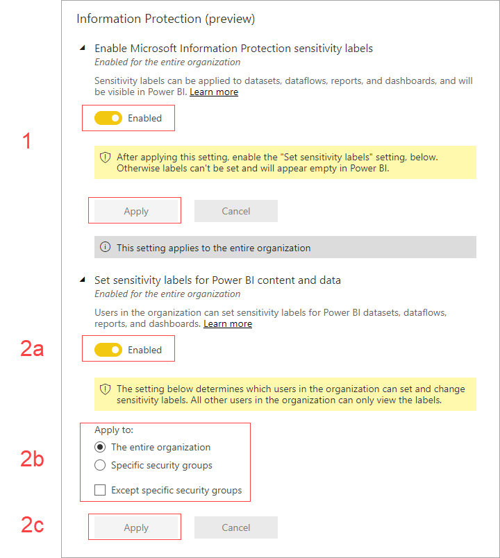

# Enable data sensitivity labels in Power BI

In order for [Microsoft Information Protection data sensitivity labels](https://docs.microsoft.com/microsoft-365/compliance/sensitivity-labels) to be used in Power BI, they must be enabled on the tenant. This article shows Power BI tenant administrators how to do this. For an overview about data sensitivity labels in Power BI, see [Data protection in Power BI](service-security-data-protection-overview.md). For information about applying sensitivity labels in Power BI, see [Applying sensitivity labels](../collaborate-share/service-security-apply-data-sensitivity-labels.md) 

When sensitivity labels are enabled:

* Specified users and security groups in the organization can classify and [apply sensitivity labels](../collaborate-share/service-security-apply-data-sensitivity-labels.md) to their Power BI reports, dashboards, datasets, and dataflows.
* All members of the organization can see those labels.

Enabling data sensitivity labels requires an Azure Information Protection license. See [Licensing](service-security-data-protection-overview.md#licensing) for detail.

## Enable data sensitivity labels

Go to the Power BI **Admin portal**, open the **Tenant settings** pane, and find the **Information protection** section.

In the **Information Protection** section, perform the following steps:
1. Open **Allow users to apply sensitivity labels for Power BI content**.
1. Enable the toggle.
1. Define who can apply and change sensitivity labels in Power BI assets. By default, everyone in your organization will be able to apply sensitivity labels. However, you can choose to enable setting sensitivity labels only for specific users or security groups. With either the entire organization or specific security groups selected, you can exclude specific subsets of users or security groups.
   
   * When sensitivity labels are enabled for the entire organization, exceptions are typically security groups.
   * When sensitivity labels are enabled only for specific users or security groups, exceptions are typically specific users.  
    This approach makes it possible to prevent certain users from applying sensitivity labels in Power BI, even if they belong to a group that has permissions to do so.

1. Press **Apply**.

> [!IMPORTANT]
> Only Power BI Pro users who have *create* and *edit* permissions on the asset, and who are part of the relevant security group that was set in this section, will be able to set and edit the sensitivity labels. Users who are not part of this group won’t be able to set or edit the label.  

## Troubleshooting

Power BI uses Microsoft Information Protection sensitivity labels. Thus if you encounter an error message when trying to enable sensitivity labels, it might be due to one of the following:

* You do not have an Azure Information Protection [license](service-security-data-protection-overview.md#licensing).
* Sensitivity labels have not been migrated to the Microsoft Information Protection version supported by Power BI. Learn more about [migrating sensitivity labels](https://docs.microsoft.com/azure/information-protection/configure-policy-migrate-labels).
* No Microsoft Information Protection sensitivity labels have been defined in the organization. Note that to be usable, a label must be part of a published policy. [Learn more about sensitivity labels](https://docs.microsoft.com/Office365/SecurityCompliance/sensitivity-labels), or visit the [Microsoft security and compliance center](https://sip.protection.office.com/sensitivity?flight=EnableMIPLabels) to read about how to define labels and publish policies for your organization.

## Considerations and limitations

The following list provides some limitations of sensitivity labels in Power BI:

**General**
* Sensitivity labels can be applied only on dashboards, reports, datasets and dataflows. They are not currently available for [paginated reports](../paginated-reports/report-builder-power-bi.md) and workbooks.
* Sensitivity labels on Power BI assets are visible in the workspace list, lineage, favorites, recents, and apps views; labels are not currently visible in the "shared with me" view. Note, however, that a label applied to a Power BI asset, even if not visible, will always persist on data exported to Excel, PowerPoint, and PDF files.
* Sensitivity labels are only supported for tenants in the global (public) cloud. Sensitivity labels are not supported for tenants in other clouds.
* Data sensitivity labels are not supported for template apps. Sensitivity labels set by the template app creator are removed when the app is extracted and installed, and sensitivity labels added to artifacts in an installed template app by the app consumer are lost (reset to nothing) when the app is updated.
* Power BI does not support sensitivity labels of the [Do Not Forward](https://docs.microsoft.com/microsoft-365/compliance/encryption-sensitivity-labels?view=o365-worldwide#let-users-assign-permissions), [user-defined](https://docs.microsoft.com/microsoft-365/compliance/encryption-sensitivity-labels?view=o365-worldwide#let-users-assign-permissions), and [HYOK](https://docs.microsoft.com/azure/information-protection/configure-adrms-restrictions) protection types. The Do Not Forward and user-defined protection types refer to labels defined in the [Microsoft 365 security center](https://security.microsoft.com/) or the [Microsoft 365 compliance center](https://compliance.microsoft.com/).
* It is not recommended to allow users to apply parent labels within Power BI. If a parent label is applied to content, exporting data from that content to a file (Excel, PowerPoint and PDF) will fail. See [Sublabels (grouping labels)](https://docs.microsoft.com/microsoft-365/compliance/sensitivity-labels?view=o365-worldwide#sublabels-grouping-labels).

**Export**
* Label and protection controls are enforced only when data is exported to Excel, PowerPoint and PDF files. Label and protection are not enforced when data is exported to .csv or .pbix files, Analyze in Excel, or any other export path.
* Applying a sensitivity label and protection to an exported file doesn’t add content marking to the file. However, if the label is configured to apply content markings, they are automatically applied by the Azure Information Protection unified labeling client when the file is opened in Office desktop apps. The content markings are not automatically applied when you use built-in labeling for desktop, mobile, or web apps. See [When Office apps apply content marking and encryption](https://docs.microsoft.com/microsoft-365/compliance/sensitivity-labels-office-apps?view=o365-worldwide#when-office-apps-apply-content-marking-and-encryption) for more detail.
* A user who exports a file from Power BI has permissions to access and edit that file according to the sensitivity label settings. The user who exports the data does not get owner permissions to the file.
* Export will fail if a label can't be applied when data is exported to a file. To check if export failed because the label couldn't be applied, click the report or dashboard name at the center of the title bar and see whether it says "Sensitivity label can't be loaded" in the info dropdown that opens. This can happen if the applied label has been unpublished or deleted by the security admin, or as the result of a temporary system issue.

## Next steps

This article described how to enable data sensitivity labels in Power BI. The following articles provide more details about data protection in Power BI. 

* [Overview of sensitivity labels in Power BI](service-security-sensitivity-labels-overview.md)
* [Apply data sensitivity labels in Power BI](../collaborate-share/service-security-apply-data-sensitivity-labels.md)
* [Using Microsoft Cloud App Security controls in Power BI](service-security-using-microsoft-cloud-app-security-controls.md)
* [Data protection metrics report](service-security-data-protection-metrics-report.md)