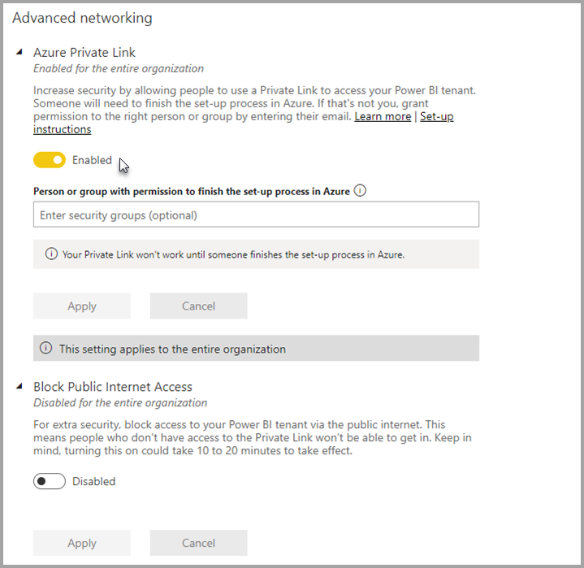
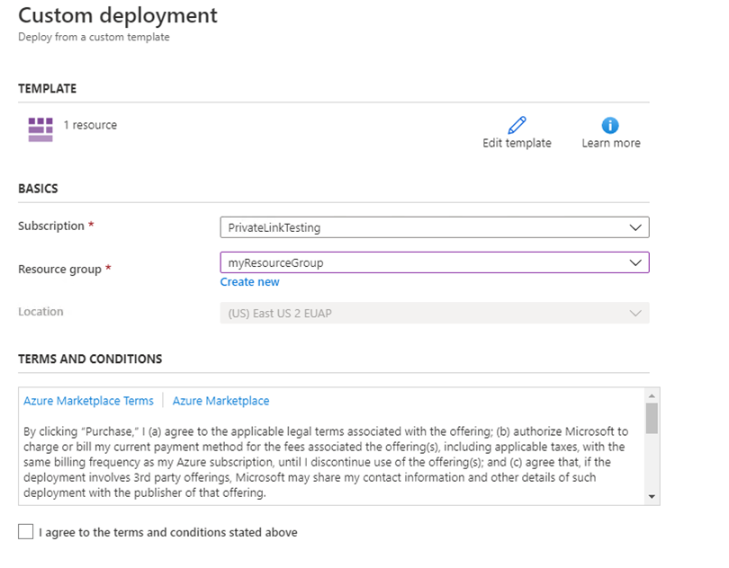
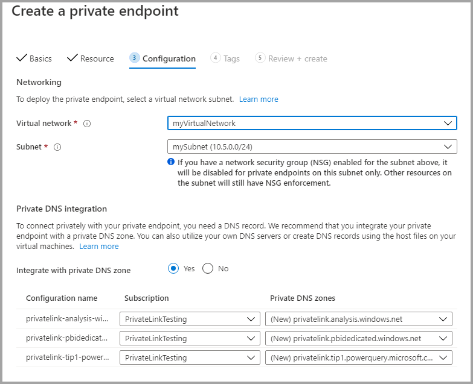

# Private endpoints for accessing Power BI

You can use the Azure Private Link feature to provide secure access for data traffic in Power BI. Azure networking provides the Azure Private Link feature. In this configuration, Azure Private Link and Azure Networking private endpoints are used to send data traffic privately using Microsoft's backbone network infrastructure. The data travels the Microsoft private network backbone instead of going across the Internet.

Private endpoints make sure that Power BI users go through the Microsoft private network backbone when they access resources in the Power BI service.

See [What is Azure Private Link](/azure/private-link/private-link-overview) to learn more about Azure Private Link.

## Understanding private endpoints

Private endpoints guarantee that traffic going *into* your organization’s Power BI artifacts (such as reports, or workspaces) always follow your organization's configured private link network path. User traffic to your Power BI artifacts must come from the established private link. You can configure Power BI to deny all requests that don’t come from the configured network path. 

Private endpoints *do not* guarantee that traffic from Power BI to your external data sources, whether in the cloud or on premises, is secured. Configure firewall rules and virtual networks to further secure your data sources. 

### Power BI and private endpoint integration

Azure Private Endpoint for Power BI is a network interface that connects you privately and securely to the Power BI service, powered by Azure Private Link.

Private Endpoints integration enables Platform as a Service (PaaS) services to be deployed and accessed privately from customer's virtual and on-premises networks, while the service is still running outside of the customer’s network. Private Endpoints is a single, directional technology that lets clients initiate connections to a given service, but it doesn't allow the service to initiate a connection into the customer network. This Private Endpoint integration pattern provides management isolation, since the service can operate independently of customer network policy configuration. For multi-tenant services, this Private Endpoint model provides link identifiers to prevent access to other customers' resources hosted within the same service. When using Private Endpoints, only a limited set of other PaaS service resources can be accessed from services using the integration.  

The Power BI service implements Private Endpoints, and not Service Endpoints.  

Using private endpoints with Power BI provide the following benefits:

1. Private endpoints ensure that traffic will flow over the Azure backbone to a private endpoint for Azure cloud-based resources. 

2. Network traffic isolation from non-Azure based infrastructure, such as on-premises access, would require customers to have ExpressRoute or a Virtual Private Network (VPN) configured.  

## Using secure private endpoints to access Power BI

In Power BI, you can configure and use an endpoint that enables your organization to access Power BI privately. To configure private endpoints, you must be a Power BI administrator and have permissions in Azure to create and configure resources such as Virtual Machines (VMs) and Virtual Networks (V-Net).

The steps that enable you to securely access Power BI from private endpoints are:

1. [Enable private endpoints for Power BI](#enable-private-endpoints-for-power-bi)
2. [Create a Power BI resource in the Azure portal](#create-a-power-bi-resource-in-the-azure-portal)
3. [Create a virtual network](#create-a-virtual-network)
4. [Create a virtual machine (VM)](#create-a-virtual-machine-vm)
5. [Create a private endpoint](#create-a-private-endpoint)
6. [Connect to a VM using Remote Desktop (RDP)](#connect-to-a-vm-using-remote-desktop-rdp)
7. [Access Power BI privately from the virtual machine](#access-power-bi-privately-from-the-vm)
8. [Disable public access for Power BI](#disable-public-access-for-power-bi)

The following sections provide additional information for each step.

## Enable private endpoints for Power BI

To get started, sign in to the [Power BI](https://app.powerbi.com) service as an administrator, then perform the following steps:

1. From the page header, select **Settings** > **Admin portal**.
1. Select **Tenant settings** and scroll to  **Advanced Networking**. Toggle the radio button to turn on **Azure Private Link**.

     

It takes about 15 minutes to configure a private link for your tenant, which includes configuring a separate FQDN for the tenant in order to communicate privately with Power BI services.

After this process is finished, you can move on to the next step.

## Create a Power BI resource in the Azure portal

Next, sign into the [Azure portal](https://portal.azure.com) and create a Power BI resource, using an **Azure Template**. Replace the parameters in the ARM template example, shown in the following table, to create a Power BI resource.


|**Parameter**  |**Value**  |
|---------|---------|
|```<resource-name>```    | myPowerBIResource         |
|```<tenant-object-id>```     | [Find your tenant ID in the Azure portal](/azure/active-directory/fundamentals/active-directory-how-to-find-tenant) |

Create the ARM template 

```
{
  "$schema": "http://schema.management.azure.com/schemas/2015-01-01/deploymentTemplate.json#",
  "contentVersion": "1.0.0.0",
  "parameters": {},
  "resources": [
      {
          "type":"Microsoft.PowerBI/privateLinkServicesForPowerBI",
          "apiVersion": "2020-06-01",
          "name" : "<resource-name>",
          "location": "global",
          "properties" : 
          {
               "tenantId": "<tenant-object-id>"
          }
      }
  ]
}
```

In the dialog that appears, select the checkbox to agree to the terms and conditions, and then select **Purchase**.




## Create a virtual network

The next step is to create a virtual network and subnet. Replace the sample parameters in the table below with your own to create a virtual network and subnet.

| Parameter | 	Value| 
|---------|---------|
| ```<resource-group-name>```	| myResourceGroup |
| ```<virtual-network-name>```	| myVirtualNetwork |
| ```<region-name>```	| Central US  |
| ```<IPv4-address-space>```	| 10.5.0.0/16 |
| ```<subnet-name>```	| mySubnet |
| ```<subnet-address-range>```	| 10.5.0.0/24 |

1. On the upper-left side of the screen, select **Create a resource > Networking > Virtual network** or search for **Virtual network** in the search box.
2. In **Create virtual network** enter or select the following information in the **Basics** tab:

    |Settings |	Value |
    |-------------------|---------|
    |**Project details**|
    |Subscription |	Select your Azure Subscription |
    |Resource Group |	Select **Create new**, enter ```<resource-group-name>```, then select **OK**, or select an existing ```<resource-group-name>``` based on parameters. |
    |**Instance details** |
    | Name	| Enter ```<virtual-network-name>``` |
    |Region | Select ```<region-name>``` |
    
    The following image shows the **Basics** tab.
    
    


3. Next, select the **IP Addresses** tab or select the **Next: IP Addresses button** at the bottom of the form. In the IP Addresses tab, enter the following information:

    |Settings |	Value |
    |-------------------|---------|
    |IPv4 address space	|Enter ```<IPv4-address-space>``` |
    
    
    

4. In **Subnet name** select the word *default*, and in **Edit subnet**, enter the following information:

    |Settings |	Value |
    |-------------------|---------|
    | Subnet name |Enter ```<subnet-name>``` |
    | Subnet address range | Enter ```<subnet-address-range>``` |
    
    
    

5. Then select **Save**, and then select the **Review + create** tab, or select the **Review + create** button. 

6. Then, select **Create**.

Once you've completed these steps, you can create a virtual machine (VM), as described in the next section.

## Create a virtual machine (VM)

The next step is to create virtual network, and the subnet to host the virtual machine (VM).

1. On the upper-left side of the screen in your Azure portal, select **Create a resource > Compute > Virtual Machine**.

2. In **Create a virtual machine - Basics** enter or select the following information:

    |Settings |	Value |
    |-------------------|---------|
    |**Project details**||
    |Subscription |	Select your Azure Subscription |
    |Resource Group |	Select **myResourceGroup** which you created in the previous section. |
    |**Instance details** ||
    |Name | Enter **myVm** |
    |Region | Select **Central US** |
    |Availability options| Leave the default **No infrastructure redundancy required** |
    |Image | Select **Windows 10 Pro** |
    |Size | Leave the default **Standard DS1 v2** |
    |ADMINISTRATOR ACCOUNT ||
    |Username |Enter a username of your choosing |
    |Password | Enter a password of your choosing. The password must be at least 12 characters long and meet the [defined complexity requirements](/azure/virtual-machines/windows/faq#what-are-the-password-requirements-when-creating-a-vm) |
    |Confirm Password | Reenter password |
    |INBOUND PORT RULES ||
    |Public inbound ports | Leave the default **None** |
    |SAVE MONEY ||
    |Already have a Windows license? |	Leave the default **No** |

3. Then select **Next: Disks**
4. In **Create a virtual machine - Disks**, leave the defaults and select **Next: Networking**.
5. In **Create a virtual machine - Networking**, select the following information:

    |Settings |	Value |
    |-------------------|---------|
    |Virtual network|	Leave the default **MyVirtualNetwork**|
    |Address space|	Leave the default **10.5.0.0/24**|
    |Subnet	|Leave the default **mySubnet (10.5.0.0/24)**|
    |Public IP|	Leave the default **(new) myVm-ip**|
    |Public inbound ports|	Select **Allow selected **|
    |Select inbound ports|	Select **RDP**|

6. Select **Review + create**. You're taken to the **Review + create** page where Azure validates your configuration.
7. When you see the **Validation passed** message, select **Create**.


## Create a private endpoint

The next step, is to create a private endpoint for Power BI.

1. On the upper-left side of the Azure portal screen **Create a resource > Networking > Private Link Center (Preview)**.
2. In **Private Link Center - Overview**, on the option to **Build a private connection to a service**, select **Create private endpoint**.
3. In **Create a private endpoint (Preview) - Basics** enter or select the following information:

    |Settings |	Value |
    |-------------------|---------|
    |**Project details** ||
    |Subscription|	Select your Azure Subscription|
    |Resource Group|	Select **myResourceGroup**. You created this in the previous section|
    |**Instance details** ||
    |Name|	Enter *myPrivateEndpoint*. If this name is taken, create a unique name|
    |Region|	Select **Central US**|
    
    The following image shows the **Create a private endpoint - Basics** window.
    
    

4. Once that information is complete, select **Next: Resource** and in the **Create a private endpoint - Resource** page, enter or select the following information:

    |Settings |	Value |
    |-------------------|---------|
    |Connection method|	Select connect to an Azure resource in my directory|
    |Subscription|	Select your subscription|
    |Resource type|	Select **Microsoft.PowerBI/privateLinkServicesForPowerBI** |
    |Resource|	myPowerBIResource|
    |Target sub-resource|	Tenant|
    
    The following image shows the **Create a private endpoint - Resource** window.
    
    

5. Once that information is properly input, select **Next: Configuration** and in the **Create a private endpoint (Preview) - Configuration** and enter or select the following information:

    |Settings |	Value |
    |-------------------|---------|
    |**NETWORKING** ||
    |Virtual network|	Select *myVirtualNetwork* |
    |Subnet	|Select *mySubnet* |
    |**PRIVATE DNS INTEGRATION** ||
    |Integrate with private DNS zone|	Select **Yes** |
    |Private DNS Zone	|Select <br> *(New)privatelink.analysis.windows.net* <br> *(New)privatelink.pbidedicated.windows.net* <br> *(New)privatelink.tip1.powerquery.microsoft.com* |
    
    The following image shows the **Create a private endpoint - Configuration** window.
    
    
    
    Next select **Review + create**, which displays the **Review + create** page where Azure validates your configuration. When you see the **Validation passed** message, select **Create**.

## Connect to a VM using Remote Desktop (RDP)

Once you've created your virtual machine, called **myVM**, connected to it from the Internet using the following steps:

1. In the portal's search bar, enter *myVm*.
2. Select the **Connect** button. Once you select the **Connect** button, **Connect to virtual machine** opens.
3. Select **Download RDP File**. Azure creates a Remote Desktop Protocol (.rdp) file and downloads it to your computer.
4. Open the .rdp file.
5. If prompted, select **Connect**.
6. Enter the username and password you specified when creating the VM in the previous step.
7. Select **OK**.
8. You may receive a certificate warning during the sign-in process. If you receive a certificate warning, select **Yes** or **Continue**.

## Access Power BI privately from the VM

The next step is to access Power BI privately, from the virtual machine you created in the previous step, using the following steps: 

1. In the Remote Desktop of myVM, open PowerShell.
2. Enter nslookup *tenant-object-id-without-hyphens*-api.privatelink.analysis.windows.net.
3. You'll receive a response similar to the message shown below:

    ```
    Server:  UnKnown
    Address:  168.63.129.16
    
    Non-authoritative answer:
    Name:    52d40f65ad6d48c3906f1ccf598612d4-api.privatelink.analysis.windows.net
    Address:  10.5.0.4
    ```

4. Open the browser and go to app.powerbi.com to access Power BI privately.

## Disable public access for Power BI

Lastly, you need to disable public access for Power BI. 

Sign to the [Power BI](https://app.powerbi.com) service as an administrator, and navigate to the **Admin portal**. Select **Tenant settings** and scroll to the **Advanced networking** section. Enable the toggle button in the **Block Public Internet Access** section, as shown in the following image. It takes approximately 15 minutes for the system to disable your organization's access to Power BI from the public Internet.

And that's it - after following these steps, Power BI for your organizations is only accessible from private endpoints, and not accessible from the public Internet. 

## Considerations and limitations

There are a few considerations to keep in mind while working with private endpoints in Power BI:

* Any uses of external images or themes aren't available when using a private link environment.
* If Internet access is disabled, and if the dataset or dataflow is connecting to a Power BI dataset or dataflow as a data source, the connection will fail.
* Usage metrics do *not* work when private endpoints are enabled.
* Publish to Web is not supported when you enable **Azure Private Link** in Power BI.
* Email subscriptions are not supported when you enable **Block Public Internet Access** in Power BI. 
* [Microsoft Information Protection (MIP)](/microsoft-365/compliance/information-protection) doesn't currently support Private Links. This means that in [Power BI Desktop](service-security-sensitivity-label-overview.md#sensitivity-labels-in-power-bi-desktop) running in an isolated network, the Sensitivity button will be grayed out, label information will not appear, and decryption of *.pbix* files will fail.

   To enable these capabilities in Power BI Desktop, admins can configure [Service Tags](/azure/virtual-network/service-tags-overview) for the underlying services that support MIP, [EOP](/azure/virtual-network/service-tags-overview#eopexternalpublishedips), and AIP. Make sure you understand the implications of using Service Tags in a Private Links isolated network.
* Gateways enabled for Power BI private endpoints will not work properly with non-Power BI scenarios. 

## Next steps

- [Administering Power BI in your Organization](service-admin-administering-power-bi-in-your-organization.md)  
- [Understanding the Power BI admin role](service-admin-role.md)  
- [Auditing Power BI in your organization](service-admin-auditing.md)  

The following video shows how to connect a mobile device to Power BI, using private endpoints:

> [!NOTE]  
> This video might use earlier versions of Power BI Desktop or the Power BI service.

> [!VIDEO https://www.youtube.com/embed/-3yFtlZBpqs]

More questions? [Try asking the Power BI Community](https://community.powerbi.com/)
