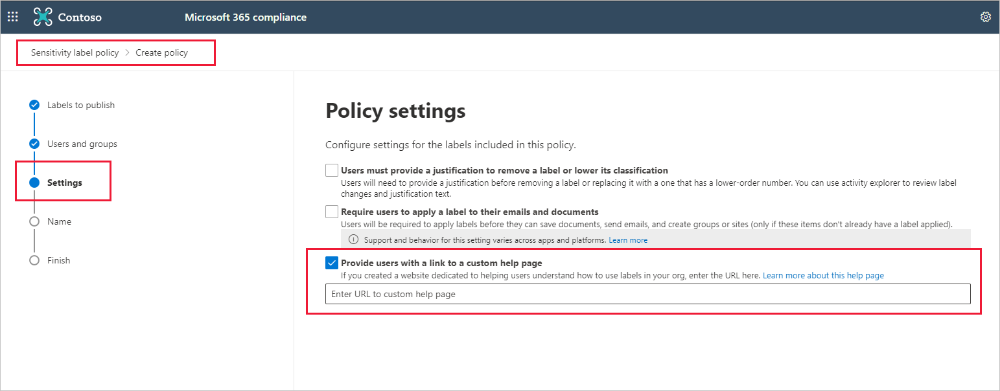

# Custom help link for sensitivity labels

To help your organization's Power BI users understand what your sensitivity labels mean or how they should be used, you can provide a *Learn more* link pointing to your organization’s custom web page that users will see when they're applying or being prompted to apply sensitivity labels. The image below is an example that shows how the *Learn more* link appears when applying a sensitivity label in Power BI Desktop.


## Define a custom help link

You can define a custom help link for sensitivity labels in two ways:

* Using the Security & Compliance Center PowerShell [Set-LabelPolicy](/powershell/module/exchange/set-labelpolicy) command. This creates a Power BI dedicated help link.
    
    ```powershell
    Set-LabelPolicy -Identity "<policy name>" -AdvancedSettings @{powerbicustomurl=https://<your link>}
    ```

* If a dedicated custom help link for Power BI isn't set, Power BI uses the custom help link defined for Office 365 apps. This link is defined in the [Microsoft 365 compliance center](https://compliance.microsoft.com/informationprotection). See [What label policies can do](/microsoft-365/compliance/sensitivity-labels#what-label-policies-can-do).

    

If a user has more than one label policy, the custom URL is always taken from the policy with the highest priority, so be sure to configure the custom URL on that policy.

## Next steps
* [Sensitivity label overview](service-security-sensitivity-label-overview.md)