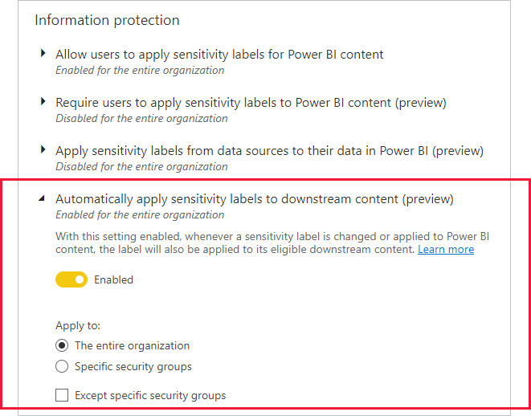

# Sensitivity label downstream inheritance (preview)

When a sensitivity label is applied to a dataset or report in the Power BI service, it is possible to have the label trickle down and be applied to content that is built from that dataset or report as well. For datasets, this means other datasets, reports, and dashboards. For reports, this means dashboards. This capability is called downstream inheritance.

Downstream inheritance is a critical link in Power BI’s end-to-end information protection solution. Together with [inheritance from data sources](service-security-sensitivity-label-inheritance-from-data-sources.md), [inheritance upon creation of new content](service-security-sensitivity-label-overview.md#sensitivity-label-inheritance-upon-creation-of-new-content), [inheritance upon export to file](service-security-sensitivity-label-overview.md#sensitivity-labels-and-protection-on-exported-data), and other capabilities for applying sensitivity labels, downstream inheritance helps ensure that sensitive data remains protected throughout its journey through Power BI, from data source to point of consumption. 

Downstream inheritance is illustrated below using [lineage view](../collaborate-share/service-data-lineage.md). When a label is applied to the dataset “Customer profitability”, that label filters down and also gets applied to the dataset’s downstream content – the reports that are built using that dataset, and, in this case, a dashboard that is built from visuals from one of those reports.

>[!IMPORTANT]
>* Downstream inheritance never overwrites labels that were applied manually.
>* Downstream inheritance never overwrites a label with a less restrictive label.

## Downstream inheritance modes

Downstream inheritance operates in one of two modes. The Power BI admin decides via a [tenant setting](#enabling-fully-automated-downstream-inheritance) which mode will be operable on the tenant.
* **Downstream inheritance with user consent** (default): In this mode, when users apply sensitivity labels on datasets or reports, they can choose whether to apply that label downstream as well. They make their choice using a checkbox that appears along with the sensitivity label selector.
* **Fully automated downstream inheritance** (when enabled by Power BI admin): In this mode, downstream inheritance happens automatically whenever a label is applied to a dataset or report. There is no checkbox provided for user consent.

The two downstream inheritance modes are explained in more detail below.

### Downstream inheritance with user consent
In user consent mode, when a user applies a sensitivity label to a dataset or report, they can choose whether to apply the label to its downstream content as well. A checkbox appears along with the label selector:

By default, the checkbox is selected. This means that when the user applies a sensitivity label to a dataset or report, the label will filter down to its downstream content. For each downstream item, the label will be applied only if:
* The user who applied or changed the label has Power BI edit permissions on the downstream item (that is, the user is an admin, member, or contributor in the workspace where the downstream item is located).
* The user who applied or changed the label is [authorized](service-security-sensitivity-label-change-enforcement.md) to change the sensitivity label that already exists on the downstream item. 

Clearing the checkbox prevents the label from being inherited downstream.

### Fully automated downstream inheritance

In fully automated mode, a label applied to either a dataset or report will automatically be propagated and applied to the dataset or report’s downstream content, without regard to edit permissions on the downstream item and the [usage rights](service-security-sensitivity-label-change-enforcement.md) on the label.

## Relaxed label change enforcement

In certain cases, downstream inheritance (like other automated labeling scenarios) can result in a situation where no user has all the required permissions needed to change a label. For such situations, label change enforcement relaxations are in place to guarantee access to affected items. See [Relaxations to accommodate automatic labeling scenarios](service-security-sensitivity-label-change-enforcement.md#relaxations-to-accommodate-automatic-labeling-scenarios) for detail.

## Enabling fully automated downstream inheritance

By default, downstream inheritance operates in user consent mode. To switch downstream inheritance in the tenant to fully automated mode, the Power BI admin must enable the **Automatically apply sensitivity labels to downstream content (preview)** tenant setting in the admin portal.

## Considerations and limitations
* Downstream inheritance is limited to 80 items. If the number of downstream items exceeds 80, no downstream inheritance takes place. Only the item the label was actually applied to will receive the label.
* Downstream inheritance never overwrites manually applied labels.
* Downstream inheritance never overwrites labels on downstream content with less restrictive labels.
* [Sensitivity labels inherited from data sources](service-security-sensitivity-label-inheritance-from-data-sources.md) are automatically propagated downstream only when fully automated downstream inheritance mode is enabled.

## Next steps
* [Sensitivity label overview](service-security-sensitivity-label-overview.md)
* [Label change enforcement](service-security-sensitivity-label-change-enforcement.md)