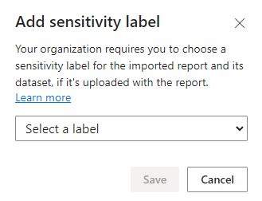

# Mandatory label policy for Power BI

To help ensure comprehensive protection and governance of sensitive data, you can require your organization's Power BI users to apply sensitivity labels to content they create or edit in Power BI. You do this by enabling, in their sensitivity label policies, a special setting for mandatory labeling in Power BI. This article describes the user actions that are affected by a mandatory labeling policy, and explains how to enable a mandatory labeling policy for Power BI.

>[!NOTE]
> The mandatory label policy setting for Power BI is independent of the mandatory label policy setting for files and email.
>
> Mandatory labeling in Power BI is not supported for service principals and APIs. Service principals and APIs are not subject to mandatory label policies.

## What happens when a mandatory label policy is in effect?

When a mandatory label policy is in effect,
* In the service:
    * Users must apply a sensitivity label in order to be able to save new reports, dashboards, or datasets.
    * Users must apply a sensitivity label in order to be able to save changes to the settings or content of existing unlabeled reports and dashboards.
    * If users try to import data from an unlabeled *.pbix* file, they will be prompted to select a label before being allowed to continue. The label they select will be applied to the resulting dataset and report in the service. **It is not applied to the *.pbix* file itself**.
  
  The images below show the dialogs that prompt users to choose and apply a label when they try to save or import unlabeled content. The save button only becomes active when the user selects a label.

    

* In Desktop:
    * Users must apply a sensitivity label to an unlabeled *.pbix* file before they will be allowed to save it. 
    * Users must apply a sensitivity label to an unlabeled *.pbix* file before they will be allowed to publish it to the service. If they try to publish an unlabeled *.pbix* file, a message prompts them to apply a label from the Sensitivity menu on the Home ribbon. After they've applied the label in Desktop and saved their changes, they will be able to publish the file to the service.

    The image below shows the Power BI Desktop message that prompts users to choose and apply a label from the Sensitivity menu on Desktop's Home ribbon.

    :::image type="content" source="media/service-security-sensitivity-label-mandatory-label-policy/mandatory-labels-desktop-message.png" alt-text="Screenshot of mandatory label message in Desktop.":::

## Enabling a mandatory label policy for Power BI

A Microsoft 365 administrator can enable a mandatory label policy for Power BI by selecting the **Require users to apply a label to their Power BI content** checkbox in the [Microsoft 365 compliance center](https://compliance.microsoft.com/informationprotection). See [What label policies can do](/microsoft-365/compliance/sensitivity-labels#what-label-policies-can-do).

:::image type="content" source="media/service-security-sensitivity-label-mandatory-label-policy/mandatory-labels-config-in-compliance-center.png" alt-text="Screenshot of mandatory label setting in the Microsoft compliance center.":::

If you already have an existing policy and you want to enable mandatory labeling in Power BI in it, you can use the [Security & Compliance Center PowerShell setLabelPolicy API](/powershell/module/exchange/set-labelpolicy).

```powershell
Set-LabelPolicy -Identity "<policy name>" -AdvancedSettings @{powerbimandatory="true"}
```
Where:

* policy name = the name of the policy where you want to set labeling in Power BI as mandatory.

**Requirements for using PowerShell**
 
* You need the EXO V2 module to run this command. For more information, see [About the Exchange Online PowerShell V2 module](/powershell/exchange/exchange-online-powershell-v2#install-and-maintain-the-exo-v2-module)
* A connection to the Microsoft 365 compliance center is also required. For more information, see [Connect to Security & Compliance Center PowerShell using the EXO V2 module](/powershell/exchange/connect-to-scc-powershell)

### Documentation

* [Admin Guide: Custom configurations for the Azure Information Protection unified labeling client](/azure/information-protection/rms-client/clientv2-admin-guide-customizations#available-advanced-settings-for-labels)
* [Create and configure sensitivity labels and their policies](/microsoft-365/compliance/create-sensitivity-labels#use-powershell-for-sensitivity-labels-and-their-policies)
* [Set-LabelPolicy documentation](/powershell/module/exchange/set-labelpolicy)

## Considerations and limitations
* Mandatory labeling in Power BI covers most common scenarios, but there may be some corner-case flows that still allow a user to create or edit unlabeled content.
* The mandatory label policy setting for Power BI is independent of the mandatory label policy setting for files and email.
* Mandatory labeling in Power BI is not supported for service principals and APIs. Service principals and APIs are not subject to mandatory label policies.
* Mandatory labeling in Power BI is not supported for [external guest users (B2B users)](service-admin-azure-ad-b2b.md). B2B users are not subject to mandatory label policies.

## Next steps

* [Default label policy for Power BI](service-security-sensitivity-label-default-label-policy.md)
* [Sensitivity labels in Power BI](service-security-sensitivity-label-overview.md)