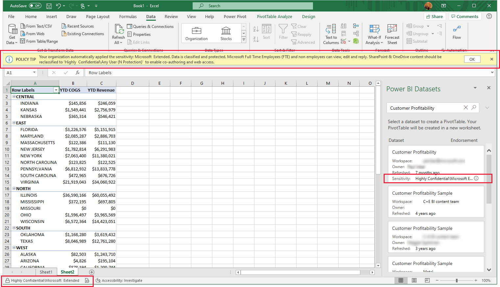
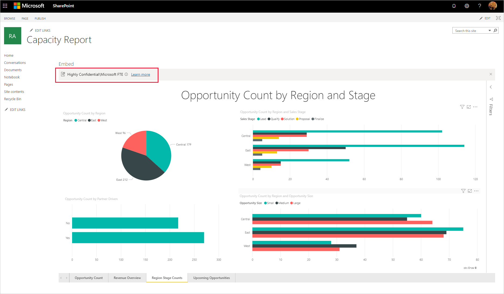
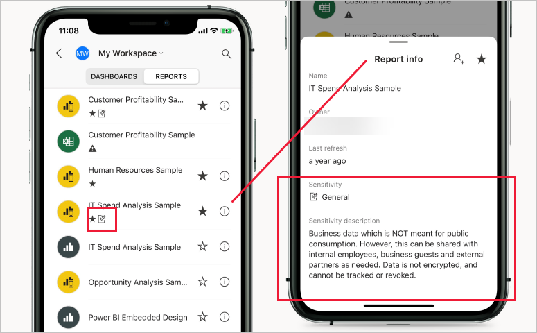
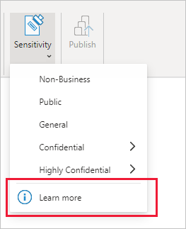

# Sensitivity labels in Power BI

This article describes the functionality of Microsoft Information Protection sensitivity labels in Power BI.

For information about enabling sensitivity labels on your tenant, including licensing requirements and prerequisites, see [Enable data sensitivity labels in Power BI](service-security-enable-data-sensitivity-labels.md).

For information about how to apply sensitivity labels on your Power BI content and files, see [How to apply sensitivity labels in Power BI](./service-security-apply-data-sensitivity-labels.md).

>[!NOTE]
>Sensitivity label support in Power BI Desktop is currently in preview.

## Introduction

Microsoft Information Protection sensitivity labels provide a simple way for your users to classify critical content in Power BI without compromising productivity or the ability to collaborate. They can be applied in both Power BI Desktop and the Power BI service, making it possible to protect your sensitive data from the moment you first start developing your content on through to when it's being accessed from Excel via a live connection. Sensitivity labels are retained when you move your content back and forth between Desktop and the service in the form of .pbix files.

In the Power BI service, sensitivity labels can be applied to datasets, reports, dashboards, and dataflows. When labeled data leaves Power BI, either via export to Excel, PowerPoint, PDF, or .pbix files, or via other supported export scenarios such as Analyze in Excel or live connection PivotTables in Excel, Power BI automatically applies the label to the exported file and protects it according to the label's file encryption settings. This way your sensitive data can remain protected, even when it leaves Power BI.

In addition, sensitivity labels can be applied to .pbix files in Power BI Desktop, so that your data and content is safe when it is shared outside Power BI (for example, so that only users within your organization can open a confidential .pbix that has been shared or attached in an email), even before it has been published to the Power BI service. See [Restrict access to content by using sensitivity labels to apply encryption](/microsoft-365/compliance/encryption-sensitivity-labels) for more detail.

Sensitivity labels on reports, dashboards, datasets, and dataflows are visible from many places in the Power BI service. Sensitivity labels on reports and dashboards are also visible in the Power BI iOS and Android mobile apps and in embedded visuals. In Desktop, you can see the sensitivity label in the status bar.

A [protection metrics report](service-security-data-protection-metrics-report.md) available in the Power BI admin portal gives Power BI admins full visibility over the sensitive data in the Power BI tenant. In addition, the Power BI audit logs include sensitivity label information about activities such as applying, removing, and changing labels, as well as about activities such as viewing reports, dashboards, etc., This gives Power BI and security admins visibility over sensitive data consumption for the purposes of monitoring and investigating security alerts.

## Important considerations

In the Power BI service, sensitivity labeling **does not** affect access to content. Access to content in the service is managed solely by Power BI permissions. While the labels are visible, any associated encryption settings (configured in the [Microsoft 365 compliance center](https://compliance.microsoft.com/)) are not applied. They are applied only to data that leaves the service via a supported export path, such as export to Excel, PowerPoint, or PDF, and download to .pbix.

In Power BI Desktop, sensitivity labels with encryption settings **do** affect access to content. If a user does not have sufficient [permissions](#power-bi-desktop) according to the encryption settings of the sensitivity label on the .pbix file, they will not be able to open the file. In addition, in Desktop, when you save your work, any sensitivity label you've added and its associated encryption settings will be applied to the saved .pbix file.

Sensitivity labels and file encryption **are not** applied in non-supported export paths. The Power BI admin can block export from non-supported export paths.

>[!NOTE]
> Users who are granted access to a report are granted access to the entire underlying dataset, unless [row-level security (RLS)](./service-admin-rls.md) limits their access. Report authors can classify and label reports using sensitivity labels. If the sensitivity label has protection settings, Power BI applies these protection settings when the report data leaves Power BI via a supported export path such as export to Excel, PowerPoint, or PDF, download to .pbix, and **Save** (Desktop). Only authorized users will be able to open protected files.

### Supported export paths
Applying sensitivity labels and their associated protection to data that leaves the Power BI service is currently supported for the following export paths:
* Export to Excel, PDF files (Service only), and PowerPoint.
* Analyze in Excel from the Power BI service, which triggers download of an Excel file with a live connection to a Power BI dataset.
* PivotTable in Excel with a live connection to a Power BI dataset, for users with Microsoft 365 E3 and above.
* Download to .pbix (Service)

>[!NOTE]
>When using **Download the .pbix** in the Power BI service, if the downloaded report and its dataset have different labels, the more restrictive label will be applied to the .pbix file. 

## How sensitivity labels work in Power BI

When you apply a sensitivity label to Power BI content and files, it's similar to applying a tag on that resource that has the following benefits:
* **Customizable** - you can create categories for different levels of sensitive content in your organization, such as Personal, Public, General, Confidential, and Highly Confidential.
* **Clear text** - since the label is in clear text, it's easy for users to understand how to treat the content according to sensitivity label guidelines.
* **Persistent** - after a sensitivity label has been applied to content, it accompanies that content when it is exported to  Excel, PowerPoint and PDF files, downloaded to .pbix, or saved (in Desktop) and becomes the basis for applying and enforcing policies.

Here's a quick example of how sensitivity labels in Power BI work. The image below shows how a sensitivity label is applied on a report in the Power BI service, then how the data from the report is exported to an Excel file, and finally how the sensitivity label and its protections persist in the exported file.

The sensitivity labels you apply to content persist and roam with the content as it's used and shared throughout Power BI. You can use  use the labeling to generate usage reports and to see activity data for your sensitive content.

## Sensitivity labels in Power BI Desktop

Sensitivity labels can also be applied in Power BI Desktop. This makes it possible to protect your data from the moment you first start developing your content. When you save your work in Desktop, the sensitivity label you applied, along with any associated encryption settings, is applied to the resulting .pbix file. If the label has encryption settings, the file is thus protected wherever it goes and however it is transmitted. Only those with the [necessary RMS permissions](#power-bi-desktop) will be able to open it.

>[!NOTE]
>* Some limitations may apply. See [Limitations](#limitations).

If you apply a sensitivity label in Desktop, when you publish your work to the service, or when you upload a .pbix file of that work to the service, the label travels with the data into the service. In the service, the label will be applied to both the dataset and the report that you get with the file. If the dataset and report already have sensitivity labels, you can choose to keep those labels or to overwrite them with the label coming from Desktop.
 
If you upload a .pbix file that has never been published to the service before, and that has the same name as a report or dataset that already exists on the service, the upload will succeed only if the uploader has the RMS permissions necessary to change the label.

The same is also true in the opposite direction - when you download to .pbix in the service and then load the .pbix into Desktop, the label that was in the service will be applied to the downloaded .pbix file and from there be loaded into Desktop. If the report and dataset in the service have different labels, the more restrictive of the two will be applied to the downloaded .pbix file.

When you apply a label in Desktop, it shows up in the status bar.

[Learn how to apply sensitivity labels to Power BI content and files](./service-security-apply-data-sensitivity-labels.md).

## Sensitivity label inheritance upon creation of new content

When new reports and dashboards are created in the Power BI service, they automatically inherit the sensitivity label previously applied on parent dataset or report. For example, a new report created on top of a dataset that has a "Highly Confidential" sensitivity label will automatically receive the "Highly Confidential" label as well.

The following image shows how a dataset's sensitivity label is automatically applied on a new report that is built on top of the dataset.

>[!NOTE]
>If for any reason the sensitivity label can't be applied on the new report or dashboard, Power BI **will not** block creation of the new item.

## Sensitivity label inheritance from data sources (preview)

Power BI datasets that connect to sensitivity-labeled data in supported data sources can inherit those labels so that the data remains classified and secure when brought into Power BI. Currently, Azure Synapse Analytics (formerly SQL Data Warehouse) and Azure SQL Database are supported. See [Sensitivity label inheritance from data sources](service-security-sensitivity-label-inheritance-from-data-sources.md) to learn how inheritance from data sources works and how to enable it for your organization.

## Sensitivity label downstream inheritance (preview)

When a sensitivity label is applied to a dataset or report in the Power BI service, it is possible to have the label trickle down and be automatically applied to content that is built from that dataset or report as well. This capability is called downstream inheritance.

Downstream inheritance is a critical link in Power BI’s end-to-end information protection solution. Together with inheritance from data sources, inheritance upon creation of new content, inheritance upon export to file, and other capabilities for applying sensitivity labels, downstream inheritance helps ensure that sensitive data remains protected throughout its journey through Power BI, from data source to point of consumption.

[Read more about downstream inheritance](service-security-sensitivity-label-downstream-inheritance.md)

## Default label policy (preview)

To help ensure comprehensive protection and governance of sensitive data, organizations can create default label policies for Power BI that automatically apply default sensitivity labels to unlabeled content. Currently, default label policies are supported in Power BI Desktop only. See [Default label policy](service-security-sensitivity-label-default-label-policy.md) for more information.

## Mandatory label policy (preview)

To help ensure comprehensive protection and governance of sensitive data, organizations can require users to apply labels to their sensitive Power BI content. Such a policy is called a mandatory label policy. See [Mandatory label policy](service-security-sensitivity-label-mandatory-label-policy.md) for more information.

## Admin APIs for setting and removing labels programmatically

To meet compliance requirements, organizations are often required to classify and label all sensitive data in Power BI. This task can be challenging for tenants that have large volumes of data in Power BI. To make the task easier and more effective, Power BI has admin REST APIs that admins can use to set and remove sensitivity labels on large numbers of Power BI artifacts programatically. See the following:
* [Admin - InformationProtection SetLabelsAsAdmin](/rest/api/power-bi/admin/informationprotection_setlabelsasadmin)
* [Admin - InformationProtection RemoveLabelsAsAdmin](/rest/api/power-bi/admin/informationprotection_removelabelsasadmin)

## Auditing for activity on sensitivity labels

Whenever a sensitivity label on a dataset, report, dashboard, or dataflow is applied, changed, or removed, that activity is recorded in the audit log for Power BI. You can track these activities in the unified audit log or in the Power BI activity log. See [Audit schema for sensitivity labels in Power BI](service-security-sensitivity-label-audit-schema.md) for detail.

## Sensitivity labels and protection on exported data

When data is exported from Power BI to Excel, PDF files (service only) or PowerPoint files, Power BI automatically applies a sensitivity label on the exported file and protects it according to the label’s file encryption settings. This way your sensitive data remains protected no matter where it is.

A user who exports a file from Power BI has permissions to access and edit that file according to the sensitivity label settings; they do not get owner permissions to the file.

>[!NOTE]
>When using **Download the .pbix** in the Power BI service, if the downloaded report and its dataset have different labels, the more restrictive label will be applied to the .pbix file. 

Sensitivity labels and protection are not applied when data is exported to .csv, files or any other unsupported export path.

Applying a sensitivity label and protection to an exported file doesn't add content marking to the file. However, if the label is configured to apply content markings, the markings are automatically applied by the Azure Information Protection unified labeling client when the file is opened in Office desktop apps. The content markings are not automatically applied when you use built-in labeling for desktop, mobile, or web apps. See [When Office apps apply content marking and encryption](/microsoft-365/compliance/sensitivity-labels-office-apps#when-office-apps-apply-content-marking-and-encryption) for more detail.

Export fails if a label can't be applied when data is exported to a file. To check if export failed because the label couldn't be applied, click the report or dashboard name at the center of the title bar and see whether it says "Sensitivity label can't be loaded" in the info dropdown that opens. This can happen as the result of a temporary system issue, or if the applied label has been unpublished or deleted by the security admin.

## Sensitivity label inheritance in Analyze in Excel

When you create a PivotTable in Excel with a live connection to a Power BI dataset (you can do this either from Power BI through [Analyze In Excel](../collaborate-share/service-analyze-in-excel.md) or from [Excel](https://support.microsoft.com/office/create-a-pivottable-from-power-bi-datasets-31444a04-9c38-4dd7-9a45-22848c666884?ui=en-US&rs=en-US&ad=US)), the dataset's sensitivity label is inherited and applied to your Excel file, along with any associated protection. If the label on the dataset later changes to a more restrictive one, the label applied on the linked Excel file will automatically update upon data refresh.

 
Sensitivity labels in Excel that were manually set are not automatically overwritten by the dataset's sensitivity label. Rather, a banner notifies you that the dataset has a sensitivity label and recommends that you apply it.

>[!NOTE]
>If the dataset's sensitivity label is less restrictive than the Excel file's sensitivity label, no label inheritance or update takes place. An Excel file never inherits a less restrictive sensitivity label.

## Sensitivity label persistence in embedded reports and dashboards

You can embed Power BI reports, dashboards, and visuals in business applications such as Microsoft Teams and SharePoint, or in an organization’s website. When you embed a visual, report or dashboard that has a sensitivity label applied to it, the sensitivity label will be visible in the embedded view, and the label and its protection will persist when data is exported to Excel.

The following embedding scenarios are supported:
* [Embed for your organization](../developer/embedded/embed-sample-for-your-organization.md)
* Microsoft 365 apps (for example, [Teams](../collaborate-share/service-embed-report-microsoft-teams.md) and [SharePoint](../collaborate-share/service-embed-report-spo.md))
* [Secure URL embedding](../collaborate-share/service-embed-secure.md) (embedding from the Power BI service) 

## Sensitivity labels in paginated reports

Sensitivity labels can be applied to paginated reports hosted in the Power BI service. After uploading a paginated report to the service, you apply the label to the report just as you would to a regular Power BI report. See [Sensitivity label support for paginated reports](service-security-sensitivity-label-paginated-reports.md) for detail.

## Sensitivity labels in deployment pipelines
Sensitivity labels are supported in deployment pipelines. See the [deployment pipeline documentation](../create-reports/deployment-pipelines-process.md#item-properties-copied-during-deployment) for details about how sensitivity labels are handled as content is deployed from stage to stage.

## Sensitivity labels in the Power BI mobile apps

Sensitivity labels can be viewed on reports and dashboards in the Power BI mobile apps. An icon near the name of the report or dashboard indicates that it has a sensitivity label, and the type of label and its description can be found in the report or dashboard's info box.

## Label change enforcement

Power BI restricts permission to change or remove Microsoft Information Protection sensitivity labels that have file encryption settings to authorized users only. See [Sensitivity label change enforcement](service-security-sensitivity-label-change-enforcement.md) for detail.

## Supported clouds
Sensitivity labels are supported for tenants in global (public) clouds, and the following national clouds:
* [US Government](service-govus-overview.md#power-bi-feature-availability): GCC, GCC High, DoD
* China

Sensitivity labels are not currently supported in other national clouds.

## Licensing and requirements

See [Licensing and requirements](service-security-enable-data-sensitivity-labels.md#licensing-and-requirements).

## Sensitivity label creation and management

Sensitivity labels are created and managed in the [Microsoft 365 compliance center](https://compliance.microsoft.com/).

To access sensitivity labels in either of these centers, navigate to **Classification > Sensitivity labels**. These sensitivity labels can be used by multiple Microsoft services such Azure Information Protection, Office apps, and Office 365 services.

>[!Important]
> If your organization uses Azure Information Protection sensitivity labels, you need to [migrate](/azure/information-protection/configure-policy-migrate-labels) them to one of the previously listed services in order for the labels to be used in Power BI.

## Custom help link

To help your users understand what your sensitivity labels mean or how they should be used, you can provide a *Learn more* URL that appears at the bottom of the sensitivity label menu that you see when you're applying a sensitivity label.

See [Custom help link for sensitivity labels](service-security-sensitivity-label-custom-help-link.md) for detail.

## Limitations

### General

* It is not recommended to allow users to apply parent labels within Power BI (a label is considered to be a parent label only if it has sublabels). If a parent label is applied to content, exporting data from that content to a file (Excel, PowerPoint, and PDF) will fail. See [Sublabels (grouping labels)](/microsoft-365/compliance/sensitivity-labels#sublabels-grouping-labels).

* Data sensitivity labels are not supported for template apps. Sensitivity labels set by the template app creator are removed when the app is extracted and installed, and sensitivity labels added to artifacts in an installed template app by the app consumer are lost (reset to nothing) when the app is updated.

* In the Power BI service, if a dataset has a label that has been deleted from the label admin center, you will not be able to export or download the data. In Analyze in Excel, a warning will be issued and the data will be exported to an .odc file with no sensitivity label. In Desktop, if a .pbix file has such an invalid label, you will not be able to save the file.

* Power BI does not support sensitivity labels of the [Do Not Forward](/microsoft-365/compliance/encryption-sensitivity-labels#let-users-assign-permissions), [user-defined](/microsoft-365/compliance/encryption-sensitivity-labels#let-users-assign-permissions), and [HYOK](/azure/information-protection/configure-adrms-restrictions) protection types. The Do Not Forward and user-defined protection types refer to labels defined in the [Microsoft 365 compliance center](https://compliance.microsoft.com/).

* Getting data from encrypted Excel (.xlsx) files is not supported. This includes “Get data” and refresh scenarios.

* Information protection in Power BI doesn’t support **B2B** and **multi-tenant scenarios**.

### Power BI service

* Sensitivity labels can be applied only on dashboards, reports, datasets, and dataflows. They are not currently available for [paginated reports](../paginated-reports/report-builder-power-bi.md) and workbooks.

* Sensitivity labels on Power BI assets are visible in the workspace list, lineage, favorites, recents, and apps views; labels are not currently visible in the "shared with me" view. Note, however, that a label applied to a Power BI asset, even if not visible, will always persist on data exported to Excel, PowerPoint, and PDF files.

### Power BI Desktop

* Power BI Desktop for Power BI Report Server does not support information protection. If you try to open a protected .pbix file, the file will not open and you will receive an error message. Sensitivity-labeled .pbix files that are not encrypted can be opened as normal.

* Protected .pbix files can be only opened by a user who has [**Full control** and/or **Export** usage rights](/microsoft-365/compliance/encryption-sensitivity-labels) for the relevant label. The user that set the label also has Full control and can never be locked out. [See more detail](/azure/information-protection/configure-usage-rights#rights-management-issuer-and-rights-management-owner)

* "Publish" or "Get data" of a protected .pbix file requires that the label on the .pbix file be in the user's [label policy](/microsoft-365/compliance/create-sensitivity-labels). If the label isn't in the user's label policy, the Publish or Get data action will fail.

* If the label applied to a .pbix file hasn’t been published to the user in the Microsoft 365 compliance center, the user will not be able to save the file in Desktop.

* Publishing or importing a .pbix file with a sensitivity label to the service via APIs running under a service principal is not supported and will fail. To mitigate, users can remove the labels and then publish using service principals.

* Power BI Desktop users may experience problems saving their work when internet connectivity is lost, such as after going offline. With no internet connection, some actions related to sensitivity labels and rights management might not complete properly. In such cases it is recommended to go back online and try saving again.

* If you've created a large model and the resulting protected .pbix file is very large (over 2GB), it may crash when you try to save or open it. To work around this, consider removing the protection from the .pbix file and re-applying it after the file has been published to the Power BI service.

    In general, when you protect a file with a sensitivity label that applies encryption, it is good practice to use another encryption method as well, such as pagefile encryption, NTFS encryption, BitLocker instances, antimalware, etc.

* Temp files are not encrypted.

* **Get data** can upload protected files only if they are local. Protected files from online services such as SharePoint Online or OneDrive for Business cannot be uploaded. For a protected file, you can either upload it from your local device, or first remove the file's label in Power BI Desktop and then upload it via one of the online services.

* **Export to PDF** does not support sensitivity labels. If you export a file that has a sensitivity label to PDF, the PDF will not receive the label and no protection will be applied.

* If you overwrite a labeled dataset or report in the service with an unlabeled .pbix file, the labels in the service will be retained.

## Next steps

This article provided an overview of data protection in Power BI. The following articles provide more details about data protection in Power BI. 

* [Enable sensitivity labels in Power BI](service-security-enable-data-sensitivity-labels.md)
* [How to apply sensitivity labels in Power BI](service-security-apply-data-sensitivity-labels.md)
* [Using Microsoft Cloud App Security controls in Power BI](service-security-using-microsoft-cloud-app-security-controls.md)
* [Protection metrics report](service-security-data-protection-metrics-report.md)
