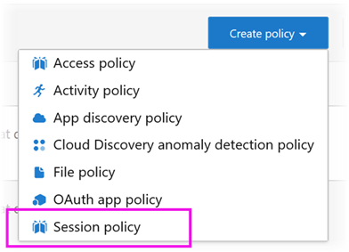

# Using Microsoft cloud app security controls in Power BI (preview)

Using Microsoft Cloud App Security with Power BI, you can help protect your Power BI reports, data, and services from unintended leaks or breaches. With Cloud App Security, you create conditional access policies for your organization’s data, using real-time session controls in Azure Active Directory (Azure AD), that help to ensure your Power BI analytics are secure. Once these policies have been set, administrators can monitor user access and activity, perform real-time risk analysis, and set label-specific controls. 

You can configure Microsoft Cloud App Security for all sorts of apps and services, not only Power BI. Cloud App Security is a Microsoft service that protects apps and devices, and is managed through its own dashboard. You’ll need to configure Cloud App Security to work with Power BI to benefit from Cloud App Security protections for your Power BI data and analytics. For more information about Cloud App Security, including an overview of how it works, the dashboard, and app risk scores, see [Microsoft Cloud App Security](https://docs.microsoft.com/cloud-app-security/) documentation.

## Using Microsoft Cloud App Security with Power BI

To use Microsoft Cloud App Security with Power BI, you must use and configure relevant Microsoft security services, some of which are set outside Power BI.

### Microsoft Cloud App Security licensing

In order to have Microsoft Cloud App Security in your tenant, you must have one of the following licenses:
* MCAS: Provides OCAS capabilities for all supported apps, part of EMS E5 and M365 E5 suites.
* CAS-D: Provides only MCAS Discovery.
* OCAS: Provides MCAS capabilities only for Office 365, part of the Office E5 suite.
* Optional: AAD P1 and AIP P1 in order to benefit from the major Microsoft Cloud App Security capabilities.

The sections below describe the steps for using Microsoft Cloud App Security in Power BI.

### Set session policies in Azure Active Directory (required)
The steps necessary to set session controls are completed in the Azure AD and Microsoft Cloud App Security portals. In the Azure AD portal, you create a conditional access policy for Power BI, and route sessions used in Power BI through the Microsoft Cloud App Security service. 

Microsoft Cloud App Security operates using a reverse-proxy architecture, and is integrated with Azure AD conditional access to monitor Power BI user activity in real-time. The following steps are provided here to help you understand the process, and detailed step-by-step instructions are provided in the linked content in each of the following steps. You can also read this [Cloud App Security article](https://docs.microsoft.com/cloud-app-security/proxy-deployment-aad) that describes the process in whole.

1.	[Create an Azure AD conditional access test policy](https://docs.microsoft.com/cloud-app-security/proxy-deployment-aad#add-azure-ad)
2.	[Sign into each app using a user scoped to the policy](https://docs.microsoft.com/cloud-app-security/proxy-deployment-aad#sign-in-scoped)
3.	[Verify the apps are configured to use access and session controls](https://docs.microsoft.com/cloud-app-security/proxy-deployment-aad#portal)
4.	[Test the deployment](https://docs.microsoft.com/cloud-app-security/proxy-deployment-aad#step-4-test-the-deployment)

The process for setting session policies is described in detail in the [Session policies](https://docs.microsoft.com/cloud-app-security/session-policy-aad) article. 

### Set anomaly detection policies to monitor PBI activities (recommended)
You can define anomaly Power BI detection policies that can be independently scoped, so that they apply to only the users and groups you want to include and exclude in the policy. [Learn more](https://docs.microsoft.com/cloud-app-security/anomaly-detection-policy#scope-anomaly-detection-policies).

Cloud App Security also has two dedicated, built-in detections for Power BI. [See the section later on in this document for detail](built-in-microsoft-cloud-app-security-detections-for-power-bi).

### Use Microsoft Information Protection sensitivity labels (recommended)

Sensitivity labels enable you to classify and help protect sensitive content, so that people in your organization can collaborate with partners outside your organization, yet still be careful and aware of sensitive content and data. 

You can read the article on [sensitivity labels in Power BI](../designer/service-security-apply-data-sensitivity-labels.md), which goes into detail about the process of using sensitivity labels for Power BI. See below for an [example of a Power BI policy based on sensitivity labels](#Example).

## Built-in Microsoft Cloud App Security detections for Power BI

Microsoft Cloud App Security detections enable administrators to monitor specific activities of a monitored app. For Power BI, there are currently two dedicated, built-in Cloud App Security detections: 

* **Suspicious share** – detects when a user shares a sensitive report with an unfamiliar (external to the organization) email. A sensitive report is a report whose sensitivity label is set to **INTERNAL-ONLY** or higher. 

* **Mass share of reports** – detects when a user shares many different reports in a single session.

Settings for these detections are configured in the Cloud App Security portal. [Learn more](https://docs.microsoft.com/cloud-app-security/anomaly-detection-policy#unusual-activities-by-user). 

## Power BI admin role in Microsoft Cloud App Security

A new role is created for Power BI admins when using Microsoft Cloud App Security with Power BI. When you log in as a Power BI admin to the [Cloud App Security portal](https://portal.cloudappsecurity.com/), you have limited access to Power-BI-relevant data, alerts, users at risk, activity logs, and other information.

## Considerations and limitations 
Using Cloud App Security with Power BI is designed to help secure your organization’s content and data, with detections that monitor user sessions and their activities. When using Cloud App Security with Power BI, there are a few limitations you should keep in mind:

* Microsoft Cloud App Security can only operate on Excel, PowerPoint, and PDF files.
* If you want to use sensitivity labels capabilities in your session policies for Power BI, you need to have one of the following Microsoft Information Protection licenses, and also have sensitivity labels applied on your PBI assets:
    * Azure Information Protection P1
    * Azure Information Protection P2
    * OFFICE E3/E5
    * M365 E3/E5
    * EMS E3/E5

> [!CAUTION]
> * The *content inspection* policy on Microsoft Cloud App Security is currently not available in Power BI when applying an Excel file policy, so do not set this policy for Power BI.
> * In the session policy, in the “Action” part, the “protect” capability will only work if no label exists on the item. If a label already exists, the “protect” action won't apply; you can’t override an existing label that has already been applied to an item in Power BI.

## Example

The following example shows you how to create a new session policy using Microsoft Cloud App Security with Power BI.

First, create a new session policy. Select **Policies** from the left menu in the **Cloud App Security** portal.

In the window that appears, select the **Create Policy** drop-down.

From the list of options in the drop-down, select **Session policy**.

In the window that appears, create the session policy. The numbered steps describe settings for the following image.

  1. In the **Policy template** drop-down, choose *No template*.
  2. For the **Policy name** box, provide a relevant name for your session policy.
  3. For **Session control type**, select *Control file downloaded (with DLP)*.

      For the **Activity source** section, choose relevant blocking policies. We recommend blocking unmanaged and non-compliant devices. Choose to block downloads when the session is in Power BI.

        

        When you scroll down you see more options. The following image shows those options, with additional examples. 

  4. Choose *Confidentiality label* as *highly confidential* or whatever best fits your organization.
  5. Change the **Inspection method** to *none*.
  6. Choose the **Block** option that fits your needs.
  7. Make sure you create an alert for such an action.

        

        

  8. Finally make sure you select the **Create** button to create the session policy.

        

> [!CAUTION]
> Make sure you do not create a **Content Inspection** policy on Power BI Excel files. This is a known limitation of this *preview* release.

## Next steps
This article described how Microsoft Cloud App Security can provide data and content protections for Power BI. You might also be interested in the following articles, which describe Data Protection for Power BI and supporting content for the Azure services that enable it.

* [Overview of data protection in Power BI](service-security-data-protection-overview.md)
* [Enable data sensitivity labels in Power BI](service-security-enable-data-sensitivity-labels.md)
* [Apply data sensitivity labels in Power BI](../designer/service-security-apply-data-sensitivity-labels.md)

You might also be interested in the following Azure and security articles:

* [Protect apps with Microsoft Cloud App Security Conditional Access App Control](https://docs.microsoft.com/cloud-app-security/proxy-intro-aad)
* [Deploy Conditional Access App Control for featured apps](https://docs.microsoft.com/cloud-app-security/proxy-deployment-aad)
* [Session policies](https://docs.microsoft.com/cloud-app-security/session-policy-aad)
* [Overview of sensitivity labels](https://docs.microsoft.com/microsoft-365/compliance/sensitivity-labels)
