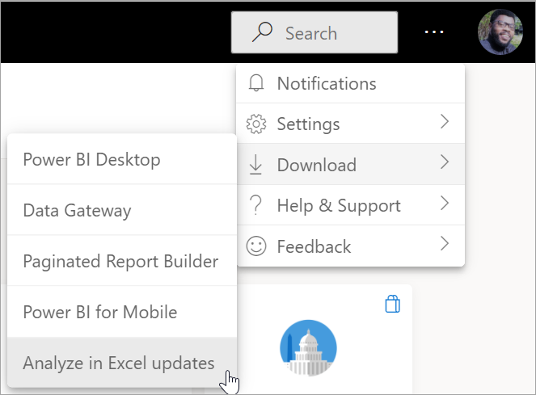
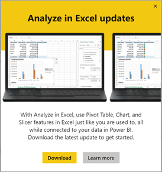
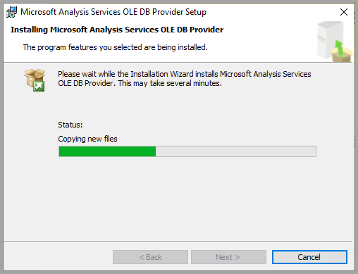
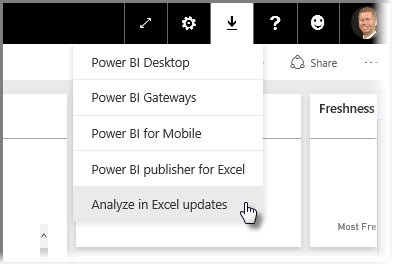
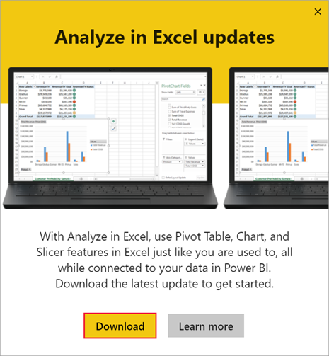
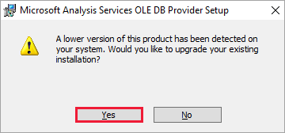

# Troubleshoot connecting Excel to Power BI data

There may be times when connecting Excel to Power BI data that you get an unexpected result, or the feature doesn't work as you expected. This page provides solutions for common issues when analyzing Power BI data in Excel.

> [!NOTE]
> There are separate pages that describe:
>
> - [Starting in Power BI with Analyze in Excel](service-analyze-in-excel.md).
> - [Starting in Excel to connect to Power BI data](service-connect-excel-power-bi-datasets.md)
>
> If you encounter a scenario that is not listed below, you can ask for assistance on the [Power BI community site](https://community.powerbi.com/), or create a [support ticket](https://powerbi.microsoft.com/support/).

This article contains the following troubleshooting sections:

* [Install Analyze in Excel](#install-analyze-in-excel)
* [Update Excel libraries](#update-excel-libraries-for-the-ole-db-provider) for the OLE DB provider
* [Determine whether you need to update your Excel libraries](#determine-whether-you-need-to-update-your-excel-libraries)
* [Connection cannot be made](#connection-cannot-be-made-error) error
* [Forbidden](#forbidden-error) error
* [No data models](#no-data-models)
* [Token expired](#token-expired-error) error
* [Unable to access on-premises Analysis services](#unable-to-access-on-premises-analysis-services)
* [Can't drag anything to the PivotTable Values area](#cant-drag-anything-to-the-pivottable-values-area-no-measures) (no measures)

## Install Analyze in Excel

To use Analyze in Excel, you must first download the feature from Power BI and install it from links provided after you [sign in to the Power BI service](https://app.powerbi.com). Usually, it installs automatically when you [select Analyze in Excel](#connect-to-power-bi-data-with-analyze-in-excel) in the Power BI service. If not, follow these steps to install. Power BI detects the version of Excel you have on your computer, and automatically downloads the appropriate version (32-bit or 64-bit).

1. In the Power BI service in your browser, select **More options (...)** in the upper-right corner, then select **Download > Analyze in Excel updates**. This menu item applies to new installations of updates of Analyze in Excel.

    

    Power BI detects whether you have installed Analyze in Excel. If not, Power BI prompts you to download.

    

When you select **Download**, Power BI detects the version of Excel you have installed and downloads the appropriate version of the Analyze in Excel installer. You see a download status in the bottom of your browser, or wherever your browser displays download progress. 

When the download completes, run the installer (.msi) to install Analyze in Excel. The name of the installation process is different from Analyze in Excel; the name will be **Microsoft Analysis Services OLE DB Provider** as shown in the following image, or something similar.

Once it completes, you're ready to select a report in the Power BI service (or other Power BI data element, like a dataset), and then analyze it in Excel.

If you need to uninstall the Analyze in Excel feature, use the **Add or remove programs** system setting on your computer.

## Update Excel libraries for the OLE DB provider
To use **Analyze in Excel**, your computer must have a current AS OLE DB provider installed. This [community post](https://community.powerbi.com/t5/Service/Analyze-in-Excel-Initialization-of-the-data-source-failed/m-p/30837#M8081) is a great source to verify your installation of the OLE DB provider, or to download a recent version.

The Excel libraries need to match your version of Windows in terms of its bit-level. If you have 64-bit Windows installed, you need to install the 64-bit OLE DB provider.

To download the latest Excel libraries, visit Power BI and select the **down arrow** in the upper right corner of the Power BI service, then select **Analyze in Excel updates**.

In the dialog that appears, select **Download**.

## Determine whether you need to update your Excel libraries
You can download the most recent version of the Excel OLE DB provider libraries from the links in the previous section. Once you download the appropriate OLD DB provider library and begin installation, checks are performed against your current installed version.

If your Excel OLE DB provider client libraries are up to date, you'll be presented with a dialog that looks like the following:

Alternatively, if the new version you are installing is newer than the version on your computer, the following dialog appears:

If you see the dialog prompting you to upgrade, you should continue with the installation to get the most recent version of the OLE DB provider installed in your computer.

## Connection cannot be made error
The primary cause for a *connection cannot be made* error is that your computer's OLE DB provider client libraries are not current. For information about how to determine the correct update, and for download links, see **Update Excel libraries for the OLE DB provider** earlier in this article.

## Forbidden error
Some users have more than one Power BI account, and when Excel attempts to connect to Power BI using existing credentials, it may use credentials that do not have access to the dataset or report you want to access.

When this occurs, you may  receive an error titled **Forbidden**, which means you may be signed into Power BI with credentials that do not have permissions to the dataset. After encountering the **forbidden** error, when prompted to enter your credentials, use the credentials that have permission to access the dataset you're trying to use.

If you still run into errors, log into Power BI with the account that has permission, and verify that you can view and access the dataset in Power BI that you're attempting to access in Excel.

## No data models
If you encounter an error that states **Can't find OLAP cube model**, then the dataset you're trying to access has no data model, and therefore cannot be analyzed in Excel.

## Token expired error
If you receive a **token expired** error, it means you haven't recently used the **Analyze in Excel** feature on the computer you're using. Simply re-enter your credentials, or reopen the file, and the error should go away.

## Unable to access on-premises Analysis Services
If you're trying to access a dataset that has a live connection to SQL Server Analysis Services or Azure Analysis Services data, you may receive an error message. Connecting to Power BI datasets that are built on live connections to Analysis Services is not supported unless the user has read access to the data in Analysis Services in addition to the datasets permissions in Power BI.

## Can't drag anything to the PivotTable Values area (no measures)
When your Power BI dataset connects to an external OLAP model (which is how Excel connects to Power BI), the *PivotTable* requires **measures** to be defined in the external model, since all calculations are performed on the server. This is different from working with a local data source (such as tables in Excel, or working with datasets in **Power BI Desktop** or the **Power BI service**). In those cases, the tabular model is available locally, and [you can use implicit measures](https://support.microsoft.com/en-us/office/measures-in-power-pivot-86484821-a324-4da3-803b-82fd2e5033f4). Implicit measures are generated dynamically, and not stored in the data model. In these cases, the behavior in Excel is different from the behavior in **Power BI Desktop** or the **Power BI service**: there may be columns in the data that can be treated as measures in Power BI, but can't be used as values (measures) in Excel.

To address this issue, you have a few options:

1. Create [measures in your data model in **Power BI Desktop**](../transform-model/desktop-tutorial-create-measures.md), then publish the data model to the **Power BI service** and access that published dataset from Excel.
2. Create [measures in your data model from Excel PowerPivot](https://support.office.com/article/Create-a-Measure-in-Power-Pivot-d3cc1495-b4e5-48e7-ba98-163022a71198).
3. If you imported data from an Excel workbook that had only tables (and no data model), then you can [add the tables to the data model](https://support.office.com/article/Add-worksheet-data-to-a-Data-Model-using-a-linked-table-d3665fc3-99b0-479d-ba09-a37640f5be42), then follow the steps in option 2, directly above, to create measures in your data model.

Once your measures are defined in the model in the Power BI service, you'll be able to use them in the **Values** area in Excel PivotTables.

## Next steps
[Analyze in Excel](service-analyze-in-excel.md)

[Tutorial: Create your own measures in Power BI Desktop](../transform-model/desktop-tutorial-create-measures.md)

[Measures in PowerPivot](https://support.microsoft.com/en-us/office/measures-in-power-pivot-86484821-a324-4da3-803b-82fd2e5033f4)

[Create a Measure in PowerPivot](https://support.office.com/article/Create-a-Measure-in-Power-Pivot-d3cc1495-b4e5-48e7-ba98-163022a71198)

[Add worksheet data to a Data Model using a linked table](https://support.office.com/article/Add-worksheet-data-to-a-Data-Model-using-a-linked-table-d3665fc3-99b0-479d-ba09-a37640f5be42)
