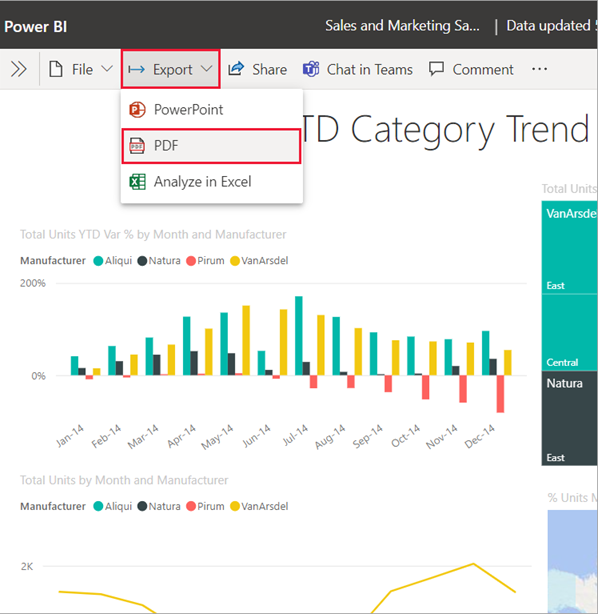

# Export reports from Power BI to PDF

[!INCLUDE[consumer-appliesto-yyn](../includes/applies-yes-desktop-yes-service.md)]

You can export your Power BI reports to PDF easily, both from the Power BI service and from Power BI Desktop. Exporting to PDF is one way to share or print reports.

When you export to PDF, each page in the Power BI report becomes an individual page in your PDF document.

If your report has a sensitivity label, the label and any encryption settings carry over to the exported file, ensuring that your data remains protected even after it leaves Power BI.

> [!NOTE]
> In Desktop, sensitivity label inheritance by the PDF is a preview feature that is on by default. You can turn off sensitivity label inheritance in PDF export in Desktop by going to **File > Options and settings > Options > Preview features**, and unchecking **Enable setting sensitivity label on exported PDF**.

# [Power BI service](#tab/powerbi-service)

## Export to PDF from the Power BI service

1. In the service, select a report to display it on the canvas. You can select a report from your **Home** page, **Apps**, or any other container from the nav pane.
1. In the Power BI service, select **Export** > **PDF** from the menu bar.

    

    A pop-up appears where you can select **Current values** or **Default values**. **Current values** exports the report in the current state, which includes the active changes you made to slicer and filter values. Most users select this option. Alternatively, selecting **Default values** exports the report in its original state, as the *designer* shared it, and doesn't reflect any changes you made to that original state.
    
    Additionally, there's a check box to select whether or not to export the hidden tabs of a report. Select this check box if you want to export only report tabs that are visible to you in your browser. If you prefer to get all the hidden tabs as part of your export, you can leave this check box cleared. If the check box is grayed out, there are no hidden tabs in the report. After you make your selections, select **Export** to continue.
    
    You may also choose to export only the current page you're viewing in a report by checking the **Only export current page** option. By default, this option is unchecked and all pages are exported from your report.
    
    A progress bar displays in the upper-right corner. Exporting might take a few minutes. You can continue to work in the Power BI service while the report is being exported.

    

    After the Power BI service finishes the export process, the notification banner changes to let you know. In Microsoft Edge, you are prompted to save or open the PDF. 

    :::image type="content" source="media/end-user-pdf/power-bi-exports.png" alt-text="Screenshot of selecting the option to open or save the PDF.":::

    In Google Chrome, the file options display in the lower left corner of the browser. 

    :::image type="content" source="media/end-user-pdf/power-bi-export-end.png" alt-text="Screenshot showing the PDF options in the left corner of s Chrome browser.":::

    If you make no selection, by default, the PDF is saved in your **Downloads** folder. 

# [Power BI Desktop](#tab/powerbi-desktop)

## Export to PDF from Power BI Desktop

1. In Desktop, open the *.pbix* file that contains the report you want to export.
1. After the report opens, select **File** > **Export** > **Export to PDF**.

    :::image type="content" source="media/end-user-pdf/export-to-pdf-01.png" alt-text="Screenshot showing export to PDF from Desktop.":::

* Report pages that are currently not visible, such as any tooltips or hidden pages, aren't exported to the PDF file. 

* While the export is being processed, a dialog appears that lets you know that the export process is underway. The dialog remains on the screen until the export process completes. During the export process, all interaction with the report being exported is disabled. The only way to interact with the report is to wait until the export process completes, or to cancel the export.

* The exported PDF displays in your default PDF viewer (typically Adobe Acrobat Reader or a browser).
    > [!NOTE]
    > If the PDF file is encrypted, to display it:
    > * The PDF viewer must support Microsoft Purview Information Protection. For more information, see [Which PDF readers are supported for protected PDFs?](/azure/information-protection/rms-client/protected-pdf-readers) and [PDF reader in Microsoft Edge](/deployedge/microsoft-edge-pdf).
    > * The credentials used to sign into the PDF viewer must have sufficient permissions under the file's encryption settings to open the file.

---

## Considerations and limitations
There are a few considerations and limitations to keep in mind when you work with the **Export to PDF** feature.

### If you don't see the **Export** option
* Make sure that you're viewing a report (not a dashboard).
* It's possible that your administrator disabled this feature. Contact your administrator for details. Administrators: See [Export reports as PowerPoint presentations or PDF documents](/fabric/admin/service-admin-portal-export-sharing#export-reports-as-powerpoint-presentations-or-pdf-documents).

### Visuals that aren't supported
The following aren't supported for **Export to PDF**. Either the **PDF** export option is  grayed out or isn't listed at all on the **Export** dropdown. In some cases, such as for R visuals, the report exports but the visual renders as a gray box with an error message.

* These Power BI visuals aren't supported. When you subscribe to a report containing these visuals, they display an error symbol. 
    - Power BI [custom visuals](../developer/visuals/develop-power-bi-visuals.md). The exception is those Power BI custom visuals that are [certified](../developer/visuals/power-bi-custom-visuals-certified.md)
    - [ESRI ArcGIS](../visuals/power-bi-visualizations-arcgis.md) visuals
    - [R visuals](../visuals/service-r-visuals.md)
    - [Power Apps visuals](../visuals/power-bi-visualization-powerapp.md)
    - [Python visuals](../connect-data/desktop-python-visuals.md)
    - [Power Automate visuals](../create-reports/power-bi-automate-visual.md) 
    - [The Paginated report visual](../visuals/paginated-report-visual.md)
    - Visio visuals
    - [The Copilot narrative visual](../create-reports/copilot-narrative-visual-embed-power-bi.md)
* Visual [displayed as a Data point table or displayed with "Show data point as a table,"](../consumer/end-user-show-data.md) can't be exported to PDF.

### Reports that can't be exported
* Power BI reports with more than 50 report pages currently can't be exported. Paginated reports don't have this limitation. See [Print a paginated report](../consumer/end-user-paginated-report.md#interact-with-a-paginated-report) for details. 
* Reports larger than 500 MB. 
* Reports that are owned by a user outside your Power BI tenant domain, such as a report owned by someone outside your organization and shared with you, can't be published to PDF.
* You can share a dashboard with someone outside of your organization--someone who isn't in your Power BI tenant. However, that user can't export the shared dashboard's associated reports to PDF. For example, if you're aaron@contoso.com, you can share with cassie@northwinds.com. But cassie@northwinds.com can't export the associated reports to PDF.

### General

* Export to PDF isn't supported when the admin setting **Azure private link** > **Block public internet access** is enabled in Power BI. In this case, the export fails. The export might also fail if the admin setting **Azure private link** is on and **Block public internet access** is off.
* Semantic model refresh operations using an XMLA endpoint.
* In the Power BI service, URL filters aren't currently respected when you choose **Current Values** for your export.
* Visuals [displayed as a Data table or displayed with "Show as a table"](../consumer/end-user-show-data.md) are included in the export, but the visual displays in its default state, without the table. 
* The process of exporting the report to PDF might take a few minutes to complete, so be patient. Factors that can affect the time required include the structure of the report and the current load on the Power BI service or Power BI Desktop.
* Background images are cropped with the visualization's bounding area. Also, when you export to PDF with reports that contain a background image, you might see a distorted image in the export if you use the **Normal** or **Fill** options for the **Page Background**. For best results, use the **Fit** option to avoid issues with your exported document. Or, remove backgrounds before exporting.

* The Power BI service uses your Power BI language setting as the language for the PDF export. To see or set your language preference, select the cog icon  > **Settings** > **General** > **Language**.

* Reports with unusual custom page sizes may experience issues in export scenarios. For best results, consider switching to a standard page size for your report.
* Hidden pages will not be included in report exports and subscriptions. You can export hidden pages by going to the report in the Power BI service and exporting to the format of choice.
* Reports using themes with custom fonts will have the custom font replaced with a default font.
* While we look to provide a consistent experience, we can't guarantee the exported PDF from the Power BI service will always match the exported PDF from a local Power BI Desktop file.
* We can't guarantee precise fidelity for Power BI reports. The resolution of exported report pages is 1,280 pixels x 720 pixels. 
* Visuals with scrollbars are exported in their default state. The visual displays all possible rows, starting with the first row. Even if you have the visual scrolled down, when exported, the visual displays unscrolled. 
* Export to PDF supports Unicode 6 and earlier. If for example, Unicode 7 is used, Power BI export displays that image as a blank box. 

    

* Visuals in a drilled down state are exported in their default state. 
* The feature doesn't export any wallpaper you apply to the report. Since wallpaper isn't exported to the PDF, you should pay special attention to reports that use dark wallpaper. If the text in your report is light or white, it is difficult to read in the export to PDF process since the dark wallpaper isn't exported with the rest of the report. 
* All Power BI reports have a page margin when exported to PDF. That is, there is a band of white space at the top and bottom of the exported file.
* If you acess a report using a bookmark, the exported report displays with the bookmark filters applied. Any filters applied at the time of the export are ignored. You can get around this by creating a bookmark with the required filters and then export the report.
* Export to PDF isn't currently supported for tenants in the China North region. 

## Related content

* [Print a report](../consumer/end-user-print.md).
