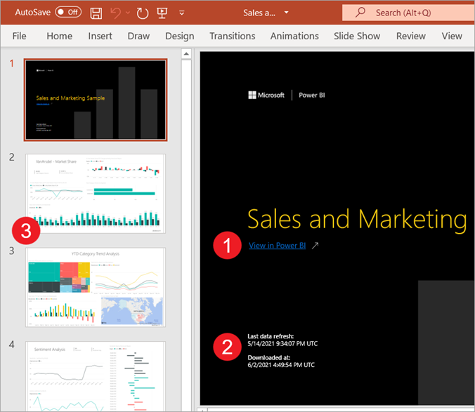
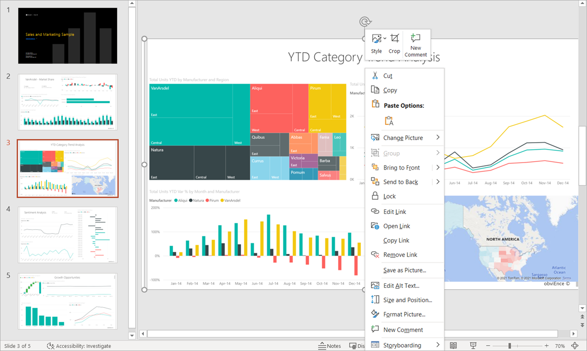

# Export a report to PowerPoint

[!INCLUDE[consumer-appliesto-yyn](../includes/consumer-appliesto-yyn.md)]

There are several different ways that Power BI and PowerPoint work together. In this article, you learn how to export a Power BI report and create a PowerPoint slide deck with one slide for each report page. The report is static; the slides retain the state of the report at the time of export.

Another option is to embed a live version of your report page in PowerPoint. You can interact with your data just as you would in Power BI. For more information about embedding a live report page, visit these articles:

- [Add a live Power BI report page in PowerPoint](service-power-bi-powerpoint-add-in-install.md)
- [Use the Power BI Add-in for PowerPoint](service-power-bi-powerpoint-add-in-view-present.md)
- [Administer the Power BI add-in for PowerPoint](service-power-bi-powerpoint-add-in-admin.md)

## Export a report to PowerPoint
When you export to PowerPoint, the following occurs:

* Each page in the Power BI report becomes an individual slide in PowerPoint.
* Each page in the Power BI report is exported as a single high-resolution image in PowerPoint.
* You can preserve the filters and slicers settings that are added to the report.
* A link is created in PowerPoint that links back to the Power BI report.

Getting your **Power BI report** exported into **PowerPoint** is quick. Follow the steps outlined in the next section.

> [!TIP]
> You can also copy one visual at a time from the Power BI service and paste it into PowerPoint (or any other program that supports pasting). Select the **Copy as image** icon to copy the visual to your clipboard. Then, open PowerPoint and paste the visual. For more information, see [Copy visuals as static images](../visuals/power-bi-visualization-copy-paste.md).    

## Export your Power BI report to PowerPoint

1. In the **Power BI service**, select a report to display it on the canvas. Then, select **Export** > **PowerPoint** from the menu bar.

    :::image type="content" source="./media/end-user-powerpoint/power-bi-export.png" alt-text="Screenshot showing Export PowerPoint menu bar selections.":::

1. In the **Export to PowerPoint** dialog that appears, choose **Export as image**, and then choose the other options as desired.

    :::image type="content" source="./media/end-user-powerpoint/power-bi-current-values.png" alt-text="Screenshot showing how to choose what to export.":::

    * **Current values** exports the report in the current state. This includes the active changes you made to slicer and filter values. Most users select this option. If you've scrolled, **Current values** doesn't include the scroll state of the visual, but instead exports the top portion of the data.

    * **Default values** exports the report in the original state, as the designer shared it. Any changes made to the original state aren't reflected.

    * **Exclude hidden report tabs** exports only report tabs that are visible to you in your browser. If you prefer to get all the hidden tabs as part of your export, leave this check box cleared. If the check box is grayed out, it means there are no hidden tabs in the report. An example of a hidden tab would be a tooltip tab. [Custom tooltips](../create-reports/desktop-tooltips.md) are created by report designers and don't display as report tabs in the Power BI service for business users.

    * **Only export current page** exports only the current page you're viewing in the report. By default, **Only export current page** is unchecked and all pages are exported from your report.

1. After you make your selections, select **Export** to continue. A notification banner in the upper-right corner of the Power BI service browser window tells you that the report is being exported to PowerPoint.

    Exporting might take a few minutes. Factors that can affect the time required include the structure of the report and the current load on the Power BI service. You can continue to work in Power BI while the report is being exported.

    After the Power BI service completes the export process, the notification banner changes to let you know that your file has been downloaded and is available.

## Open the PowerPoint file
When you open the PowerPoint file that Power BI exported, you find a few cool and useful elements. Take a look at the following image, and check out the numbered elements that describe some of those cool features. Pages in PowerPoint are always created in the standard 9:16 size, regardless of the original page sizes or dimensions in the Power BI report.

1. The first page of the slide deck includes the name of your report and a link so that you can **View in Power BI** the report on which the slide deck is based.
2. You get some useful information about the report, too. **Last data refresh** shows the date and time on which the exported report is based. **Downloaded at** shows the date and time when the Power BI report was exported into a PowerPoint file. The **Downloaded at** time is the time of the export in UTC (Universal Coordinated Time).

3. Each report page is a separate slide, as shown in the nav pane. 

    > [!NOTE]
    > PowerPoint includes the name of each visual on the page and adds alt text for each item. The report creator can include alt text when designing the report. Otherwise, the default is "No alt text provided."

5. Your published report is rendered in the language according to your Power BI settings, or otherwise by the locale setting of your browser. To see or set your language preference in your browser, select the cog icon  > **Settings** > **General** > **Language**. For locale information, see [Supported languages and countries/regions for Power BI](../fundamentals/supported-languages-countries-regions.md).

When you view an individual slide, you see that each report page is an independent image. Scrolling in PowerPoint isn't available since each slide is a static image.

What you do with your PowerPoint deck from there, or any of the high-resolution images, is up to you.

## Considerations and limitations
There are a few considerations and limitations to keep in mind when you work with the **Export to PowerPoint** feature.
 
### If you don't see the **Export** option
* Make sure that you're viewing a report (not a dashboard).
* It's possible that your administrator disabled this feature. Contact your administrator for details. Administrators: See [Export reports as PowerPoint presentations or PDF documents](/fabric/admin/service-admin-portal-export-sharing#export-reports-as-powerpoint-presentations-or-pdf-documents).

### Visuals that aren't supported
The following aren't supported for **Export to PowerPoint**. Either the **PowerPoint** export option is greyed out or isn't listed at all on the **Export** dropdown. In some cases, such as for R visuals, the report exports but the visual renders as a gray box with an error message.

- Power BI [custom visuals](../developer/visuals/develop-power-bi-visuals.md). The exception is those Power BI custom visuals that are [certified](../developer/visuals/power-bi-custom-visuals-certified.md)
- [ESRI ArcGIS](../visuals/power-bi-visualizations-arcgis.md) visuals
- [R visuals](../visuals/service-r-visuals.md)
- [Power Apps visuals](../visuals/power-bi-visualization-powerapp.md)
- [Python visuals](../connect-data/desktop-python-visuals.md)
- [Power Automate visuals](../create-reports/power-bi-automate-visual.md)
- [The Paginated report visual](../visuals/paginated-report-visual.md)
- Visio visuals
* Visuals [displayed as a Data point table or displayed with "Show data point as a table"](../consumer/end-user-show-data.md) can't export to PowerPoint

### Reports that can't be exported

- Reports with more than 50 report pages. Paginated reports don't have this limitation. See [Print a paginated report](../consumer/end-user-paginated-report.md#interact-with-a-paginated-report) for details.
- Reports larger than 500 MB when exported. 
- Reports being exported to older versions of PowerPoint.
- Reports that take longer than an hour to process. 
- Report pages that take longer than 6 minutes to load.
- The resolution of exported report pages is 1,280 pixels x 720 pixels. 
- You can share a dashboard with someone outside of your organization, or with a user who isn't in your Power BI tenant. But that user can't export the shared dashboard's associated reports to PowerPoint. For example, if you're aaron@contoso.com, you can share with david@cohowinery.com. But david@cohowinery.com can't export the associated reports to PowerPoint.

### General

* Export to PowerPoint isn't supported when the admin setting **Azure private link** > **Block public internet access** is enabled in Power BI. In this case, the export fails. The export might also fail if the admin setting **Azure private link** is on and **Block public internet access** is off.
* Background images are cropped with the chart's bounding area. We recommend that you remove background images before you export to PowerPoint.
* Semantic model refresh operations using an XMLA endpoint.
* If the report uses a custom font, that font is replaced with a default font.
* [URL filters](../collaborate-share/service-url-filters.md) aren't currently respected when you choose **Current Values** for your export.
* The Power BI service uses your Power BI language setting as the language for the PowerPoint export. To see or set your language preference, in your browser, select the cog icon  > **Settings** > **General** > **Language**.
* Visuals [displayed as a Data table or displayed with "Show as a table"](../consumer/end-user-show-data.md) export the visual in its default state, without the table.   
* Visuals in a drill-down state are exported in their default state.
* If you acess a report using a bookmark, the export will also be executed against the bookmark (filters will be the same as that of the bookmark) and **not** against the filters applied when the export is triggered. You can get around this by creating a bookmark with the required filters and then export the report.
* Export to PowerPoint isn't currently supported for tenants in the China North region. 
* Export to PDF supports Unicode 6 and earlier. If for example, Unicode 7 is used, Power BI export displays that image as a blank box. 

## Related content

- [Add a live Power BI report page in PowerPoint](service-power-bi-powerpoint-add-in-install.md)    
- [Use the Power BI Add-in for PowerPoint](service-power-bi-powerpoint-add-in-view-present.md)    
- [Copy visuals as static images](../visuals/power-bi-visualization-copy-paste.md)    
- [Print a report](../consumer/end-user-print.md)
